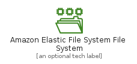
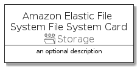

# AmazonElasticFileSystemFileSystem


```text
aws-20210730/Resource/Storage/AmazonElasticFileSystemFileSystem
```

```text
include('aws-20210730/Resource/Storage/AmazonElasticFileSystemFileSystem')
```


| Illustration | AmazonElasticFileSystemFileSystem | AmazonElasticFileSystemFileSystemCard | AmazonElasticFileSystemFileSystemGroup |
| :---: | :---: | :---: | :---: |
|  |  |  |  |


## AmazonElasticFileSystemFileSystem

### Load remotely
```plantuml
@startuml
' configures the library
!global $LIB_BASE_LOCATION="https://github.com/tmorin/plantuml-libs/distribution"

' loads the library's bootstrap
!include $LIB_BASE_LOCATION/bootstrap.puml

' loads the package bootstrap
include('aws-20210730/bootstrap')

' loads the Item which embeds the element AmazonElasticFileSystemFileSystem
include('aws-20210730/Resource/Storage/AmazonElasticFileSystemFileSystem')

' renders the element
AmazonElasticFileSystemFileSystem('AmazonElasticFileSystemFileSystem', 'Amazon Elastic File System File System', 'an optional tech label')
@enduml
```

### Load locally
```plantuml
@startuml
' configures the library
!global $INCLUSION_MODE="local"
!global $LIB_BASE_LOCATION="../../.."

' loads the library's bootstrap
!include $LIB_BASE_LOCATION/bootstrap.puml

' loads the package bootstrap
include('aws-20210730/bootstrap')

' loads the Item which embeds the element AmazonElasticFileSystemFileSystem
include('aws-20210730/Resource/Storage/AmazonElasticFileSystemFileSystem')

' renders the element
AmazonElasticFileSystemFileSystem('AmazonElasticFileSystemFileSystem', 'Amazon Elastic File System File System', 'an optional tech label')
@enduml
```

## AmazonElasticFileSystemFileSystemCard

### Load remotely
```plantuml
@startuml
' configures the library
!global $LIB_BASE_LOCATION="https://github.com/tmorin/plantuml-libs/distribution"

' loads the library's bootstrap
!include $LIB_BASE_LOCATION/bootstrap.puml

' loads the package bootstrap
include('aws-20210730/bootstrap')

' loads the Item which embeds the element AmazonElasticFileSystemFileSystemCard
include('aws-20210730/Resource/Storage/AmazonElasticFileSystemFileSystem')

' renders the element
AmazonElasticFileSystemFileSystemCard('AmazonElasticFileSystemFileSystemCard', 'Amazon Elastic File System File System Card', 'an optional description')
@enduml
```

### Load locally
```plantuml
@startuml
' configures the library
!global $INCLUSION_MODE="local"
!global $LIB_BASE_LOCATION="../../.."

' loads the library's bootstrap
!include $LIB_BASE_LOCATION/bootstrap.puml

' loads the package bootstrap
include('aws-20210730/bootstrap')

' loads the Item which embeds the element AmazonElasticFileSystemFileSystemCard
include('aws-20210730/Resource/Storage/AmazonElasticFileSystemFileSystem')

' renders the element
AmazonElasticFileSystemFileSystemCard('AmazonElasticFileSystemFileSystemCard', 'Amazon Elastic File System File System Card', 'an optional description')
@enduml
```

## AmazonElasticFileSystemFileSystemGroup

### Load remotely
```plantuml
@startuml
' configures the library
!global $LIB_BASE_LOCATION="https://github.com/tmorin/plantuml-libs/distribution"

' loads the library's bootstrap
!include $LIB_BASE_LOCATION/bootstrap.puml

' loads the package bootstrap
include('aws-20210730/bootstrap')

' loads the Item which embeds the element AmazonElasticFileSystemFileSystemGroup
include('aws-20210730/Resource/Storage/AmazonElasticFileSystemFileSystem')

' renders the element
AmazonElasticFileSystemFileSystemGroup('AmazonElasticFileSystemFileSystemGroup', 'Amazon Elastic File System File System Group', 'an optional tech label') {
    note as note
        the content of the group
    end note
}
@enduml
```

### Load locally
```plantuml
@startuml
' configures the library
!global $INCLUSION_MODE="local"
!global $LIB_BASE_LOCATION="../../.."

' loads the library's bootstrap
!include $LIB_BASE_LOCATION/bootstrap.puml

' loads the package bootstrap
include('aws-20210730/bootstrap')

' loads the Item which embeds the element AmazonElasticFileSystemFileSystemGroup
include('aws-20210730/Resource/Storage/AmazonElasticFileSystemFileSystem')

' renders the element
AmazonElasticFileSystemFileSystemGroup('AmazonElasticFileSystemFileSystemGroup', 'Amazon Elastic File System File System Group', 'an optional tech label') {
    note as note
        the content of the group
    end note
}
@enduml
```

