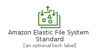
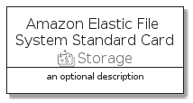

# AmazonElasticFileSystemStandard


```text
aws-20210730/Resource/Storage/AmazonElasticFileSystemStandard
```

```text
include('aws-20210730/Resource/Storage/AmazonElasticFileSystemStandard')
```


| Illustration | AmazonElasticFileSystemStandard | AmazonElasticFileSystemStandardCard | AmazonElasticFileSystemStandardGroup |
| :---: | :---: | :---: | :---: |
|  |  |  |  |


## AmazonElasticFileSystemStandard

### Load remotely
```plantuml
@startuml
' configures the library
!global $LIB_BASE_LOCATION="https://github.com/tmorin/plantuml-libs/distribution"

' loads the library's bootstrap
!include $LIB_BASE_LOCATION/bootstrap.puml

' loads the package bootstrap
include('aws-20210730/bootstrap')

' loads the Item which embeds the element AmazonElasticFileSystemStandard
include('aws-20210730/Resource/Storage/AmazonElasticFileSystemStandard')

' renders the element
AmazonElasticFileSystemStandard('AmazonElasticFileSystemStandard', 'Amazon Elastic File System Standard', 'an optional tech label')
@enduml
```

### Load locally
```plantuml
@startuml
' configures the library
!global $INCLUSION_MODE="local"
!global $LIB_BASE_LOCATION="../../.."

' loads the library's bootstrap
!include $LIB_BASE_LOCATION/bootstrap.puml

' loads the package bootstrap
include('aws-20210730/bootstrap')

' loads the Item which embeds the element AmazonElasticFileSystemStandard
include('aws-20210730/Resource/Storage/AmazonElasticFileSystemStandard')

' renders the element
AmazonElasticFileSystemStandard('AmazonElasticFileSystemStandard', 'Amazon Elastic File System Standard', 'an optional tech label')
@enduml
```

## AmazonElasticFileSystemStandardCard

### Load remotely
```plantuml
@startuml
' configures the library
!global $LIB_BASE_LOCATION="https://github.com/tmorin/plantuml-libs/distribution"

' loads the library's bootstrap
!include $LIB_BASE_LOCATION/bootstrap.puml

' loads the package bootstrap
include('aws-20210730/bootstrap')

' loads the Item which embeds the element AmazonElasticFileSystemStandardCard
include('aws-20210730/Resource/Storage/AmazonElasticFileSystemStandard')

' renders the element
AmazonElasticFileSystemStandardCard('AmazonElasticFileSystemStandardCard', 'Amazon Elastic File System Standard Card', 'an optional description')
@enduml
```

### Load locally
```plantuml
@startuml
' configures the library
!global $INCLUSION_MODE="local"
!global $LIB_BASE_LOCATION="../../.."

' loads the library's bootstrap
!include $LIB_BASE_LOCATION/bootstrap.puml

' loads the package bootstrap
include('aws-20210730/bootstrap')

' loads the Item which embeds the element AmazonElasticFileSystemStandardCard
include('aws-20210730/Resource/Storage/AmazonElasticFileSystemStandard')

' renders the element
AmazonElasticFileSystemStandardCard('AmazonElasticFileSystemStandardCard', 'Amazon Elastic File System Standard Card', 'an optional description')
@enduml
```

## AmazonElasticFileSystemStandardGroup

### Load remotely
```plantuml
@startuml
' configures the library
!global $LIB_BASE_LOCATION="https://github.com/tmorin/plantuml-libs/distribution"

' loads the library's bootstrap
!include $LIB_BASE_LOCATION/bootstrap.puml

' loads the package bootstrap
include('aws-20210730/bootstrap')

' loads the Item which embeds the element AmazonElasticFileSystemStandardGroup
include('aws-20210730/Resource/Storage/AmazonElasticFileSystemStandard')

' renders the element
AmazonElasticFileSystemStandardGroup('AmazonElasticFileSystemStandardGroup', 'Amazon Elastic File System Standard Group', 'an optional tech label') {
    note as note
        the content of the group
    end note
}
@enduml
```

### Load locally
```plantuml
@startuml
' configures the library
!global $INCLUSION_MODE="local"
!global $LIB_BASE_LOCATION="../../.."

' loads the library's bootstrap
!include $LIB_BASE_LOCATION/bootstrap.puml

' loads the package bootstrap
include('aws-20210730/bootstrap')

' loads the Item which embeds the element AmazonElasticFileSystemStandardGroup
include('aws-20210730/Resource/Storage/AmazonElasticFileSystemStandard')

' renders the element
AmazonElasticFileSystemStandardGroup('AmazonElasticFileSystemStandardGroup', 'Amazon Elastic File System Standard Group', 'an optional tech label') {
    note as note
        the content of the group
    end note
}
@enduml
```

