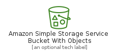
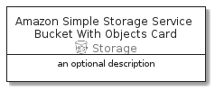

# AmazonSimpleStorageServiceBucketWithObjects


```text
aws-20210730/Resource/Storage/AmazonSimpleStorageServiceBucketWithObjects
```

```text
include('aws-20210730/Resource/Storage/AmazonSimpleStorageServiceBucketWithObjects')
```


| Illustration | AmazonSimpleStorageServiceBucketWithObjects | AmazonSimpleStorageServiceBucketWithObjectsCard | AmazonSimpleStorageServiceBucketWithObjectsGroup |
| :---: | :---: | :---: | :---: |
|  |  |  |  |


## AmazonSimpleStorageServiceBucketWithObjects

### Load remotely
```plantuml
@startuml
' configures the library
!global $LIB_BASE_LOCATION="https://github.com/tmorin/plantuml-libs/distribution"

' loads the library's bootstrap
!include $LIB_BASE_LOCATION/bootstrap.puml

' loads the package bootstrap
include('aws-20210730/bootstrap')

' loads the Item which embeds the element AmazonSimpleStorageServiceBucketWithObjects
include('aws-20210730/Resource/Storage/AmazonSimpleStorageServiceBucketWithObjects')

' renders the element
AmazonSimpleStorageServiceBucketWithObjects('AmazonSimpleStorageServiceBucketWithObjects', 'Amazon Simple Storage Service Bucket With Objects', 'an optional tech label')
@enduml
```

### Load locally
```plantuml
@startuml
' configures the library
!global $INCLUSION_MODE="local"
!global $LIB_BASE_LOCATION="../../.."

' loads the library's bootstrap
!include $LIB_BASE_LOCATION/bootstrap.puml

' loads the package bootstrap
include('aws-20210730/bootstrap')

' loads the Item which embeds the element AmazonSimpleStorageServiceBucketWithObjects
include('aws-20210730/Resource/Storage/AmazonSimpleStorageServiceBucketWithObjects')

' renders the element
AmazonSimpleStorageServiceBucketWithObjects('AmazonSimpleStorageServiceBucketWithObjects', 'Amazon Simple Storage Service Bucket With Objects', 'an optional tech label')
@enduml
```

## AmazonSimpleStorageServiceBucketWithObjectsCard

### Load remotely
```plantuml
@startuml
' configures the library
!global $LIB_BASE_LOCATION="https://github.com/tmorin/plantuml-libs/distribution"

' loads the library's bootstrap
!include $LIB_BASE_LOCATION/bootstrap.puml

' loads the package bootstrap
include('aws-20210730/bootstrap')

' loads the Item which embeds the element AmazonSimpleStorageServiceBucketWithObjectsCard
include('aws-20210730/Resource/Storage/AmazonSimpleStorageServiceBucketWithObjects')

' renders the element
AmazonSimpleStorageServiceBucketWithObjectsCard('AmazonSimpleStorageServiceBucketWithObjectsCard', 'Amazon Simple Storage Service Bucket With Objects Card', 'an optional description')
@enduml
```

### Load locally
```plantuml
@startuml
' configures the library
!global $INCLUSION_MODE="local"
!global $LIB_BASE_LOCATION="../../.."

' loads the library's bootstrap
!include $LIB_BASE_LOCATION/bootstrap.puml

' loads the package bootstrap
include('aws-20210730/bootstrap')

' loads the Item which embeds the element AmazonSimpleStorageServiceBucketWithObjectsCard
include('aws-20210730/Resource/Storage/AmazonSimpleStorageServiceBucketWithObjects')

' renders the element
AmazonSimpleStorageServiceBucketWithObjectsCard('AmazonSimpleStorageServiceBucketWithObjectsCard', 'Amazon Simple Storage Service Bucket With Objects Card', 'an optional description')
@enduml
```

## AmazonSimpleStorageServiceBucketWithObjectsGroup

### Load remotely
```plantuml
@startuml
' configures the library
!global $LIB_BASE_LOCATION="https://github.com/tmorin/plantuml-libs/distribution"

' loads the library's bootstrap
!include $LIB_BASE_LOCATION/bootstrap.puml

' loads the package bootstrap
include('aws-20210730/bootstrap')

' loads the Item which embeds the element AmazonSimpleStorageServiceBucketWithObjectsGroup
include('aws-20210730/Resource/Storage/AmazonSimpleStorageServiceBucketWithObjects')

' renders the element
AmazonSimpleStorageServiceBucketWithObjectsGroup('AmazonSimpleStorageServiceBucketWithObjectsGroup', 'Amazon Simple Storage Service Bucket With Objects Group', 'an optional tech label') {
    note as note
        the content of the group
    end note
}
@enduml
```

### Load locally
```plantuml
@startuml
' configures the library
!global $INCLUSION_MODE="local"
!global $LIB_BASE_LOCATION="../../.."

' loads the library's bootstrap
!include $LIB_BASE_LOCATION/bootstrap.puml

' loads the package bootstrap
include('aws-20210730/bootstrap')

' loads the Item which embeds the element AmazonSimpleStorageServiceBucketWithObjectsGroup
include('aws-20210730/Resource/Storage/AmazonSimpleStorageServiceBucketWithObjects')

' renders the element
AmazonSimpleStorageServiceBucketWithObjectsGroup('AmazonSimpleStorageServiceBucketWithObjectsGroup', 'Amazon Simple Storage Service Bucket With Objects Group', 'an optional tech label') {
    note as note
        the content of the group
    end note
}
@enduml
```

