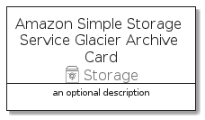

# AmazonSimpleStorageServiceGlacierArchive


```text
aws-20210730/Resource/Storage/AmazonSimpleStorageServiceGlacierArchive
```

```text
include('aws-20210730/Resource/Storage/AmazonSimpleStorageServiceGlacierArchive')
```


| Illustration | AmazonSimpleStorageServiceGlacierArchive | AmazonSimpleStorageServiceGlacierArchiveCard | AmazonSimpleStorageServiceGlacierArchiveGroup |
| :---: | :---: | :---: | :---: |
|  |  |  |  |


## AmazonSimpleStorageServiceGlacierArchive

### Load remotely
```plantuml
@startuml
' configures the library
!global $LIB_BASE_LOCATION="https://raw.githubusercontent.com/tmorin/plantuml-libs/master/distribution"

' loads the library's bootstrap
!include $LIB_BASE_LOCATION/bootstrap.puml

' loads the package bootstrap
include('aws-20210730/bootstrap')

' loads the Item which embeds the element AmazonSimpleStorageServiceGlacierArchive
include('aws-20210730/Resource/Storage/AmazonSimpleStorageServiceGlacierArchive')

' renders the element
AmazonSimpleStorageServiceGlacierArchive('AmazonSimpleStorageServiceGlacierArchive', 'Amazon Simple Storage Service Glacier Archive', 'an optional tech label')
@enduml
```

### Load locally
```plantuml
@startuml
' configures the library
!global $INCLUSION_MODE="local"
!global $LIB_BASE_LOCATION="../../.."

' loads the library's bootstrap
!include $LIB_BASE_LOCATION/bootstrap.puml

' loads the package bootstrap
include('aws-20210730/bootstrap')

' loads the Item which embeds the element AmazonSimpleStorageServiceGlacierArchive
include('aws-20210730/Resource/Storage/AmazonSimpleStorageServiceGlacierArchive')

' renders the element
AmazonSimpleStorageServiceGlacierArchive('AmazonSimpleStorageServiceGlacierArchive', 'Amazon Simple Storage Service Glacier Archive', 'an optional tech label')
@enduml
```

## AmazonSimpleStorageServiceGlacierArchiveCard

### Load remotely
```plantuml
@startuml
' configures the library
!global $LIB_BASE_LOCATION="https://raw.githubusercontent.com/tmorin/plantuml-libs/master/distribution"

' loads the library's bootstrap
!include $LIB_BASE_LOCATION/bootstrap.puml

' loads the package bootstrap
include('aws-20210730/bootstrap')

' loads the Item which embeds the element AmazonSimpleStorageServiceGlacierArchiveCard
include('aws-20210730/Resource/Storage/AmazonSimpleStorageServiceGlacierArchive')

' renders the element
AmazonSimpleStorageServiceGlacierArchiveCard('AmazonSimpleStorageServiceGlacierArchiveCard', 'Amazon Simple Storage Service Glacier Archive Card', 'an optional description')
@enduml
```

### Load locally
```plantuml
@startuml
' configures the library
!global $INCLUSION_MODE="local"
!global $LIB_BASE_LOCATION="../../.."

' loads the library's bootstrap
!include $LIB_BASE_LOCATION/bootstrap.puml

' loads the package bootstrap
include('aws-20210730/bootstrap')

' loads the Item which embeds the element AmazonSimpleStorageServiceGlacierArchiveCard
include('aws-20210730/Resource/Storage/AmazonSimpleStorageServiceGlacierArchive')

' renders the element
AmazonSimpleStorageServiceGlacierArchiveCard('AmazonSimpleStorageServiceGlacierArchiveCard', 'Amazon Simple Storage Service Glacier Archive Card', 'an optional description')
@enduml
```

## AmazonSimpleStorageServiceGlacierArchiveGroup

### Load remotely
```plantuml
@startuml
' configures the library
!global $LIB_BASE_LOCATION="https://raw.githubusercontent.com/tmorin/plantuml-libs/master/distribution"

' loads the library's bootstrap
!include $LIB_BASE_LOCATION/bootstrap.puml

' loads the package bootstrap
include('aws-20210730/bootstrap')

' loads the Item which embeds the element AmazonSimpleStorageServiceGlacierArchiveGroup
include('aws-20210730/Resource/Storage/AmazonSimpleStorageServiceGlacierArchive')

' renders the element
AmazonSimpleStorageServiceGlacierArchiveGroup('AmazonSimpleStorageServiceGlacierArchiveGroup', 'Amazon Simple Storage Service Glacier Archive Group', 'an optional tech label') {
    note as note
        the content of the group
    end note
}
@enduml
```

### Load locally
```plantuml
@startuml
' configures the library
!global $INCLUSION_MODE="local"
!global $LIB_BASE_LOCATION="../../.."

' loads the library's bootstrap
!include $LIB_BASE_LOCATION/bootstrap.puml

' loads the package bootstrap
include('aws-20210730/bootstrap')

' loads the Item which embeds the element AmazonSimpleStorageServiceGlacierArchiveGroup
include('aws-20210730/Resource/Storage/AmazonSimpleStorageServiceGlacierArchive')

' renders the element
AmazonSimpleStorageServiceGlacierArchiveGroup('AmazonSimpleStorageServiceGlacierArchiveGroup', 'Amazon Simple Storage Service Glacier Archive Group', 'an optional tech label') {
    note as note
        the content of the group
    end note
}
@enduml
```

