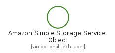
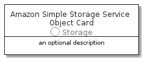

# AmazonSimpleStorageServiceObject


```text
aws-20210730/Resource/Storage/AmazonSimpleStorageServiceObject
```

```text
include('aws-20210730/Resource/Storage/AmazonSimpleStorageServiceObject')
```


| Illustration | AmazonSimpleStorageServiceObject | AmazonSimpleStorageServiceObjectCard | AmazonSimpleStorageServiceObjectGroup |
| :---: | :---: | :---: | :---: |
|  |  |  |  |


## AmazonSimpleStorageServiceObject

### Load remotely
```plantuml
@startuml
' configures the library
!global $LIB_BASE_LOCATION="https://github.com/tmorin/plantuml-libs/distribution"

' loads the library's bootstrap
!include $LIB_BASE_LOCATION/bootstrap.puml

' loads the package bootstrap
include('aws-20210730/bootstrap')

' loads the Item which embeds the element AmazonSimpleStorageServiceObject
include('aws-20210730/Resource/Storage/AmazonSimpleStorageServiceObject')

' renders the element
AmazonSimpleStorageServiceObject('AmazonSimpleStorageServiceObject', 'Amazon Simple Storage Service Object', 'an optional tech label')
@enduml
```

### Load locally
```plantuml
@startuml
' configures the library
!global $INCLUSION_MODE="local"
!global $LIB_BASE_LOCATION="../../.."

' loads the library's bootstrap
!include $LIB_BASE_LOCATION/bootstrap.puml

' loads the package bootstrap
include('aws-20210730/bootstrap')

' loads the Item which embeds the element AmazonSimpleStorageServiceObject
include('aws-20210730/Resource/Storage/AmazonSimpleStorageServiceObject')

' renders the element
AmazonSimpleStorageServiceObject('AmazonSimpleStorageServiceObject', 'Amazon Simple Storage Service Object', 'an optional tech label')
@enduml
```

## AmazonSimpleStorageServiceObjectCard

### Load remotely
```plantuml
@startuml
' configures the library
!global $LIB_BASE_LOCATION="https://github.com/tmorin/plantuml-libs/distribution"

' loads the library's bootstrap
!include $LIB_BASE_LOCATION/bootstrap.puml

' loads the package bootstrap
include('aws-20210730/bootstrap')

' loads the Item which embeds the element AmazonSimpleStorageServiceObjectCard
include('aws-20210730/Resource/Storage/AmazonSimpleStorageServiceObject')

' renders the element
AmazonSimpleStorageServiceObjectCard('AmazonSimpleStorageServiceObjectCard', 'Amazon Simple Storage Service Object Card', 'an optional description')
@enduml
```

### Load locally
```plantuml
@startuml
' configures the library
!global $INCLUSION_MODE="local"
!global $LIB_BASE_LOCATION="../../.."

' loads the library's bootstrap
!include $LIB_BASE_LOCATION/bootstrap.puml

' loads the package bootstrap
include('aws-20210730/bootstrap')

' loads the Item which embeds the element AmazonSimpleStorageServiceObjectCard
include('aws-20210730/Resource/Storage/AmazonSimpleStorageServiceObject')

' renders the element
AmazonSimpleStorageServiceObjectCard('AmazonSimpleStorageServiceObjectCard', 'Amazon Simple Storage Service Object Card', 'an optional description')
@enduml
```

## AmazonSimpleStorageServiceObjectGroup

### Load remotely
```plantuml
@startuml
' configures the library
!global $LIB_BASE_LOCATION="https://github.com/tmorin/plantuml-libs/distribution"

' loads the library's bootstrap
!include $LIB_BASE_LOCATION/bootstrap.puml

' loads the package bootstrap
include('aws-20210730/bootstrap')

' loads the Item which embeds the element AmazonSimpleStorageServiceObjectGroup
include('aws-20210730/Resource/Storage/AmazonSimpleStorageServiceObject')

' renders the element
AmazonSimpleStorageServiceObjectGroup('AmazonSimpleStorageServiceObjectGroup', 'Amazon Simple Storage Service Object Group', 'an optional tech label') {
    note as note
        the content of the group
    end note
}
@enduml
```

### Load locally
```plantuml
@startuml
' configures the library
!global $INCLUSION_MODE="local"
!global $LIB_BASE_LOCATION="../../.."

' loads the library's bootstrap
!include $LIB_BASE_LOCATION/bootstrap.puml

' loads the package bootstrap
include('aws-20210730/bootstrap')

' loads the Item which embeds the element AmazonSimpleStorageServiceObjectGroup
include('aws-20210730/Resource/Storage/AmazonSimpleStorageServiceObject')

' renders the element
AmazonSimpleStorageServiceObjectGroup('AmazonSimpleStorageServiceObjectGroup', 'Amazon Simple Storage Service Object Group', 'an optional tech label') {
    note as note
        the content of the group
    end note
}
@enduml
```

