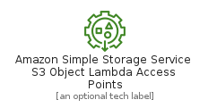
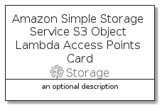

# AmazonSimpleStorageServiceS3ObjectLambdaAccessPoints


```text
aws-20210730/Resource/Storage/AmazonSimpleStorageServiceS3ObjectLambdaAccessPoints
```

```text
include('aws-20210730/Resource/Storage/AmazonSimpleStorageServiceS3ObjectLambdaAccessPoints')
```


| Illustration | AmazonSimpleStorageServiceS3ObjectLambdaAccessPoints | AmazonSimpleStorageServiceS3ObjectLambdaAccessPointsCard | AmazonSimpleStorageServiceS3ObjectLambdaAccessPointsGroup |
| :---: | :---: | :---: | :---: |
|  |  |  |  |


## AmazonSimpleStorageServiceS3ObjectLambdaAccessPoints

### Load remotely
```plantuml
@startuml
' configures the library
!global $LIB_BASE_LOCATION="https://raw.githubusercontent.com/tmorin/plantuml-libs/master/distribution"

' loads the library's bootstrap
!include $LIB_BASE_LOCATION/bootstrap.puml

' loads the package bootstrap
include('aws-20210730/bootstrap')

' loads the Item which embeds the element AmazonSimpleStorageServiceS3ObjectLambdaAccessPoints
include('aws-20210730/Resource/Storage/AmazonSimpleStorageServiceS3ObjectLambdaAccessPoints')

' renders the element
AmazonSimpleStorageServiceS3ObjectLambdaAccessPoints('AmazonSimpleStorageServiceS3ObjectLambdaAccessPoints', 'Amazon Simple Storage Service S3 Object Lambda Access Points', 'an optional tech label')
@enduml
```

### Load locally
```plantuml
@startuml
' configures the library
!global $INCLUSION_MODE="local"
!global $LIB_BASE_LOCATION="../../.."

' loads the library's bootstrap
!include $LIB_BASE_LOCATION/bootstrap.puml

' loads the package bootstrap
include('aws-20210730/bootstrap')

' loads the Item which embeds the element AmazonSimpleStorageServiceS3ObjectLambdaAccessPoints
include('aws-20210730/Resource/Storage/AmazonSimpleStorageServiceS3ObjectLambdaAccessPoints')

' renders the element
AmazonSimpleStorageServiceS3ObjectLambdaAccessPoints('AmazonSimpleStorageServiceS3ObjectLambdaAccessPoints', 'Amazon Simple Storage Service S3 Object Lambda Access Points', 'an optional tech label')
@enduml
```

## AmazonSimpleStorageServiceS3ObjectLambdaAccessPointsCard

### Load remotely
```plantuml
@startuml
' configures the library
!global $LIB_BASE_LOCATION="https://raw.githubusercontent.com/tmorin/plantuml-libs/master/distribution"

' loads the library's bootstrap
!include $LIB_BASE_LOCATION/bootstrap.puml

' loads the package bootstrap
include('aws-20210730/bootstrap')

' loads the Item which embeds the element AmazonSimpleStorageServiceS3ObjectLambdaAccessPointsCard
include('aws-20210730/Resource/Storage/AmazonSimpleStorageServiceS3ObjectLambdaAccessPoints')

' renders the element
AmazonSimpleStorageServiceS3ObjectLambdaAccessPointsCard('AmazonSimpleStorageServiceS3ObjectLambdaAccessPointsCard', 'Amazon Simple Storage Service S3 Object Lambda Access Points Card', 'an optional description')
@enduml
```

### Load locally
```plantuml
@startuml
' configures the library
!global $INCLUSION_MODE="local"
!global $LIB_BASE_LOCATION="../../.."

' loads the library's bootstrap
!include $LIB_BASE_LOCATION/bootstrap.puml

' loads the package bootstrap
include('aws-20210730/bootstrap')

' loads the Item which embeds the element AmazonSimpleStorageServiceS3ObjectLambdaAccessPointsCard
include('aws-20210730/Resource/Storage/AmazonSimpleStorageServiceS3ObjectLambdaAccessPoints')

' renders the element
AmazonSimpleStorageServiceS3ObjectLambdaAccessPointsCard('AmazonSimpleStorageServiceS3ObjectLambdaAccessPointsCard', 'Amazon Simple Storage Service S3 Object Lambda Access Points Card', 'an optional description')
@enduml
```

## AmazonSimpleStorageServiceS3ObjectLambdaAccessPointsGroup

### Load remotely
```plantuml
@startuml
' configures the library
!global $LIB_BASE_LOCATION="https://raw.githubusercontent.com/tmorin/plantuml-libs/master/distribution"

' loads the library's bootstrap
!include $LIB_BASE_LOCATION/bootstrap.puml

' loads the package bootstrap
include('aws-20210730/bootstrap')

' loads the Item which embeds the element AmazonSimpleStorageServiceS3ObjectLambdaAccessPointsGroup
include('aws-20210730/Resource/Storage/AmazonSimpleStorageServiceS3ObjectLambdaAccessPoints')

' renders the element
AmazonSimpleStorageServiceS3ObjectLambdaAccessPointsGroup('AmazonSimpleStorageServiceS3ObjectLambdaAccessPointsGroup', 'Amazon Simple Storage Service S3 Object Lambda Access Points Group', 'an optional tech label') {
    note as note
        the content of the group
    end note
}
@enduml
```

### Load locally
```plantuml
@startuml
' configures the library
!global $INCLUSION_MODE="local"
!global $LIB_BASE_LOCATION="../../.."

' loads the library's bootstrap
!include $LIB_BASE_LOCATION/bootstrap.puml

' loads the package bootstrap
include('aws-20210730/bootstrap')

' loads the Item which embeds the element AmazonSimpleStorageServiceS3ObjectLambdaAccessPointsGroup
include('aws-20210730/Resource/Storage/AmazonSimpleStorageServiceS3ObjectLambdaAccessPoints')

' renders the element
AmazonSimpleStorageServiceS3ObjectLambdaAccessPointsGroup('AmazonSimpleStorageServiceS3ObjectLambdaAccessPointsGroup', 'Amazon Simple Storage Service S3 Object Lambda Access Points Group', 'an optional tech label') {
    note as note
        the content of the group
    end note
}
@enduml
```

