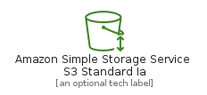
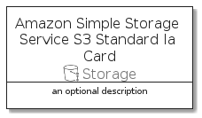

# AmazonSimpleStorageServiceS3StandardIa


```text
aws-20210730/Resource/Storage/AmazonSimpleStorageServiceS3StandardIa
```

```text
include('aws-20210730/Resource/Storage/AmazonSimpleStorageServiceS3StandardIa')
```


| Illustration | AmazonSimpleStorageServiceS3StandardIa | AmazonSimpleStorageServiceS3StandardIaCard | AmazonSimpleStorageServiceS3StandardIaGroup |
| :---: | :---: | :---: | :---: |
|  |  |  |  |


## AmazonSimpleStorageServiceS3StandardIa

### Load remotely
```plantuml
@startuml
' configures the library
!global $LIB_BASE_LOCATION="https://github.com/tmorin/plantuml-libs/distribution"

' loads the library's bootstrap
!include $LIB_BASE_LOCATION/bootstrap.puml

' loads the package bootstrap
include('aws-20210730/bootstrap')

' loads the Item which embeds the element AmazonSimpleStorageServiceS3StandardIa
include('aws-20210730/Resource/Storage/AmazonSimpleStorageServiceS3StandardIa')

' renders the element
AmazonSimpleStorageServiceS3StandardIa('AmazonSimpleStorageServiceS3StandardIa', 'Amazon Simple Storage Service S3 Standard Ia', 'an optional tech label')
@enduml
```

### Load locally
```plantuml
@startuml
' configures the library
!global $INCLUSION_MODE="local"
!global $LIB_BASE_LOCATION="../../.."

' loads the library's bootstrap
!include $LIB_BASE_LOCATION/bootstrap.puml

' loads the package bootstrap
include('aws-20210730/bootstrap')

' loads the Item which embeds the element AmazonSimpleStorageServiceS3StandardIa
include('aws-20210730/Resource/Storage/AmazonSimpleStorageServiceS3StandardIa')

' renders the element
AmazonSimpleStorageServiceS3StandardIa('AmazonSimpleStorageServiceS3StandardIa', 'Amazon Simple Storage Service S3 Standard Ia', 'an optional tech label')
@enduml
```

## AmazonSimpleStorageServiceS3StandardIaCard

### Load remotely
```plantuml
@startuml
' configures the library
!global $LIB_BASE_LOCATION="https://github.com/tmorin/plantuml-libs/distribution"

' loads the library's bootstrap
!include $LIB_BASE_LOCATION/bootstrap.puml

' loads the package bootstrap
include('aws-20210730/bootstrap')

' loads the Item which embeds the element AmazonSimpleStorageServiceS3StandardIaCard
include('aws-20210730/Resource/Storage/AmazonSimpleStorageServiceS3StandardIa')

' renders the element
AmazonSimpleStorageServiceS3StandardIaCard('AmazonSimpleStorageServiceS3StandardIaCard', 'Amazon Simple Storage Service S3 Standard Ia Card', 'an optional description')
@enduml
```

### Load locally
```plantuml
@startuml
' configures the library
!global $INCLUSION_MODE="local"
!global $LIB_BASE_LOCATION="../../.."

' loads the library's bootstrap
!include $LIB_BASE_LOCATION/bootstrap.puml

' loads the package bootstrap
include('aws-20210730/bootstrap')

' loads the Item which embeds the element AmazonSimpleStorageServiceS3StandardIaCard
include('aws-20210730/Resource/Storage/AmazonSimpleStorageServiceS3StandardIa')

' renders the element
AmazonSimpleStorageServiceS3StandardIaCard('AmazonSimpleStorageServiceS3StandardIaCard', 'Amazon Simple Storage Service S3 Standard Ia Card', 'an optional description')
@enduml
```

## AmazonSimpleStorageServiceS3StandardIaGroup

### Load remotely
```plantuml
@startuml
' configures the library
!global $LIB_BASE_LOCATION="https://github.com/tmorin/plantuml-libs/distribution"

' loads the library's bootstrap
!include $LIB_BASE_LOCATION/bootstrap.puml

' loads the package bootstrap
include('aws-20210730/bootstrap')

' loads the Item which embeds the element AmazonSimpleStorageServiceS3StandardIaGroup
include('aws-20210730/Resource/Storage/AmazonSimpleStorageServiceS3StandardIa')

' renders the element
AmazonSimpleStorageServiceS3StandardIaGroup('AmazonSimpleStorageServiceS3StandardIaGroup', 'Amazon Simple Storage Service S3 Standard Ia Group', 'an optional tech label') {
    note as note
        the content of the group
    end note
}
@enduml
```

### Load locally
```plantuml
@startuml
' configures the library
!global $INCLUSION_MODE="local"
!global $LIB_BASE_LOCATION="../../.."

' loads the library's bootstrap
!include $LIB_BASE_LOCATION/bootstrap.puml

' loads the package bootstrap
include('aws-20210730/bootstrap')

' loads the Item which embeds the element AmazonSimpleStorageServiceS3StandardIaGroup
include('aws-20210730/Resource/Storage/AmazonSimpleStorageServiceS3StandardIa')

' renders the element
AmazonSimpleStorageServiceS3StandardIaGroup('AmazonSimpleStorageServiceS3StandardIaGroup', 'Amazon Simple Storage Service S3 Standard Ia Group', 'an optional tech label') {
    note as note
        the content of the group
    end note
}
@enduml
```

