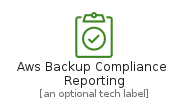
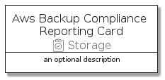

# AwsBackupComplianceReporting


```text
aws-20210730/Resource/Storage/AwsBackupComplianceReporting
```

```text
include('aws-20210730/Resource/Storage/AwsBackupComplianceReporting')
```


| Illustration | AwsBackupComplianceReporting | AwsBackupComplianceReportingCard | AwsBackupComplianceReportingGroup |
| :---: | :---: | :---: | :---: |
|  |  |  |  |


## AwsBackupComplianceReporting

### Load remotely
```plantuml
@startuml
' configures the library
!global $LIB_BASE_LOCATION="https://raw.githubusercontent.com/tmorin/plantuml-libs/master/distribution"

' loads the library's bootstrap
!include $LIB_BASE_LOCATION/bootstrap.puml

' loads the package bootstrap
include('aws-20210730/bootstrap')

' loads the Item which embeds the element AwsBackupComplianceReporting
include('aws-20210730/Resource/Storage/AwsBackupComplianceReporting')

' renders the element
AwsBackupComplianceReporting('AwsBackupComplianceReporting', 'Aws Backup Compliance Reporting', 'an optional tech label')
@enduml
```

### Load locally
```plantuml
@startuml
' configures the library
!global $INCLUSION_MODE="local"
!global $LIB_BASE_LOCATION="../../.."

' loads the library's bootstrap
!include $LIB_BASE_LOCATION/bootstrap.puml

' loads the package bootstrap
include('aws-20210730/bootstrap')

' loads the Item which embeds the element AwsBackupComplianceReporting
include('aws-20210730/Resource/Storage/AwsBackupComplianceReporting')

' renders the element
AwsBackupComplianceReporting('AwsBackupComplianceReporting', 'Aws Backup Compliance Reporting', 'an optional tech label')
@enduml
```

## AwsBackupComplianceReportingCard

### Load remotely
```plantuml
@startuml
' configures the library
!global $LIB_BASE_LOCATION="https://raw.githubusercontent.com/tmorin/plantuml-libs/master/distribution"

' loads the library's bootstrap
!include $LIB_BASE_LOCATION/bootstrap.puml

' loads the package bootstrap
include('aws-20210730/bootstrap')

' loads the Item which embeds the element AwsBackupComplianceReportingCard
include('aws-20210730/Resource/Storage/AwsBackupComplianceReporting')

' renders the element
AwsBackupComplianceReportingCard('AwsBackupComplianceReportingCard', 'Aws Backup Compliance Reporting Card', 'an optional description')
@enduml
```

### Load locally
```plantuml
@startuml
' configures the library
!global $INCLUSION_MODE="local"
!global $LIB_BASE_LOCATION="../../.."

' loads the library's bootstrap
!include $LIB_BASE_LOCATION/bootstrap.puml

' loads the package bootstrap
include('aws-20210730/bootstrap')

' loads the Item which embeds the element AwsBackupComplianceReportingCard
include('aws-20210730/Resource/Storage/AwsBackupComplianceReporting')

' renders the element
AwsBackupComplianceReportingCard('AwsBackupComplianceReportingCard', 'Aws Backup Compliance Reporting Card', 'an optional description')
@enduml
```

## AwsBackupComplianceReportingGroup

### Load remotely
```plantuml
@startuml
' configures the library
!global $LIB_BASE_LOCATION="https://raw.githubusercontent.com/tmorin/plantuml-libs/master/distribution"

' loads the library's bootstrap
!include $LIB_BASE_LOCATION/bootstrap.puml

' loads the package bootstrap
include('aws-20210730/bootstrap')

' loads the Item which embeds the element AwsBackupComplianceReportingGroup
include('aws-20210730/Resource/Storage/AwsBackupComplianceReporting')

' renders the element
AwsBackupComplianceReportingGroup('AwsBackupComplianceReportingGroup', 'Aws Backup Compliance Reporting Group', 'an optional tech label') {
    note as note
        the content of the group
    end note
}
@enduml
```

### Load locally
```plantuml
@startuml
' configures the library
!global $INCLUSION_MODE="local"
!global $LIB_BASE_LOCATION="../../.."

' loads the library's bootstrap
!include $LIB_BASE_LOCATION/bootstrap.puml

' loads the package bootstrap
include('aws-20210730/bootstrap')

' loads the Item which embeds the element AwsBackupComplianceReportingGroup
include('aws-20210730/Resource/Storage/AwsBackupComplianceReporting')

' renders the element
AwsBackupComplianceReportingGroup('AwsBackupComplianceReportingGroup', 'Aws Backup Compliance Reporting Group', 'an optional tech label') {
    note as note
        the content of the group
    end note
}
@enduml
```

