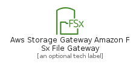
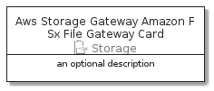
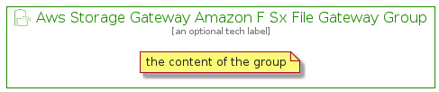

# AwsStorageGatewayAmazonFSxFileGateway


```text
aws-20210730/Resource/Storage/AwsStorageGatewayAmazonFSxFileGateway
```

```text
include('aws-20210730/Resource/Storage/AwsStorageGatewayAmazonFSxFileGateway')
```


| Illustration | AwsStorageGatewayAmazonFSxFileGateway | AwsStorageGatewayAmazonFSxFileGatewayCard | AwsStorageGatewayAmazonFSxFileGatewayGroup |
| :---: | :---: | :---: | :---: |
|  |  |  |  |


## AwsStorageGatewayAmazonFSxFileGateway

### Load remotely
```plantuml
@startuml
' configures the library
!global $LIB_BASE_LOCATION="https://github.com/tmorin/plantuml-libs/distribution"

' loads the library's bootstrap
!include $LIB_BASE_LOCATION/bootstrap.puml

' loads the package bootstrap
include('aws-20210730/bootstrap')

' loads the Item which embeds the element AwsStorageGatewayAmazonFSxFileGateway
include('aws-20210730/Resource/Storage/AwsStorageGatewayAmazonFSxFileGateway')

' renders the element
AwsStorageGatewayAmazonFSxFileGateway('AwsStorageGatewayAmazonFSxFileGateway', 'Aws Storage Gateway Amazon F Sx File Gateway', 'an optional tech label')
@enduml
```

### Load locally
```plantuml
@startuml
' configures the library
!global $INCLUSION_MODE="local"
!global $LIB_BASE_LOCATION="../../.."

' loads the library's bootstrap
!include $LIB_BASE_LOCATION/bootstrap.puml

' loads the package bootstrap
include('aws-20210730/bootstrap')

' loads the Item which embeds the element AwsStorageGatewayAmazonFSxFileGateway
include('aws-20210730/Resource/Storage/AwsStorageGatewayAmazonFSxFileGateway')

' renders the element
AwsStorageGatewayAmazonFSxFileGateway('AwsStorageGatewayAmazonFSxFileGateway', 'Aws Storage Gateway Amazon F Sx File Gateway', 'an optional tech label')
@enduml
```

## AwsStorageGatewayAmazonFSxFileGatewayCard

### Load remotely
```plantuml
@startuml
' configures the library
!global $LIB_BASE_LOCATION="https://github.com/tmorin/plantuml-libs/distribution"

' loads the library's bootstrap
!include $LIB_BASE_LOCATION/bootstrap.puml

' loads the package bootstrap
include('aws-20210730/bootstrap')

' loads the Item which embeds the element AwsStorageGatewayAmazonFSxFileGatewayCard
include('aws-20210730/Resource/Storage/AwsStorageGatewayAmazonFSxFileGateway')

' renders the element
AwsStorageGatewayAmazonFSxFileGatewayCard('AwsStorageGatewayAmazonFSxFileGatewayCard', 'Aws Storage Gateway Amazon F Sx File Gateway Card', 'an optional description')
@enduml
```

### Load locally
```plantuml
@startuml
' configures the library
!global $INCLUSION_MODE="local"
!global $LIB_BASE_LOCATION="../../.."

' loads the library's bootstrap
!include $LIB_BASE_LOCATION/bootstrap.puml

' loads the package bootstrap
include('aws-20210730/bootstrap')

' loads the Item which embeds the element AwsStorageGatewayAmazonFSxFileGatewayCard
include('aws-20210730/Resource/Storage/AwsStorageGatewayAmazonFSxFileGateway')

' renders the element
AwsStorageGatewayAmazonFSxFileGatewayCard('AwsStorageGatewayAmazonFSxFileGatewayCard', 'Aws Storage Gateway Amazon F Sx File Gateway Card', 'an optional description')
@enduml
```

## AwsStorageGatewayAmazonFSxFileGatewayGroup

### Load remotely
```plantuml
@startuml
' configures the library
!global $LIB_BASE_LOCATION="https://github.com/tmorin/plantuml-libs/distribution"

' loads the library's bootstrap
!include $LIB_BASE_LOCATION/bootstrap.puml

' loads the package bootstrap
include('aws-20210730/bootstrap')

' loads the Item which embeds the element AwsStorageGatewayAmazonFSxFileGatewayGroup
include('aws-20210730/Resource/Storage/AwsStorageGatewayAmazonFSxFileGateway')

' renders the element
AwsStorageGatewayAmazonFSxFileGatewayGroup('AwsStorageGatewayAmazonFSxFileGatewayGroup', 'Aws Storage Gateway Amazon F Sx File Gateway Group', 'an optional tech label') {
    note as note
        the content of the group
    end note
}
@enduml
```

### Load locally
```plantuml
@startuml
' configures the library
!global $INCLUSION_MODE="local"
!global $LIB_BASE_LOCATION="../../.."

' loads the library's bootstrap
!include $LIB_BASE_LOCATION/bootstrap.puml

' loads the package bootstrap
include('aws-20210730/bootstrap')

' loads the Item which embeds the element AwsStorageGatewayAmazonFSxFileGatewayGroup
include('aws-20210730/Resource/Storage/AwsStorageGatewayAmazonFSxFileGateway')

' renders the element
AwsStorageGatewayAmazonFSxFileGatewayGroup('AwsStorageGatewayAmazonFSxFileGatewayGroup', 'Aws Storage Gateway Amazon F Sx File Gateway Group', 'an optional tech label') {
    note as note
        the content of the group
    end note
}
@enduml
```

