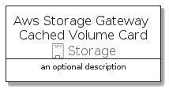

# AwsStorageGatewayCachedVolume


```text
aws-20210730/Resource/Storage/AwsStorageGatewayCachedVolume
```

```text
include('aws-20210730/Resource/Storage/AwsStorageGatewayCachedVolume')
```


| Illustration | AwsStorageGatewayCachedVolume | AwsStorageGatewayCachedVolumeCard | AwsStorageGatewayCachedVolumeGroup |
| :---: | :---: | :---: | :---: |
|  |  |  |  |


## AwsStorageGatewayCachedVolume

### Load remotely
```plantuml
@startuml
' configures the library
!global $LIB_BASE_LOCATION="https://github.com/tmorin/plantuml-libs/distribution"

' loads the library's bootstrap
!include $LIB_BASE_LOCATION/bootstrap.puml

' loads the package bootstrap
include('aws-20210730/bootstrap')

' loads the Item which embeds the element AwsStorageGatewayCachedVolume
include('aws-20210730/Resource/Storage/AwsStorageGatewayCachedVolume')

' renders the element
AwsStorageGatewayCachedVolume('AwsStorageGatewayCachedVolume', 'Aws Storage Gateway Cached Volume', 'an optional tech label')
@enduml
```

### Load locally
```plantuml
@startuml
' configures the library
!global $INCLUSION_MODE="local"
!global $LIB_BASE_LOCATION="../../.."

' loads the library's bootstrap
!include $LIB_BASE_LOCATION/bootstrap.puml

' loads the package bootstrap
include('aws-20210730/bootstrap')

' loads the Item which embeds the element AwsStorageGatewayCachedVolume
include('aws-20210730/Resource/Storage/AwsStorageGatewayCachedVolume')

' renders the element
AwsStorageGatewayCachedVolume('AwsStorageGatewayCachedVolume', 'Aws Storage Gateway Cached Volume', 'an optional tech label')
@enduml
```

## AwsStorageGatewayCachedVolumeCard

### Load remotely
```plantuml
@startuml
' configures the library
!global $LIB_BASE_LOCATION="https://github.com/tmorin/plantuml-libs/distribution"

' loads the library's bootstrap
!include $LIB_BASE_LOCATION/bootstrap.puml

' loads the package bootstrap
include('aws-20210730/bootstrap')

' loads the Item which embeds the element AwsStorageGatewayCachedVolumeCard
include('aws-20210730/Resource/Storage/AwsStorageGatewayCachedVolume')

' renders the element
AwsStorageGatewayCachedVolumeCard('AwsStorageGatewayCachedVolumeCard', 'Aws Storage Gateway Cached Volume Card', 'an optional description')
@enduml
```

### Load locally
```plantuml
@startuml
' configures the library
!global $INCLUSION_MODE="local"
!global $LIB_BASE_LOCATION="../../.."

' loads the library's bootstrap
!include $LIB_BASE_LOCATION/bootstrap.puml

' loads the package bootstrap
include('aws-20210730/bootstrap')

' loads the Item which embeds the element AwsStorageGatewayCachedVolumeCard
include('aws-20210730/Resource/Storage/AwsStorageGatewayCachedVolume')

' renders the element
AwsStorageGatewayCachedVolumeCard('AwsStorageGatewayCachedVolumeCard', 'Aws Storage Gateway Cached Volume Card', 'an optional description')
@enduml
```

## AwsStorageGatewayCachedVolumeGroup

### Load remotely
```plantuml
@startuml
' configures the library
!global $LIB_BASE_LOCATION="https://github.com/tmorin/plantuml-libs/distribution"

' loads the library's bootstrap
!include $LIB_BASE_LOCATION/bootstrap.puml

' loads the package bootstrap
include('aws-20210730/bootstrap')

' loads the Item which embeds the element AwsStorageGatewayCachedVolumeGroup
include('aws-20210730/Resource/Storage/AwsStorageGatewayCachedVolume')

' renders the element
AwsStorageGatewayCachedVolumeGroup('AwsStorageGatewayCachedVolumeGroup', 'Aws Storage Gateway Cached Volume Group', 'an optional tech label') {
    note as note
        the content of the group
    end note
}
@enduml
```

### Load locally
```plantuml
@startuml
' configures the library
!global $INCLUSION_MODE="local"
!global $LIB_BASE_LOCATION="../../.."

' loads the library's bootstrap
!include $LIB_BASE_LOCATION/bootstrap.puml

' loads the package bootstrap
include('aws-20210730/bootstrap')

' loads the Item which embeds the element AwsStorageGatewayCachedVolumeGroup
include('aws-20210730/Resource/Storage/AwsStorageGatewayCachedVolume')

' renders the element
AwsStorageGatewayCachedVolumeGroup('AwsStorageGatewayCachedVolumeGroup', 'Aws Storage Gateway Cached Volume Group', 'an optional tech label') {
    note as note
        the content of the group
    end note
}
@enduml
```

