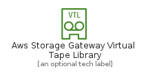
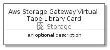

# AwsStorageGatewayVirtualTapeLibrary


```text
aws-20210730/Resource/Storage/AwsStorageGatewayVirtualTapeLibrary
```

```text
include('aws-20210730/Resource/Storage/AwsStorageGatewayVirtualTapeLibrary')
```


| Illustration | AwsStorageGatewayVirtualTapeLibrary | AwsStorageGatewayVirtualTapeLibraryCard | AwsStorageGatewayVirtualTapeLibraryGroup |
| :---: | :---: | :---: | :---: |
|  |  |  |  |


## AwsStorageGatewayVirtualTapeLibrary

### Load remotely
```plantuml
@startuml
' configures the library
!global $LIB_BASE_LOCATION="https://raw.githubusercontent.com/tmorin/plantuml-libs/master/distribution"

' loads the library's bootstrap
!include $LIB_BASE_LOCATION/bootstrap.puml

' loads the package bootstrap
include('aws-20210730/bootstrap')

' loads the Item which embeds the element AwsStorageGatewayVirtualTapeLibrary
include('aws-20210730/Resource/Storage/AwsStorageGatewayVirtualTapeLibrary')

' renders the element
AwsStorageGatewayVirtualTapeLibrary('AwsStorageGatewayVirtualTapeLibrary', 'Aws Storage Gateway Virtual Tape Library', 'an optional tech label')
@enduml
```

### Load locally
```plantuml
@startuml
' configures the library
!global $INCLUSION_MODE="local"
!global $LIB_BASE_LOCATION="../../.."

' loads the library's bootstrap
!include $LIB_BASE_LOCATION/bootstrap.puml

' loads the package bootstrap
include('aws-20210730/bootstrap')

' loads the Item which embeds the element AwsStorageGatewayVirtualTapeLibrary
include('aws-20210730/Resource/Storage/AwsStorageGatewayVirtualTapeLibrary')

' renders the element
AwsStorageGatewayVirtualTapeLibrary('AwsStorageGatewayVirtualTapeLibrary', 'Aws Storage Gateway Virtual Tape Library', 'an optional tech label')
@enduml
```

## AwsStorageGatewayVirtualTapeLibraryCard

### Load remotely
```plantuml
@startuml
' configures the library
!global $LIB_BASE_LOCATION="https://raw.githubusercontent.com/tmorin/plantuml-libs/master/distribution"

' loads the library's bootstrap
!include $LIB_BASE_LOCATION/bootstrap.puml

' loads the package bootstrap
include('aws-20210730/bootstrap')

' loads the Item which embeds the element AwsStorageGatewayVirtualTapeLibraryCard
include('aws-20210730/Resource/Storage/AwsStorageGatewayVirtualTapeLibrary')

' renders the element
AwsStorageGatewayVirtualTapeLibraryCard('AwsStorageGatewayVirtualTapeLibraryCard', 'Aws Storage Gateway Virtual Tape Library Card', 'an optional description')
@enduml
```

### Load locally
```plantuml
@startuml
' configures the library
!global $INCLUSION_MODE="local"
!global $LIB_BASE_LOCATION="../../.."

' loads the library's bootstrap
!include $LIB_BASE_LOCATION/bootstrap.puml

' loads the package bootstrap
include('aws-20210730/bootstrap')

' loads the Item which embeds the element AwsStorageGatewayVirtualTapeLibraryCard
include('aws-20210730/Resource/Storage/AwsStorageGatewayVirtualTapeLibrary')

' renders the element
AwsStorageGatewayVirtualTapeLibraryCard('AwsStorageGatewayVirtualTapeLibraryCard', 'Aws Storage Gateway Virtual Tape Library Card', 'an optional description')
@enduml
```

## AwsStorageGatewayVirtualTapeLibraryGroup

### Load remotely
```plantuml
@startuml
' configures the library
!global $LIB_BASE_LOCATION="https://raw.githubusercontent.com/tmorin/plantuml-libs/master/distribution"

' loads the library's bootstrap
!include $LIB_BASE_LOCATION/bootstrap.puml

' loads the package bootstrap
include('aws-20210730/bootstrap')

' loads the Item which embeds the element AwsStorageGatewayVirtualTapeLibraryGroup
include('aws-20210730/Resource/Storage/AwsStorageGatewayVirtualTapeLibrary')

' renders the element
AwsStorageGatewayVirtualTapeLibraryGroup('AwsStorageGatewayVirtualTapeLibraryGroup', 'Aws Storage Gateway Virtual Tape Library Group', 'an optional tech label') {
    note as note
        the content of the group
    end note
}
@enduml
```

### Load locally
```plantuml
@startuml
' configures the library
!global $INCLUSION_MODE="local"
!global $LIB_BASE_LOCATION="../../.."

' loads the library's bootstrap
!include $LIB_BASE_LOCATION/bootstrap.puml

' loads the package bootstrap
include('aws-20210730/bootstrap')

' loads the Item which embeds the element AwsStorageGatewayVirtualTapeLibraryGroup
include('aws-20210730/Resource/Storage/AwsStorageGatewayVirtualTapeLibrary')

' renders the element
AwsStorageGatewayVirtualTapeLibraryGroup('AwsStorageGatewayVirtualTapeLibraryGroup', 'Aws Storage Gateway Virtual Tape Library Group', 'an optional tech label') {
    note as note
        the content of the group
    end note
}
@enduml
```

