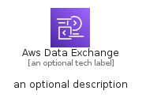
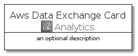
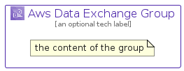

# AwsDataExchange


```text
aws-q1-2022/Architecture/Analytics/AwsDataExchange
```

```text
include('aws-q1-2022/Architecture/Analytics/AwsDataExchange')
```


| Illustration | AwsDataExchange | AwsDataExchangeCard | AwsDataExchangeGroup |
| :---: | :---: | :---: | :---: |
|  |  |  |  |


## AwsDataExchange

### Load remotely
```plantuml
@startuml
' configures the library
!global $LIB_BASE_LOCATION="https://raw.githubusercontent.com/tmorin/plantuml-libs/master/distribution"

' loads the library's bootstrap
!include $LIB_BASE_LOCATION/bootstrap.puml

' loads the package bootstrap
include('aws-q1-2022/bootstrap')

' loads the Item which embeds the element AwsDataExchange
include('aws-q1-2022/Architecture/Analytics/AwsDataExchange')

' renders the element
AwsDataExchange('AwsDataExchange', 'Aws Data Exchange', 'an optional tech label', 'an optional description')
@enduml
```

### Load locally
```plantuml
@startuml
' configures the library
!global $INCLUSION_MODE="local"
!global $LIB_BASE_LOCATION="../../.."

' loads the library's bootstrap
!include $LIB_BASE_LOCATION/bootstrap.puml

' loads the package bootstrap
include('aws-q1-2022/bootstrap')

' loads the Item which embeds the element AwsDataExchange
include('aws-q1-2022/Architecture/Analytics/AwsDataExchange')

' renders the element
AwsDataExchange('AwsDataExchange', 'Aws Data Exchange', 'an optional tech label', 'an optional description')
@enduml
```

## AwsDataExchangeCard

### Load remotely
```plantuml
@startuml
' configures the library
!global $LIB_BASE_LOCATION="https://raw.githubusercontent.com/tmorin/plantuml-libs/master/distribution"

' loads the library's bootstrap
!include $LIB_BASE_LOCATION/bootstrap.puml

' loads the package bootstrap
include('aws-q1-2022/bootstrap')

' loads the Item which embeds the element AwsDataExchangeCard
include('aws-q1-2022/Architecture/Analytics/AwsDataExchange')

' renders the element
AwsDataExchangeCard('AwsDataExchangeCard', 'Aws Data Exchange Card', 'an optional description')
@enduml
```

### Load locally
```plantuml
@startuml
' configures the library
!global $INCLUSION_MODE="local"
!global $LIB_BASE_LOCATION="../../.."

' loads the library's bootstrap
!include $LIB_BASE_LOCATION/bootstrap.puml

' loads the package bootstrap
include('aws-q1-2022/bootstrap')

' loads the Item which embeds the element AwsDataExchangeCard
include('aws-q1-2022/Architecture/Analytics/AwsDataExchange')

' renders the element
AwsDataExchangeCard('AwsDataExchangeCard', 'Aws Data Exchange Card', 'an optional description')
@enduml
```

## AwsDataExchangeGroup

### Load remotely
```plantuml
@startuml
' configures the library
!global $LIB_BASE_LOCATION="https://raw.githubusercontent.com/tmorin/plantuml-libs/master/distribution"

' loads the library's bootstrap
!include $LIB_BASE_LOCATION/bootstrap.puml

' loads the package bootstrap
include('aws-q1-2022/bootstrap')

' loads the Item which embeds the element AwsDataExchangeGroup
include('aws-q1-2022/Architecture/Analytics/AwsDataExchange')

' renders the element
AwsDataExchangeGroup('AwsDataExchangeGroup', 'Aws Data Exchange Group', 'an optional tech label') {
    note as note
        the content of the group
    end note
}
@enduml
```

### Load locally
```plantuml
@startuml
' configures the library
!global $INCLUSION_MODE="local"
!global $LIB_BASE_LOCATION="../../.."

' loads the library's bootstrap
!include $LIB_BASE_LOCATION/bootstrap.puml

' loads the package bootstrap
include('aws-q1-2022/bootstrap')

' loads the Item which embeds the element AwsDataExchangeGroup
include('aws-q1-2022/Architecture/Analytics/AwsDataExchange')

' renders the element
AwsDataExchangeGroup('AwsDataExchangeGroup', 'Aws Data Exchange Group', 'an optional tech label') {
    note as note
        the content of the group
    end note
}
@enduml
```

