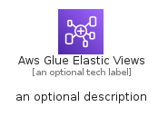
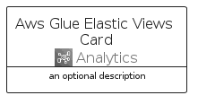
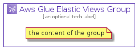

# AwsGlueElasticViews


```text
aws-q1-2022/Architecture/Analytics/AwsGlueElasticViews
```

```text
include('aws-q1-2022/Architecture/Analytics/AwsGlueElasticViews')
```


| Illustration | AwsGlueElasticViews | AwsGlueElasticViewsCard | AwsGlueElasticViewsGroup |
| :---: | :---: | :---: | :---: |
|  |  |  |  |


## AwsGlueElasticViews

### Load remotely
```plantuml
@startuml
' configures the library
!global $LIB_BASE_LOCATION="https://raw.githubusercontent.com/tmorin/plantuml-libs/master/distribution"

' loads the library's bootstrap
!include $LIB_BASE_LOCATION/bootstrap.puml

' loads the package bootstrap
include('aws-q1-2022/bootstrap')

' loads the Item which embeds the element AwsGlueElasticViews
include('aws-q1-2022/Architecture/Analytics/AwsGlueElasticViews')

' renders the element
AwsGlueElasticViews('AwsGlueElasticViews', 'Aws Glue Elastic Views', 'an optional tech label')
@enduml
```

### Load locally
```plantuml
@startuml
' configures the library
!global $INCLUSION_MODE="local"
!global $LIB_BASE_LOCATION="../../.."

' loads the library's bootstrap
!include $LIB_BASE_LOCATION/bootstrap.puml

' loads the package bootstrap
include('aws-q1-2022/bootstrap')

' loads the Item which embeds the element AwsGlueElasticViews
include('aws-q1-2022/Architecture/Analytics/AwsGlueElasticViews')

' renders the element
AwsGlueElasticViews('AwsGlueElasticViews', 'Aws Glue Elastic Views', 'an optional tech label')
@enduml
```

## AwsGlueElasticViewsCard

### Load remotely
```plantuml
@startuml
' configures the library
!global $LIB_BASE_LOCATION="https://raw.githubusercontent.com/tmorin/plantuml-libs/master/distribution"

' loads the library's bootstrap
!include $LIB_BASE_LOCATION/bootstrap.puml

' loads the package bootstrap
include('aws-q1-2022/bootstrap')

' loads the Item which embeds the element AwsGlueElasticViewsCard
include('aws-q1-2022/Architecture/Analytics/AwsGlueElasticViews')

' renders the element
AwsGlueElasticViewsCard('AwsGlueElasticViewsCard', 'Aws Glue Elastic Views Card', 'an optional description')
@enduml
```

### Load locally
```plantuml
@startuml
' configures the library
!global $INCLUSION_MODE="local"
!global $LIB_BASE_LOCATION="../../.."

' loads the library's bootstrap
!include $LIB_BASE_LOCATION/bootstrap.puml

' loads the package bootstrap
include('aws-q1-2022/bootstrap')

' loads the Item which embeds the element AwsGlueElasticViewsCard
include('aws-q1-2022/Architecture/Analytics/AwsGlueElasticViews')

' renders the element
AwsGlueElasticViewsCard('AwsGlueElasticViewsCard', 'Aws Glue Elastic Views Card', 'an optional description')
@enduml
```

## AwsGlueElasticViewsGroup

### Load remotely
```plantuml
@startuml
' configures the library
!global $LIB_BASE_LOCATION="https://raw.githubusercontent.com/tmorin/plantuml-libs/master/distribution"

' loads the library's bootstrap
!include $LIB_BASE_LOCATION/bootstrap.puml

' loads the package bootstrap
include('aws-q1-2022/bootstrap')

' loads the Item which embeds the element AwsGlueElasticViewsGroup
include('aws-q1-2022/Architecture/Analytics/AwsGlueElasticViews')

' renders the element
AwsGlueElasticViewsGroup('AwsGlueElasticViewsGroup', 'Aws Glue Elastic Views Group', 'an optional tech label') {
    note as note
        the content of the group
    end note
}
@enduml
```

### Load locally
```plantuml
@startuml
' configures the library
!global $INCLUSION_MODE="local"
!global $LIB_BASE_LOCATION="../../.."

' loads the library's bootstrap
!include $LIB_BASE_LOCATION/bootstrap.puml

' loads the package bootstrap
include('aws-q1-2022/bootstrap')

' loads the Item which embeds the element AwsGlueElasticViewsGroup
include('aws-q1-2022/Architecture/Analytics/AwsGlueElasticViews')

' renders the element
AwsGlueElasticViewsGroup('AwsGlueElasticViewsGroup', 'Aws Glue Elastic Views Group', 'an optional tech label') {
    note as note
        the content of the group
    end note
}
@enduml
```

