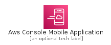
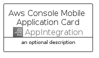

# AwsConsoleMobileApplication


```text
aws-q1-2022/Architecture/AppIntegration/AwsConsoleMobileApplication
```

```text
include('aws-q1-2022/Architecture/AppIntegration/AwsConsoleMobileApplication')
```


| Illustration | AwsConsoleMobileApplication | AwsConsoleMobileApplicationCard | AwsConsoleMobileApplicationGroup |
| :---: | :---: | :---: | :---: |
|  |  |  |  |


## AwsConsoleMobileApplication

### Load remotely
```plantuml
@startuml
' configures the library
!global $LIB_BASE_LOCATION="https://raw.githubusercontent.com/tmorin/plantuml-libs/master/distribution"

' loads the library's bootstrap
!include $LIB_BASE_LOCATION/bootstrap.puml

' loads the package bootstrap
include('aws-q1-2022/bootstrap')

' loads the Item which embeds the element AwsConsoleMobileApplication
include('aws-q1-2022/Architecture/AppIntegration/AwsConsoleMobileApplication')

' renders the element
AwsConsoleMobileApplication('AwsConsoleMobileApplication', 'Aws Console Mobile Application', 'an optional tech label', 'an optional description')
@enduml
```

### Load locally
```plantuml
@startuml
' configures the library
!global $INCLUSION_MODE="local"
!global $LIB_BASE_LOCATION="../../.."

' loads the library's bootstrap
!include $LIB_BASE_LOCATION/bootstrap.puml

' loads the package bootstrap
include('aws-q1-2022/bootstrap')

' loads the Item which embeds the element AwsConsoleMobileApplication
include('aws-q1-2022/Architecture/AppIntegration/AwsConsoleMobileApplication')

' renders the element
AwsConsoleMobileApplication('AwsConsoleMobileApplication', 'Aws Console Mobile Application', 'an optional tech label', 'an optional description')
@enduml
```

## AwsConsoleMobileApplicationCard

### Load remotely
```plantuml
@startuml
' configures the library
!global $LIB_BASE_LOCATION="https://raw.githubusercontent.com/tmorin/plantuml-libs/master/distribution"

' loads the library's bootstrap
!include $LIB_BASE_LOCATION/bootstrap.puml

' loads the package bootstrap
include('aws-q1-2022/bootstrap')

' loads the Item which embeds the element AwsConsoleMobileApplicationCard
include('aws-q1-2022/Architecture/AppIntegration/AwsConsoleMobileApplication')

' renders the element
AwsConsoleMobileApplicationCard('AwsConsoleMobileApplicationCard', 'Aws Console Mobile Application Card', 'an optional description')
@enduml
```

### Load locally
```plantuml
@startuml
' configures the library
!global $INCLUSION_MODE="local"
!global $LIB_BASE_LOCATION="../../.."

' loads the library's bootstrap
!include $LIB_BASE_LOCATION/bootstrap.puml

' loads the package bootstrap
include('aws-q1-2022/bootstrap')

' loads the Item which embeds the element AwsConsoleMobileApplicationCard
include('aws-q1-2022/Architecture/AppIntegration/AwsConsoleMobileApplication')

' renders the element
AwsConsoleMobileApplicationCard('AwsConsoleMobileApplicationCard', 'Aws Console Mobile Application Card', 'an optional description')
@enduml
```

## AwsConsoleMobileApplicationGroup

### Load remotely
```plantuml
@startuml
' configures the library
!global $LIB_BASE_LOCATION="https://raw.githubusercontent.com/tmorin/plantuml-libs/master/distribution"

' loads the library's bootstrap
!include $LIB_BASE_LOCATION/bootstrap.puml

' loads the package bootstrap
include('aws-q1-2022/bootstrap')

' loads the Item which embeds the element AwsConsoleMobileApplicationGroup
include('aws-q1-2022/Architecture/AppIntegration/AwsConsoleMobileApplication')

' renders the element
AwsConsoleMobileApplicationGroup('AwsConsoleMobileApplicationGroup', 'Aws Console Mobile Application Group', 'an optional tech label') {
    note as note
        the content of the group
    end note
}
@enduml
```

### Load locally
```plantuml
@startuml
' configures the library
!global $INCLUSION_MODE="local"
!global $LIB_BASE_LOCATION="../../.."

' loads the library's bootstrap
!include $LIB_BASE_LOCATION/bootstrap.puml

' loads the package bootstrap
include('aws-q1-2022/bootstrap')

' loads the Item which embeds the element AwsConsoleMobileApplicationGroup
include('aws-q1-2022/Architecture/AppIntegration/AwsConsoleMobileApplication')

' renders the element
AwsConsoleMobileApplicationGroup('AwsConsoleMobileApplicationGroup', 'Aws Console Mobile Application Group', 'an optional tech label') {
    note as note
        the content of the group
    end note
}
@enduml
```

