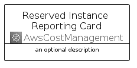
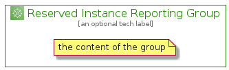

# ReservedInstanceReporting


```text
aws-q1-2022/Architecture/AwsCostManagement/ReservedInstanceReporting
```

```text
include('aws-q1-2022/Architecture/AwsCostManagement/ReservedInstanceReporting')
```


| Illustration | ReservedInstanceReporting | ReservedInstanceReportingCard | ReservedInstanceReportingGroup |
| :---: | :---: | :---: | :---: |
|  |  |  |  |


## ReservedInstanceReporting

### Load remotely
```plantuml
@startuml
' configures the library
!global $LIB_BASE_LOCATION="https://raw.githubusercontent.com/tmorin/plantuml-libs/master/distribution"

' loads the library's bootstrap
!include $LIB_BASE_LOCATION/bootstrap.puml

' loads the package bootstrap
include('aws-q1-2022/bootstrap')

' loads the Item which embeds the element ReservedInstanceReporting
include('aws-q1-2022/Architecture/AwsCostManagement/ReservedInstanceReporting')

' renders the element
ReservedInstanceReporting('ReservedInstanceReporting', 'Reserved Instance Reporting', 'an optional tech label')
@enduml
```

### Load locally
```plantuml
@startuml
' configures the library
!global $INCLUSION_MODE="local"
!global $LIB_BASE_LOCATION="../../.."

' loads the library's bootstrap
!include $LIB_BASE_LOCATION/bootstrap.puml

' loads the package bootstrap
include('aws-q1-2022/bootstrap')

' loads the Item which embeds the element ReservedInstanceReporting
include('aws-q1-2022/Architecture/AwsCostManagement/ReservedInstanceReporting')

' renders the element
ReservedInstanceReporting('ReservedInstanceReporting', 'Reserved Instance Reporting', 'an optional tech label')
@enduml
```

## ReservedInstanceReportingCard

### Load remotely
```plantuml
@startuml
' configures the library
!global $LIB_BASE_LOCATION="https://raw.githubusercontent.com/tmorin/plantuml-libs/master/distribution"

' loads the library's bootstrap
!include $LIB_BASE_LOCATION/bootstrap.puml

' loads the package bootstrap
include('aws-q1-2022/bootstrap')

' loads the Item which embeds the element ReservedInstanceReportingCard
include('aws-q1-2022/Architecture/AwsCostManagement/ReservedInstanceReporting')

' renders the element
ReservedInstanceReportingCard('ReservedInstanceReportingCard', 'Reserved Instance Reporting Card', 'an optional description')
@enduml
```

### Load locally
```plantuml
@startuml
' configures the library
!global $INCLUSION_MODE="local"
!global $LIB_BASE_LOCATION="../../.."

' loads the library's bootstrap
!include $LIB_BASE_LOCATION/bootstrap.puml

' loads the package bootstrap
include('aws-q1-2022/bootstrap')

' loads the Item which embeds the element ReservedInstanceReportingCard
include('aws-q1-2022/Architecture/AwsCostManagement/ReservedInstanceReporting')

' renders the element
ReservedInstanceReportingCard('ReservedInstanceReportingCard', 'Reserved Instance Reporting Card', 'an optional description')
@enduml
```

## ReservedInstanceReportingGroup

### Load remotely
```plantuml
@startuml
' configures the library
!global $LIB_BASE_LOCATION="https://raw.githubusercontent.com/tmorin/plantuml-libs/master/distribution"

' loads the library's bootstrap
!include $LIB_BASE_LOCATION/bootstrap.puml

' loads the package bootstrap
include('aws-q1-2022/bootstrap')

' loads the Item which embeds the element ReservedInstanceReportingGroup
include('aws-q1-2022/Architecture/AwsCostManagement/ReservedInstanceReporting')

' renders the element
ReservedInstanceReportingGroup('ReservedInstanceReportingGroup', 'Reserved Instance Reporting Group', 'an optional tech label') {
    note as note
        the content of the group
    end note
}
@enduml
```

### Load locally
```plantuml
@startuml
' configures the library
!global $INCLUSION_MODE="local"
!global $LIB_BASE_LOCATION="../../.."

' loads the library's bootstrap
!include $LIB_BASE_LOCATION/bootstrap.puml

' loads the package bootstrap
include('aws-q1-2022/bootstrap')

' loads the Item which embeds the element ReservedInstanceReportingGroup
include('aws-q1-2022/Architecture/AwsCostManagement/ReservedInstanceReporting')

' renders the element
ReservedInstanceReportingGroup('ReservedInstanceReportingGroup', 'Reserved Instance Reporting Group', 'an optional tech label') {
    note as note
        the content of the group
    end note
}
@enduml
```

