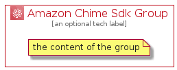

# AmazonChimeSdk


```text
aws-q1-2022/Architecture/BusinessApplications/AmazonChimeSdk
```

```text
include('aws-q1-2022/Architecture/BusinessApplications/AmazonChimeSdk')
```


| Illustration | AmazonChimeSdk | AmazonChimeSdkCard | AmazonChimeSdkGroup |
| :---: | :---: | :---: | :---: |
|  |  |  |  |


## AmazonChimeSdk

### Load remotely
```plantuml
@startuml
' configures the library
!global $LIB_BASE_LOCATION="https://raw.githubusercontent.com/tmorin/plantuml-libs/master/distribution"

' loads the library's bootstrap
!include $LIB_BASE_LOCATION/bootstrap.puml

' loads the package bootstrap
include('aws-q1-2022/bootstrap')

' loads the Item which embeds the element AmazonChimeSdk
include('aws-q1-2022/Architecture/BusinessApplications/AmazonChimeSdk')

' renders the element
AmazonChimeSdk('AmazonChimeSdk', 'Amazon Chime Sdk', 'an optional tech label')
@enduml
```

### Load locally
```plantuml
@startuml
' configures the library
!global $INCLUSION_MODE="local"
!global $LIB_BASE_LOCATION="../../.."

' loads the library's bootstrap
!include $LIB_BASE_LOCATION/bootstrap.puml

' loads the package bootstrap
include('aws-q1-2022/bootstrap')

' loads the Item which embeds the element AmazonChimeSdk
include('aws-q1-2022/Architecture/BusinessApplications/AmazonChimeSdk')

' renders the element
AmazonChimeSdk('AmazonChimeSdk', 'Amazon Chime Sdk', 'an optional tech label')
@enduml
```

## AmazonChimeSdkCard

### Load remotely
```plantuml
@startuml
' configures the library
!global $LIB_BASE_LOCATION="https://raw.githubusercontent.com/tmorin/plantuml-libs/master/distribution"

' loads the library's bootstrap
!include $LIB_BASE_LOCATION/bootstrap.puml

' loads the package bootstrap
include('aws-q1-2022/bootstrap')

' loads the Item which embeds the element AmazonChimeSdkCard
include('aws-q1-2022/Architecture/BusinessApplications/AmazonChimeSdk')

' renders the element
AmazonChimeSdkCard('AmazonChimeSdkCard', 'Amazon Chime Sdk Card', 'an optional description')
@enduml
```

### Load locally
```plantuml
@startuml
' configures the library
!global $INCLUSION_MODE="local"
!global $LIB_BASE_LOCATION="../../.."

' loads the library's bootstrap
!include $LIB_BASE_LOCATION/bootstrap.puml

' loads the package bootstrap
include('aws-q1-2022/bootstrap')

' loads the Item which embeds the element AmazonChimeSdkCard
include('aws-q1-2022/Architecture/BusinessApplications/AmazonChimeSdk')

' renders the element
AmazonChimeSdkCard('AmazonChimeSdkCard', 'Amazon Chime Sdk Card', 'an optional description')
@enduml
```

## AmazonChimeSdkGroup

### Load remotely
```plantuml
@startuml
' configures the library
!global $LIB_BASE_LOCATION="https://raw.githubusercontent.com/tmorin/plantuml-libs/master/distribution"

' loads the library's bootstrap
!include $LIB_BASE_LOCATION/bootstrap.puml

' loads the package bootstrap
include('aws-q1-2022/bootstrap')

' loads the Item which embeds the element AmazonChimeSdkGroup
include('aws-q1-2022/Architecture/BusinessApplications/AmazonChimeSdk')

' renders the element
AmazonChimeSdkGroup('AmazonChimeSdkGroup', 'Amazon Chime Sdk Group', 'an optional tech label') {
    note as note
        the content of the group
    end note
}
@enduml
```

### Load locally
```plantuml
@startuml
' configures the library
!global $INCLUSION_MODE="local"
!global $LIB_BASE_LOCATION="../../.."

' loads the library's bootstrap
!include $LIB_BASE_LOCATION/bootstrap.puml

' loads the package bootstrap
include('aws-q1-2022/bootstrap')

' loads the Item which embeds the element AmazonChimeSdkGroup
include('aws-q1-2022/Architecture/BusinessApplications/AmazonChimeSdk')

' renders the element
AmazonChimeSdkGroup('AmazonChimeSdkGroup', 'Amazon Chime Sdk Group', 'an optional tech label') {
    note as note
        the content of the group
    end note
}
@enduml
```

