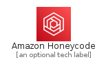
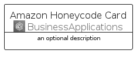
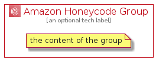

# AmazonHoneycode


```text
aws-q1-2022/Architecture/BusinessApplications/AmazonHoneycode
```

```text
include('aws-q1-2022/Architecture/BusinessApplications/AmazonHoneycode')
```


| Illustration | AmazonHoneycode | AmazonHoneycodeCard | AmazonHoneycodeGroup |
| :---: | :---: | :---: | :---: |
|  |  |  |  |


## AmazonHoneycode

### Load remotely
```plantuml
@startuml
' configures the library
!global $LIB_BASE_LOCATION="https://raw.githubusercontent.com/tmorin/plantuml-libs/master/distribution"

' loads the library's bootstrap
!include $LIB_BASE_LOCATION/bootstrap.puml

' loads the package bootstrap
include('aws-q1-2022/bootstrap')

' loads the Item which embeds the element AmazonHoneycode
include('aws-q1-2022/Architecture/BusinessApplications/AmazonHoneycode')

' renders the element
AmazonHoneycode('AmazonHoneycode', 'Amazon Honeycode', 'an optional tech label', 'an optional description')
@enduml
```

### Load locally
```plantuml
@startuml
' configures the library
!global $INCLUSION_MODE="local"
!global $LIB_BASE_LOCATION="../../.."

' loads the library's bootstrap
!include $LIB_BASE_LOCATION/bootstrap.puml

' loads the package bootstrap
include('aws-q1-2022/bootstrap')

' loads the Item which embeds the element AmazonHoneycode
include('aws-q1-2022/Architecture/BusinessApplications/AmazonHoneycode')

' renders the element
AmazonHoneycode('AmazonHoneycode', 'Amazon Honeycode', 'an optional tech label', 'an optional description')
@enduml
```

## AmazonHoneycodeCard

### Load remotely
```plantuml
@startuml
' configures the library
!global $LIB_BASE_LOCATION="https://raw.githubusercontent.com/tmorin/plantuml-libs/master/distribution"

' loads the library's bootstrap
!include $LIB_BASE_LOCATION/bootstrap.puml

' loads the package bootstrap
include('aws-q1-2022/bootstrap')

' loads the Item which embeds the element AmazonHoneycodeCard
include('aws-q1-2022/Architecture/BusinessApplications/AmazonHoneycode')

' renders the element
AmazonHoneycodeCard('AmazonHoneycodeCard', 'Amazon Honeycode Card', 'an optional description')
@enduml
```

### Load locally
```plantuml
@startuml
' configures the library
!global $INCLUSION_MODE="local"
!global $LIB_BASE_LOCATION="../../.."

' loads the library's bootstrap
!include $LIB_BASE_LOCATION/bootstrap.puml

' loads the package bootstrap
include('aws-q1-2022/bootstrap')

' loads the Item which embeds the element AmazonHoneycodeCard
include('aws-q1-2022/Architecture/BusinessApplications/AmazonHoneycode')

' renders the element
AmazonHoneycodeCard('AmazonHoneycodeCard', 'Amazon Honeycode Card', 'an optional description')
@enduml
```

## AmazonHoneycodeGroup

### Load remotely
```plantuml
@startuml
' configures the library
!global $LIB_BASE_LOCATION="https://raw.githubusercontent.com/tmorin/plantuml-libs/master/distribution"

' loads the library's bootstrap
!include $LIB_BASE_LOCATION/bootstrap.puml

' loads the package bootstrap
include('aws-q1-2022/bootstrap')

' loads the Item which embeds the element AmazonHoneycodeGroup
include('aws-q1-2022/Architecture/BusinessApplications/AmazonHoneycode')

' renders the element
AmazonHoneycodeGroup('AmazonHoneycodeGroup', 'Amazon Honeycode Group', 'an optional tech label') {
    note as note
        the content of the group
    end note
}
@enduml
```

### Load locally
```plantuml
@startuml
' configures the library
!global $INCLUSION_MODE="local"
!global $LIB_BASE_LOCATION="../../.."

' loads the library's bootstrap
!include $LIB_BASE_LOCATION/bootstrap.puml

' loads the package bootstrap
include('aws-q1-2022/bootstrap')

' loads the Item which embeds the element AmazonHoneycodeGroup
include('aws-q1-2022/Architecture/BusinessApplications/AmazonHoneycode')

' renders the element
AmazonHoneycodeGroup('AmazonHoneycodeGroup', 'Amazon Honeycode Group', 'an optional tech label') {
    note as note
        the content of the group
    end note
}
@enduml
```

