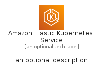
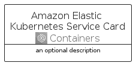

# AmazonElasticKubernetesService


```text
aws-q1-2022/Architecture/Containers/AmazonElasticKubernetesService
```

```text
include('aws-q1-2022/Architecture/Containers/AmazonElasticKubernetesService')
```


| Illustration | AmazonElasticKubernetesService | AmazonElasticKubernetesServiceCard | AmazonElasticKubernetesServiceGroup |
| :---: | :---: | :---: | :---: |
|  |  |  |  |


## AmazonElasticKubernetesService

### Load remotely
```plantuml
@startuml
' configures the library
!global $LIB_BASE_LOCATION="https://raw.githubusercontent.com/tmorin/plantuml-libs/master/distribution"

' loads the library's bootstrap
!include $LIB_BASE_LOCATION/bootstrap.puml

' loads the package bootstrap
include('aws-q1-2022/bootstrap')

' loads the Item which embeds the element AmazonElasticKubernetesService
include('aws-q1-2022/Architecture/Containers/AmazonElasticKubernetesService')

' renders the element
AmazonElasticKubernetesService('AmazonElasticKubernetesService', 'Amazon Elastic Kubernetes Service', 'an optional tech label')
@enduml
```

### Load locally
```plantuml
@startuml
' configures the library
!global $INCLUSION_MODE="local"
!global $LIB_BASE_LOCATION="../../.."

' loads the library's bootstrap
!include $LIB_BASE_LOCATION/bootstrap.puml

' loads the package bootstrap
include('aws-q1-2022/bootstrap')

' loads the Item which embeds the element AmazonElasticKubernetesService
include('aws-q1-2022/Architecture/Containers/AmazonElasticKubernetesService')

' renders the element
AmazonElasticKubernetesService('AmazonElasticKubernetesService', 'Amazon Elastic Kubernetes Service', 'an optional tech label')
@enduml
```

## AmazonElasticKubernetesServiceCard

### Load remotely
```plantuml
@startuml
' configures the library
!global $LIB_BASE_LOCATION="https://raw.githubusercontent.com/tmorin/plantuml-libs/master/distribution"

' loads the library's bootstrap
!include $LIB_BASE_LOCATION/bootstrap.puml

' loads the package bootstrap
include('aws-q1-2022/bootstrap')

' loads the Item which embeds the element AmazonElasticKubernetesServiceCard
include('aws-q1-2022/Architecture/Containers/AmazonElasticKubernetesService')

' renders the element
AmazonElasticKubernetesServiceCard('AmazonElasticKubernetesServiceCard', 'Amazon Elastic Kubernetes Service Card', 'an optional description')
@enduml
```

### Load locally
```plantuml
@startuml
' configures the library
!global $INCLUSION_MODE="local"
!global $LIB_BASE_LOCATION="../../.."

' loads the library's bootstrap
!include $LIB_BASE_LOCATION/bootstrap.puml

' loads the package bootstrap
include('aws-q1-2022/bootstrap')

' loads the Item which embeds the element AmazonElasticKubernetesServiceCard
include('aws-q1-2022/Architecture/Containers/AmazonElasticKubernetesService')

' renders the element
AmazonElasticKubernetesServiceCard('AmazonElasticKubernetesServiceCard', 'Amazon Elastic Kubernetes Service Card', 'an optional description')
@enduml
```

## AmazonElasticKubernetesServiceGroup

### Load remotely
```plantuml
@startuml
' configures the library
!global $LIB_BASE_LOCATION="https://raw.githubusercontent.com/tmorin/plantuml-libs/master/distribution"

' loads the library's bootstrap
!include $LIB_BASE_LOCATION/bootstrap.puml

' loads the package bootstrap
include('aws-q1-2022/bootstrap')

' loads the Item which embeds the element AmazonElasticKubernetesServiceGroup
include('aws-q1-2022/Architecture/Containers/AmazonElasticKubernetesService')

' renders the element
AmazonElasticKubernetesServiceGroup('AmazonElasticKubernetesServiceGroup', 'Amazon Elastic Kubernetes Service Group', 'an optional tech label') {
    note as note
        the content of the group
    end note
}
@enduml
```

### Load locally
```plantuml
@startuml
' configures the library
!global $INCLUSION_MODE="local"
!global $LIB_BASE_LOCATION="../../.."

' loads the library's bootstrap
!include $LIB_BASE_LOCATION/bootstrap.puml

' loads the package bootstrap
include('aws-q1-2022/bootstrap')

' loads the Item which embeds the element AmazonElasticKubernetesServiceGroup
include('aws-q1-2022/Architecture/Containers/AmazonElasticKubernetesService')

' renders the element
AmazonElasticKubernetesServiceGroup('AmazonElasticKubernetesServiceGroup', 'Amazon Elastic Kubernetes Service Group', 'an optional tech label') {
    note as note
        the content of the group
    end note
}
@enduml
```

