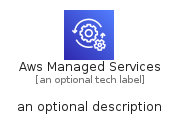
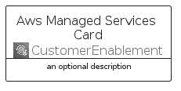
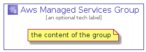

# AwsManagedServices


```text
aws-q1-2022/Architecture/CustomerEnablement/AwsManagedServices
```

```text
include('aws-q1-2022/Architecture/CustomerEnablement/AwsManagedServices')
```


| Illustration | AwsManagedServices | AwsManagedServicesCard | AwsManagedServicesGroup |
| :---: | :---: | :---: | :---: |
|  |  |  |  |


## AwsManagedServices

### Load remotely
```plantuml
@startuml
' configures the library
!global $LIB_BASE_LOCATION="https://raw.githubusercontent.com/tmorin/plantuml-libs/master/distribution"

' loads the library's bootstrap
!include $LIB_BASE_LOCATION/bootstrap.puml

' loads the package bootstrap
include('aws-q1-2022/bootstrap')

' loads the Item which embeds the element AwsManagedServices
include('aws-q1-2022/Architecture/CustomerEnablement/AwsManagedServices')

' renders the element
AwsManagedServices('AwsManagedServices', 'Aws Managed Services', 'an optional tech label', 'an optional description')
@enduml
```

### Load locally
```plantuml
@startuml
' configures the library
!global $INCLUSION_MODE="local"
!global $LIB_BASE_LOCATION="../../.."

' loads the library's bootstrap
!include $LIB_BASE_LOCATION/bootstrap.puml

' loads the package bootstrap
include('aws-q1-2022/bootstrap')

' loads the Item which embeds the element AwsManagedServices
include('aws-q1-2022/Architecture/CustomerEnablement/AwsManagedServices')

' renders the element
AwsManagedServices('AwsManagedServices', 'Aws Managed Services', 'an optional tech label', 'an optional description')
@enduml
```

## AwsManagedServicesCard

### Load remotely
```plantuml
@startuml
' configures the library
!global $LIB_BASE_LOCATION="https://raw.githubusercontent.com/tmorin/plantuml-libs/master/distribution"

' loads the library's bootstrap
!include $LIB_BASE_LOCATION/bootstrap.puml

' loads the package bootstrap
include('aws-q1-2022/bootstrap')

' loads the Item which embeds the element AwsManagedServicesCard
include('aws-q1-2022/Architecture/CustomerEnablement/AwsManagedServices')

' renders the element
AwsManagedServicesCard('AwsManagedServicesCard', 'Aws Managed Services Card', 'an optional description')
@enduml
```

### Load locally
```plantuml
@startuml
' configures the library
!global $INCLUSION_MODE="local"
!global $LIB_BASE_LOCATION="../../.."

' loads the library's bootstrap
!include $LIB_BASE_LOCATION/bootstrap.puml

' loads the package bootstrap
include('aws-q1-2022/bootstrap')

' loads the Item which embeds the element AwsManagedServicesCard
include('aws-q1-2022/Architecture/CustomerEnablement/AwsManagedServices')

' renders the element
AwsManagedServicesCard('AwsManagedServicesCard', 'Aws Managed Services Card', 'an optional description')
@enduml
```

## AwsManagedServicesGroup

### Load remotely
```plantuml
@startuml
' configures the library
!global $LIB_BASE_LOCATION="https://raw.githubusercontent.com/tmorin/plantuml-libs/master/distribution"

' loads the library's bootstrap
!include $LIB_BASE_LOCATION/bootstrap.puml

' loads the package bootstrap
include('aws-q1-2022/bootstrap')

' loads the Item which embeds the element AwsManagedServicesGroup
include('aws-q1-2022/Architecture/CustomerEnablement/AwsManagedServices')

' renders the element
AwsManagedServicesGroup('AwsManagedServicesGroup', 'Aws Managed Services Group', 'an optional tech label') {
    note as note
        the content of the group
    end note
}
@enduml
```

### Load locally
```plantuml
@startuml
' configures the library
!global $INCLUSION_MODE="local"
!global $LIB_BASE_LOCATION="../../.."

' loads the library's bootstrap
!include $LIB_BASE_LOCATION/bootstrap.puml

' loads the package bootstrap
include('aws-q1-2022/bootstrap')

' loads the Item which embeds the element AwsManagedServicesGroup
include('aws-q1-2022/Architecture/CustomerEnablement/AwsManagedServices')

' renders the element
AwsManagedServicesGroup('AwsManagedServicesGroup', 'Aws Managed Services Group', 'an optional tech label') {
    note as note
        the content of the group
    end note
}
@enduml
```

