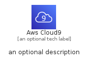
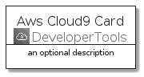
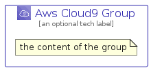

# AwsCloud9


```text
aws-q1-2022/Architecture/DeveloperTools/AwsCloud9
```

```text
include('aws-q1-2022/Architecture/DeveloperTools/AwsCloud9')
```


| Illustration | AwsCloud9 | AwsCloud9Card | AwsCloud9Group |
| :---: | :---: | :---: | :---: |
|  |  |  |  |


## AwsCloud9

### Load remotely
```plantuml
@startuml
' configures the library
!global $LIB_BASE_LOCATION="https://raw.githubusercontent.com/tmorin/plantuml-libs/master/distribution"

' loads the library's bootstrap
!include $LIB_BASE_LOCATION/bootstrap.puml

' loads the package bootstrap
include('aws-q1-2022/bootstrap')

' loads the Item which embeds the element AwsCloud9
include('aws-q1-2022/Architecture/DeveloperTools/AwsCloud9')

' renders the element
AwsCloud9('AwsCloud9', 'Aws Cloud9', 'an optional tech label', 'an optional description')
@enduml
```

### Load locally
```plantuml
@startuml
' configures the library
!global $INCLUSION_MODE="local"
!global $LIB_BASE_LOCATION="../../.."

' loads the library's bootstrap
!include $LIB_BASE_LOCATION/bootstrap.puml

' loads the package bootstrap
include('aws-q1-2022/bootstrap')

' loads the Item which embeds the element AwsCloud9
include('aws-q1-2022/Architecture/DeveloperTools/AwsCloud9')

' renders the element
AwsCloud9('AwsCloud9', 'Aws Cloud9', 'an optional tech label', 'an optional description')
@enduml
```

## AwsCloud9Card

### Load remotely
```plantuml
@startuml
' configures the library
!global $LIB_BASE_LOCATION="https://raw.githubusercontent.com/tmorin/plantuml-libs/master/distribution"

' loads the library's bootstrap
!include $LIB_BASE_LOCATION/bootstrap.puml

' loads the package bootstrap
include('aws-q1-2022/bootstrap')

' loads the Item which embeds the element AwsCloud9Card
include('aws-q1-2022/Architecture/DeveloperTools/AwsCloud9')

' renders the element
AwsCloud9Card('AwsCloud9Card', 'Aws Cloud9 Card', 'an optional description')
@enduml
```

### Load locally
```plantuml
@startuml
' configures the library
!global $INCLUSION_MODE="local"
!global $LIB_BASE_LOCATION="../../.."

' loads the library's bootstrap
!include $LIB_BASE_LOCATION/bootstrap.puml

' loads the package bootstrap
include('aws-q1-2022/bootstrap')

' loads the Item which embeds the element AwsCloud9Card
include('aws-q1-2022/Architecture/DeveloperTools/AwsCloud9')

' renders the element
AwsCloud9Card('AwsCloud9Card', 'Aws Cloud9 Card', 'an optional description')
@enduml
```

## AwsCloud9Group

### Load remotely
```plantuml
@startuml
' configures the library
!global $LIB_BASE_LOCATION="https://raw.githubusercontent.com/tmorin/plantuml-libs/master/distribution"

' loads the library's bootstrap
!include $LIB_BASE_LOCATION/bootstrap.puml

' loads the package bootstrap
include('aws-q1-2022/bootstrap')

' loads the Item which embeds the element AwsCloud9Group
include('aws-q1-2022/Architecture/DeveloperTools/AwsCloud9')

' renders the element
AwsCloud9Group('AwsCloud9Group', 'Aws Cloud9 Group', 'an optional tech label') {
    note as note
        the content of the group
    end note
}
@enduml
```

### Load locally
```plantuml
@startuml
' configures the library
!global $INCLUSION_MODE="local"
!global $LIB_BASE_LOCATION="../../.."

' loads the library's bootstrap
!include $LIB_BASE_LOCATION/bootstrap.puml

' loads the package bootstrap
include('aws-q1-2022/bootstrap')

' loads the Item which embeds the element AwsCloud9Group
include('aws-q1-2022/Architecture/DeveloperTools/AwsCloud9')

' renders the element
AwsCloud9Group('AwsCloud9Group', 'Aws Cloud9 Group', 'an optional tech label') {
    note as note
        the content of the group
    end note
}
@enduml
```

