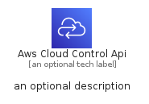
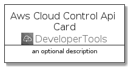
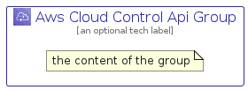

# AwsCloudControlApi


```text
aws-q1-2022/Architecture/DeveloperTools/AwsCloudControlApi
```

```text
include('aws-q1-2022/Architecture/DeveloperTools/AwsCloudControlApi')
```


| Illustration | AwsCloudControlApi | AwsCloudControlApiCard | AwsCloudControlApiGroup |
| :---: | :---: | :---: | :---: |
|  |  |  |  |


## AwsCloudControlApi

### Load remotely
```plantuml
@startuml
' configures the library
!global $LIB_BASE_LOCATION="https://raw.githubusercontent.com/tmorin/plantuml-libs/master/distribution"

' loads the library's bootstrap
!include $LIB_BASE_LOCATION/bootstrap.puml

' loads the package bootstrap
include('aws-q1-2022/bootstrap')

' loads the Item which embeds the element AwsCloudControlApi
include('aws-q1-2022/Architecture/DeveloperTools/AwsCloudControlApi')

' renders the element
AwsCloudControlApi('AwsCloudControlApi', 'Aws Cloud Control Api', 'an optional tech label')
@enduml
```

### Load locally
```plantuml
@startuml
' configures the library
!global $INCLUSION_MODE="local"
!global $LIB_BASE_LOCATION="../../.."

' loads the library's bootstrap
!include $LIB_BASE_LOCATION/bootstrap.puml

' loads the package bootstrap
include('aws-q1-2022/bootstrap')

' loads the Item which embeds the element AwsCloudControlApi
include('aws-q1-2022/Architecture/DeveloperTools/AwsCloudControlApi')

' renders the element
AwsCloudControlApi('AwsCloudControlApi', 'Aws Cloud Control Api', 'an optional tech label')
@enduml
```

## AwsCloudControlApiCard

### Load remotely
```plantuml
@startuml
' configures the library
!global $LIB_BASE_LOCATION="https://raw.githubusercontent.com/tmorin/plantuml-libs/master/distribution"

' loads the library's bootstrap
!include $LIB_BASE_LOCATION/bootstrap.puml

' loads the package bootstrap
include('aws-q1-2022/bootstrap')

' loads the Item which embeds the element AwsCloudControlApiCard
include('aws-q1-2022/Architecture/DeveloperTools/AwsCloudControlApi')

' renders the element
AwsCloudControlApiCard('AwsCloudControlApiCard', 'Aws Cloud Control Api Card', 'an optional description')
@enduml
```

### Load locally
```plantuml
@startuml
' configures the library
!global $INCLUSION_MODE="local"
!global $LIB_BASE_LOCATION="../../.."

' loads the library's bootstrap
!include $LIB_BASE_LOCATION/bootstrap.puml

' loads the package bootstrap
include('aws-q1-2022/bootstrap')

' loads the Item which embeds the element AwsCloudControlApiCard
include('aws-q1-2022/Architecture/DeveloperTools/AwsCloudControlApi')

' renders the element
AwsCloudControlApiCard('AwsCloudControlApiCard', 'Aws Cloud Control Api Card', 'an optional description')
@enduml
```

## AwsCloudControlApiGroup

### Load remotely
```plantuml
@startuml
' configures the library
!global $LIB_BASE_LOCATION="https://raw.githubusercontent.com/tmorin/plantuml-libs/master/distribution"

' loads the library's bootstrap
!include $LIB_BASE_LOCATION/bootstrap.puml

' loads the package bootstrap
include('aws-q1-2022/bootstrap')

' loads the Item which embeds the element AwsCloudControlApiGroup
include('aws-q1-2022/Architecture/DeveloperTools/AwsCloudControlApi')

' renders the element
AwsCloudControlApiGroup('AwsCloudControlApiGroup', 'Aws Cloud Control Api Group', 'an optional tech label') {
    note as note
        the content of the group
    end note
}
@enduml
```

### Load locally
```plantuml
@startuml
' configures the library
!global $INCLUSION_MODE="local"
!global $LIB_BASE_LOCATION="../../.."

' loads the library's bootstrap
!include $LIB_BASE_LOCATION/bootstrap.puml

' loads the package bootstrap
include('aws-q1-2022/bootstrap')

' loads the Item which embeds the element AwsCloudControlApiGroup
include('aws-q1-2022/Architecture/DeveloperTools/AwsCloudControlApi')

' renders the element
AwsCloudControlApiGroup('AwsCloudControlApiGroup', 'Aws Cloud Control Api Group', 'an optional tech label') {
    note as note
        the content of the group
    end note
}
@enduml
```

