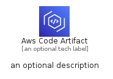
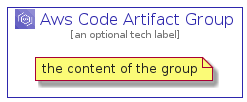

# AwsCodeArtifact


```text
aws-q1-2022/Architecture/DeveloperTools/AwsCodeArtifact
```

```text
include('aws-q1-2022/Architecture/DeveloperTools/AwsCodeArtifact')
```


| Illustration | AwsCodeArtifact | AwsCodeArtifactCard | AwsCodeArtifactGroup |
| :---: | :---: | :---: | :---: |
|  |  |  |  |


## AwsCodeArtifact

### Load remotely
```plantuml
@startuml
' configures the library
!global $LIB_BASE_LOCATION="https://raw.githubusercontent.com/tmorin/plantuml-libs/master/distribution"

' loads the library's bootstrap
!include $LIB_BASE_LOCATION/bootstrap.puml

' loads the package bootstrap
include('aws-q1-2022/bootstrap')

' loads the Item which embeds the element AwsCodeArtifact
include('aws-q1-2022/Architecture/DeveloperTools/AwsCodeArtifact')

' renders the element
AwsCodeArtifact('AwsCodeArtifact', 'Aws Code Artifact', 'an optional tech label', 'an optional description')
@enduml
```

### Load locally
```plantuml
@startuml
' configures the library
!global $INCLUSION_MODE="local"
!global $LIB_BASE_LOCATION="../../.."

' loads the library's bootstrap
!include $LIB_BASE_LOCATION/bootstrap.puml

' loads the package bootstrap
include('aws-q1-2022/bootstrap')

' loads the Item which embeds the element AwsCodeArtifact
include('aws-q1-2022/Architecture/DeveloperTools/AwsCodeArtifact')

' renders the element
AwsCodeArtifact('AwsCodeArtifact', 'Aws Code Artifact', 'an optional tech label', 'an optional description')
@enduml
```

## AwsCodeArtifactCard

### Load remotely
```plantuml
@startuml
' configures the library
!global $LIB_BASE_LOCATION="https://raw.githubusercontent.com/tmorin/plantuml-libs/master/distribution"

' loads the library's bootstrap
!include $LIB_BASE_LOCATION/bootstrap.puml

' loads the package bootstrap
include('aws-q1-2022/bootstrap')

' loads the Item which embeds the element AwsCodeArtifactCard
include('aws-q1-2022/Architecture/DeveloperTools/AwsCodeArtifact')

' renders the element
AwsCodeArtifactCard('AwsCodeArtifactCard', 'Aws Code Artifact Card', 'an optional description')
@enduml
```

### Load locally
```plantuml
@startuml
' configures the library
!global $INCLUSION_MODE="local"
!global $LIB_BASE_LOCATION="../../.."

' loads the library's bootstrap
!include $LIB_BASE_LOCATION/bootstrap.puml

' loads the package bootstrap
include('aws-q1-2022/bootstrap')

' loads the Item which embeds the element AwsCodeArtifactCard
include('aws-q1-2022/Architecture/DeveloperTools/AwsCodeArtifact')

' renders the element
AwsCodeArtifactCard('AwsCodeArtifactCard', 'Aws Code Artifact Card', 'an optional description')
@enduml
```

## AwsCodeArtifactGroup

### Load remotely
```plantuml
@startuml
' configures the library
!global $LIB_BASE_LOCATION="https://raw.githubusercontent.com/tmorin/plantuml-libs/master/distribution"

' loads the library's bootstrap
!include $LIB_BASE_LOCATION/bootstrap.puml

' loads the package bootstrap
include('aws-q1-2022/bootstrap')

' loads the Item which embeds the element AwsCodeArtifactGroup
include('aws-q1-2022/Architecture/DeveloperTools/AwsCodeArtifact')

' renders the element
AwsCodeArtifactGroup('AwsCodeArtifactGroup', 'Aws Code Artifact Group', 'an optional tech label') {
    note as note
        the content of the group
    end note
}
@enduml
```

### Load locally
```plantuml
@startuml
' configures the library
!global $INCLUSION_MODE="local"
!global $LIB_BASE_LOCATION="../../.."

' loads the library's bootstrap
!include $LIB_BASE_LOCATION/bootstrap.puml

' loads the package bootstrap
include('aws-q1-2022/bootstrap')

' loads the Item which embeds the element AwsCodeArtifactGroup
include('aws-q1-2022/Architecture/DeveloperTools/AwsCodeArtifact')

' renders the element
AwsCodeArtifactGroup('AwsCodeArtifactGroup', 'Aws Code Artifact Group', 'an optional tech label') {
    note as note
        the content of the group
    end note
}
@enduml
```

