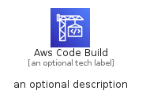
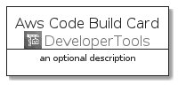
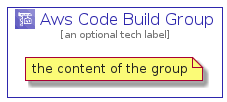

# AwsCodeBuild


```text
aws-q1-2022/Architecture/DeveloperTools/AwsCodeBuild
```

```text
include('aws-q1-2022/Architecture/DeveloperTools/AwsCodeBuild')
```


| Illustration | AwsCodeBuild | AwsCodeBuildCard | AwsCodeBuildGroup |
| :---: | :---: | :---: | :---: |
|  |  |  |  |


## AwsCodeBuild

### Load remotely
```plantuml
@startuml
' configures the library
!global $LIB_BASE_LOCATION="https://raw.githubusercontent.com/tmorin/plantuml-libs/master/distribution"

' loads the library's bootstrap
!include $LIB_BASE_LOCATION/bootstrap.puml

' loads the package bootstrap
include('aws-q1-2022/bootstrap')

' loads the Item which embeds the element AwsCodeBuild
include('aws-q1-2022/Architecture/DeveloperTools/AwsCodeBuild')

' renders the element
AwsCodeBuild('AwsCodeBuild', 'Aws Code Build', 'an optional tech label', 'an optional description')
@enduml
```

### Load locally
```plantuml
@startuml
' configures the library
!global $INCLUSION_MODE="local"
!global $LIB_BASE_LOCATION="../../.."

' loads the library's bootstrap
!include $LIB_BASE_LOCATION/bootstrap.puml

' loads the package bootstrap
include('aws-q1-2022/bootstrap')

' loads the Item which embeds the element AwsCodeBuild
include('aws-q1-2022/Architecture/DeveloperTools/AwsCodeBuild')

' renders the element
AwsCodeBuild('AwsCodeBuild', 'Aws Code Build', 'an optional tech label', 'an optional description')
@enduml
```

## AwsCodeBuildCard

### Load remotely
```plantuml
@startuml
' configures the library
!global $LIB_BASE_LOCATION="https://raw.githubusercontent.com/tmorin/plantuml-libs/master/distribution"

' loads the library's bootstrap
!include $LIB_BASE_LOCATION/bootstrap.puml

' loads the package bootstrap
include('aws-q1-2022/bootstrap')

' loads the Item which embeds the element AwsCodeBuildCard
include('aws-q1-2022/Architecture/DeveloperTools/AwsCodeBuild')

' renders the element
AwsCodeBuildCard('AwsCodeBuildCard', 'Aws Code Build Card', 'an optional description')
@enduml
```

### Load locally
```plantuml
@startuml
' configures the library
!global $INCLUSION_MODE="local"
!global $LIB_BASE_LOCATION="../../.."

' loads the library's bootstrap
!include $LIB_BASE_LOCATION/bootstrap.puml

' loads the package bootstrap
include('aws-q1-2022/bootstrap')

' loads the Item which embeds the element AwsCodeBuildCard
include('aws-q1-2022/Architecture/DeveloperTools/AwsCodeBuild')

' renders the element
AwsCodeBuildCard('AwsCodeBuildCard', 'Aws Code Build Card', 'an optional description')
@enduml
```

## AwsCodeBuildGroup

### Load remotely
```plantuml
@startuml
' configures the library
!global $LIB_BASE_LOCATION="https://raw.githubusercontent.com/tmorin/plantuml-libs/master/distribution"

' loads the library's bootstrap
!include $LIB_BASE_LOCATION/bootstrap.puml

' loads the package bootstrap
include('aws-q1-2022/bootstrap')

' loads the Item which embeds the element AwsCodeBuildGroup
include('aws-q1-2022/Architecture/DeveloperTools/AwsCodeBuild')

' renders the element
AwsCodeBuildGroup('AwsCodeBuildGroup', 'Aws Code Build Group', 'an optional tech label') {
    note as note
        the content of the group
    end note
}
@enduml
```

### Load locally
```plantuml
@startuml
' configures the library
!global $INCLUSION_MODE="local"
!global $LIB_BASE_LOCATION="../../.."

' loads the library's bootstrap
!include $LIB_BASE_LOCATION/bootstrap.puml

' loads the package bootstrap
include('aws-q1-2022/bootstrap')

' loads the Item which embeds the element AwsCodeBuildGroup
include('aws-q1-2022/Architecture/DeveloperTools/AwsCodeBuild')

' renders the element
AwsCodeBuildGroup('AwsCodeBuildGroup', 'Aws Code Build Group', 'an optional tech label') {
    note as note
        the content of the group
    end note
}
@enduml
```

