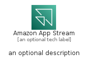
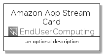
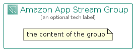

# AmazonAppStream


```text
aws-q1-2022/Architecture/EndUserComputing/AmazonAppStream
```

```text
include('aws-q1-2022/Architecture/EndUserComputing/AmazonAppStream')
```


| Illustration | AmazonAppStream | AmazonAppStreamCard | AmazonAppStreamGroup |
| :---: | :---: | :---: | :---: |
|  |  |  |  |


## AmazonAppStream

### Load remotely
```plantuml
@startuml
' configures the library
!global $LIB_BASE_LOCATION="https://raw.githubusercontent.com/tmorin/plantuml-libs/master/distribution"

' loads the library's bootstrap
!include $LIB_BASE_LOCATION/bootstrap.puml

' loads the package bootstrap
include('aws-q1-2022/bootstrap')

' loads the Item which embeds the element AmazonAppStream
include('aws-q1-2022/Architecture/EndUserComputing/AmazonAppStream')

' renders the element
AmazonAppStream('AmazonAppStream', 'Amazon App Stream', 'an optional tech label', 'an optional description')
@enduml
```

### Load locally
```plantuml
@startuml
' configures the library
!global $INCLUSION_MODE="local"
!global $LIB_BASE_LOCATION="../../.."

' loads the library's bootstrap
!include $LIB_BASE_LOCATION/bootstrap.puml

' loads the package bootstrap
include('aws-q1-2022/bootstrap')

' loads the Item which embeds the element AmazonAppStream
include('aws-q1-2022/Architecture/EndUserComputing/AmazonAppStream')

' renders the element
AmazonAppStream('AmazonAppStream', 'Amazon App Stream', 'an optional tech label', 'an optional description')
@enduml
```

## AmazonAppStreamCard

### Load remotely
```plantuml
@startuml
' configures the library
!global $LIB_BASE_LOCATION="https://raw.githubusercontent.com/tmorin/plantuml-libs/master/distribution"

' loads the library's bootstrap
!include $LIB_BASE_LOCATION/bootstrap.puml

' loads the package bootstrap
include('aws-q1-2022/bootstrap')

' loads the Item which embeds the element AmazonAppStreamCard
include('aws-q1-2022/Architecture/EndUserComputing/AmazonAppStream')

' renders the element
AmazonAppStreamCard('AmazonAppStreamCard', 'Amazon App Stream Card', 'an optional description')
@enduml
```

### Load locally
```plantuml
@startuml
' configures the library
!global $INCLUSION_MODE="local"
!global $LIB_BASE_LOCATION="../../.."

' loads the library's bootstrap
!include $LIB_BASE_LOCATION/bootstrap.puml

' loads the package bootstrap
include('aws-q1-2022/bootstrap')

' loads the Item which embeds the element AmazonAppStreamCard
include('aws-q1-2022/Architecture/EndUserComputing/AmazonAppStream')

' renders the element
AmazonAppStreamCard('AmazonAppStreamCard', 'Amazon App Stream Card', 'an optional description')
@enduml
```

## AmazonAppStreamGroup

### Load remotely
```plantuml
@startuml
' configures the library
!global $LIB_BASE_LOCATION="https://raw.githubusercontent.com/tmorin/plantuml-libs/master/distribution"

' loads the library's bootstrap
!include $LIB_BASE_LOCATION/bootstrap.puml

' loads the package bootstrap
include('aws-q1-2022/bootstrap')

' loads the Item which embeds the element AmazonAppStreamGroup
include('aws-q1-2022/Architecture/EndUserComputing/AmazonAppStream')

' renders the element
AmazonAppStreamGroup('AmazonAppStreamGroup', 'Amazon App Stream Group', 'an optional tech label') {
    note as note
        the content of the group
    end note
}
@enduml
```

### Load locally
```plantuml
@startuml
' configures the library
!global $INCLUSION_MODE="local"
!global $LIB_BASE_LOCATION="../../.."

' loads the library's bootstrap
!include $LIB_BASE_LOCATION/bootstrap.puml

' loads the package bootstrap
include('aws-q1-2022/bootstrap')

' loads the Item which embeds the element AmazonAppStreamGroup
include('aws-q1-2022/Architecture/EndUserComputing/AmazonAppStream')

' renders the element
AmazonAppStreamGroup('AmazonAppStreamGroup', 'Amazon App Stream Group', 'an optional tech label') {
    note as note
        the content of the group
    end note
}
@enduml
```

