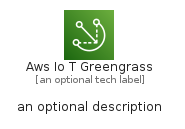
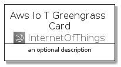
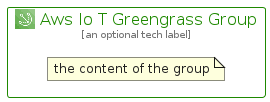

# AwsIoTGreengrass


```text
aws-q1-2022/Architecture/InternetOfThings/AwsIoTGreengrass
```

```text
include('aws-q1-2022/Architecture/InternetOfThings/AwsIoTGreengrass')
```


| Illustration | AwsIoTGreengrass | AwsIoTGreengrassCard | AwsIoTGreengrassGroup |
| :---: | :---: | :---: | :---: |
|  |  |  |  |


## AwsIoTGreengrass

### Load remotely
```plantuml
@startuml
' configures the library
!global $LIB_BASE_LOCATION="https://raw.githubusercontent.com/tmorin/plantuml-libs/master/distribution"

' loads the library's bootstrap
!include $LIB_BASE_LOCATION/bootstrap.puml

' loads the package bootstrap
include('aws-q1-2022/bootstrap')

' loads the Item which embeds the element AwsIoTGreengrass
include('aws-q1-2022/Architecture/InternetOfThings/AwsIoTGreengrass')

' renders the element
AwsIoTGreengrass('AwsIoTGreengrass', 'Aws Io T Greengrass', 'an optional tech label', 'an optional description')
@enduml
```

### Load locally
```plantuml
@startuml
' configures the library
!global $INCLUSION_MODE="local"
!global $LIB_BASE_LOCATION="../../.."

' loads the library's bootstrap
!include $LIB_BASE_LOCATION/bootstrap.puml

' loads the package bootstrap
include('aws-q1-2022/bootstrap')

' loads the Item which embeds the element AwsIoTGreengrass
include('aws-q1-2022/Architecture/InternetOfThings/AwsIoTGreengrass')

' renders the element
AwsIoTGreengrass('AwsIoTGreengrass', 'Aws Io T Greengrass', 'an optional tech label', 'an optional description')
@enduml
```

## AwsIoTGreengrassCard

### Load remotely
```plantuml
@startuml
' configures the library
!global $LIB_BASE_LOCATION="https://raw.githubusercontent.com/tmorin/plantuml-libs/master/distribution"

' loads the library's bootstrap
!include $LIB_BASE_LOCATION/bootstrap.puml

' loads the package bootstrap
include('aws-q1-2022/bootstrap')

' loads the Item which embeds the element AwsIoTGreengrassCard
include('aws-q1-2022/Architecture/InternetOfThings/AwsIoTGreengrass')

' renders the element
AwsIoTGreengrassCard('AwsIoTGreengrassCard', 'Aws Io T Greengrass Card', 'an optional description')
@enduml
```

### Load locally
```plantuml
@startuml
' configures the library
!global $INCLUSION_MODE="local"
!global $LIB_BASE_LOCATION="../../.."

' loads the library's bootstrap
!include $LIB_BASE_LOCATION/bootstrap.puml

' loads the package bootstrap
include('aws-q1-2022/bootstrap')

' loads the Item which embeds the element AwsIoTGreengrassCard
include('aws-q1-2022/Architecture/InternetOfThings/AwsIoTGreengrass')

' renders the element
AwsIoTGreengrassCard('AwsIoTGreengrassCard', 'Aws Io T Greengrass Card', 'an optional description')
@enduml
```

## AwsIoTGreengrassGroup

### Load remotely
```plantuml
@startuml
' configures the library
!global $LIB_BASE_LOCATION="https://raw.githubusercontent.com/tmorin/plantuml-libs/master/distribution"

' loads the library's bootstrap
!include $LIB_BASE_LOCATION/bootstrap.puml

' loads the package bootstrap
include('aws-q1-2022/bootstrap')

' loads the Item which embeds the element AwsIoTGreengrassGroup
include('aws-q1-2022/Architecture/InternetOfThings/AwsIoTGreengrass')

' renders the element
AwsIoTGreengrassGroup('AwsIoTGreengrassGroup', 'Aws Io T Greengrass Group', 'an optional tech label') {
    note as note
        the content of the group
    end note
}
@enduml
```

### Load locally
```plantuml
@startuml
' configures the library
!global $INCLUSION_MODE="local"
!global $LIB_BASE_LOCATION="../../.."

' loads the library's bootstrap
!include $LIB_BASE_LOCATION/bootstrap.puml

' loads the package bootstrap
include('aws-q1-2022/bootstrap')

' loads the Item which embeds the element AwsIoTGreengrassGroup
include('aws-q1-2022/Architecture/InternetOfThings/AwsIoTGreengrass')

' renders the element
AwsIoTGreengrassGroup('AwsIoTGreengrassGroup', 'Aws Io T Greengrass Group', 'an optional tech label') {
    note as note
        the content of the group
    end note
}
@enduml
```

