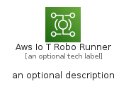
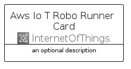
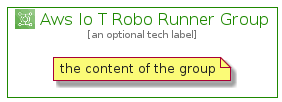

# AwsIoTRoboRunner


```text
aws-q1-2022/Architecture/InternetOfThings/AwsIoTRoboRunner
```

```text
include('aws-q1-2022/Architecture/InternetOfThings/AwsIoTRoboRunner')
```


| Illustration | AwsIoTRoboRunner | AwsIoTRoboRunnerCard | AwsIoTRoboRunnerGroup |
| :---: | :---: | :---: | :---: |
|  |  |  |  |


## AwsIoTRoboRunner

### Load remotely
```plantuml
@startuml
' configures the library
!global $LIB_BASE_LOCATION="https://raw.githubusercontent.com/tmorin/plantuml-libs/master/distribution"

' loads the library's bootstrap
!include $LIB_BASE_LOCATION/bootstrap.puml

' loads the package bootstrap
include('aws-q1-2022/bootstrap')

' loads the Item which embeds the element AwsIoTRoboRunner
include('aws-q1-2022/Architecture/InternetOfThings/AwsIoTRoboRunner')

' renders the element
AwsIoTRoboRunner('AwsIoTRoboRunner', 'Aws Io T Robo Runner', 'an optional tech label', 'an optional description')
@enduml
```

### Load locally
```plantuml
@startuml
' configures the library
!global $INCLUSION_MODE="local"
!global $LIB_BASE_LOCATION="../../.."

' loads the library's bootstrap
!include $LIB_BASE_LOCATION/bootstrap.puml

' loads the package bootstrap
include('aws-q1-2022/bootstrap')

' loads the Item which embeds the element AwsIoTRoboRunner
include('aws-q1-2022/Architecture/InternetOfThings/AwsIoTRoboRunner')

' renders the element
AwsIoTRoboRunner('AwsIoTRoboRunner', 'Aws Io T Robo Runner', 'an optional tech label', 'an optional description')
@enduml
```

## AwsIoTRoboRunnerCard

### Load remotely
```plantuml
@startuml
' configures the library
!global $LIB_BASE_LOCATION="https://raw.githubusercontent.com/tmorin/plantuml-libs/master/distribution"

' loads the library's bootstrap
!include $LIB_BASE_LOCATION/bootstrap.puml

' loads the package bootstrap
include('aws-q1-2022/bootstrap')

' loads the Item which embeds the element AwsIoTRoboRunnerCard
include('aws-q1-2022/Architecture/InternetOfThings/AwsIoTRoboRunner')

' renders the element
AwsIoTRoboRunnerCard('AwsIoTRoboRunnerCard', 'Aws Io T Robo Runner Card', 'an optional description')
@enduml
```

### Load locally
```plantuml
@startuml
' configures the library
!global $INCLUSION_MODE="local"
!global $LIB_BASE_LOCATION="../../.."

' loads the library's bootstrap
!include $LIB_BASE_LOCATION/bootstrap.puml

' loads the package bootstrap
include('aws-q1-2022/bootstrap')

' loads the Item which embeds the element AwsIoTRoboRunnerCard
include('aws-q1-2022/Architecture/InternetOfThings/AwsIoTRoboRunner')

' renders the element
AwsIoTRoboRunnerCard('AwsIoTRoboRunnerCard', 'Aws Io T Robo Runner Card', 'an optional description')
@enduml
```

## AwsIoTRoboRunnerGroup

### Load remotely
```plantuml
@startuml
' configures the library
!global $LIB_BASE_LOCATION="https://raw.githubusercontent.com/tmorin/plantuml-libs/master/distribution"

' loads the library's bootstrap
!include $LIB_BASE_LOCATION/bootstrap.puml

' loads the package bootstrap
include('aws-q1-2022/bootstrap')

' loads the Item which embeds the element AwsIoTRoboRunnerGroup
include('aws-q1-2022/Architecture/InternetOfThings/AwsIoTRoboRunner')

' renders the element
AwsIoTRoboRunnerGroup('AwsIoTRoboRunnerGroup', 'Aws Io T Robo Runner Group', 'an optional tech label') {
    note as note
        the content of the group
    end note
}
@enduml
```

### Load locally
```plantuml
@startuml
' configures the library
!global $INCLUSION_MODE="local"
!global $LIB_BASE_LOCATION="../../.."

' loads the library's bootstrap
!include $LIB_BASE_LOCATION/bootstrap.puml

' loads the package bootstrap
include('aws-q1-2022/bootstrap')

' loads the Item which embeds the element AwsIoTRoboRunnerGroup
include('aws-q1-2022/Architecture/InternetOfThings/AwsIoTRoboRunner')

' renders the element
AwsIoTRoboRunnerGroup('AwsIoTRoboRunnerGroup', 'Aws Io T Robo Runner Group', 'an optional tech label') {
    note as note
        the content of the group
    end note
}
@enduml
```

