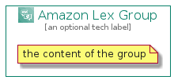

# AmazonLex


```text
aws-q1-2022/Architecture/MachineLearning/AmazonLex
```

```text
include('aws-q1-2022/Architecture/MachineLearning/AmazonLex')
```


| Illustration | AmazonLex | AmazonLexCard | AmazonLexGroup |
| :---: | :---: | :---: | :---: |
|  |  |  |  |


## AmazonLex

### Load remotely
```plantuml
@startuml
' configures the library
!global $LIB_BASE_LOCATION="https://raw.githubusercontent.com/tmorin/plantuml-libs/master/distribution"

' loads the library's bootstrap
!include $LIB_BASE_LOCATION/bootstrap.puml

' loads the package bootstrap
include('aws-q1-2022/bootstrap')

' loads the Item which embeds the element AmazonLex
include('aws-q1-2022/Architecture/MachineLearning/AmazonLex')

' renders the element
AmazonLex('AmazonLex', 'Amazon Lex', 'an optional tech label')
@enduml
```

### Load locally
```plantuml
@startuml
' configures the library
!global $INCLUSION_MODE="local"
!global $LIB_BASE_LOCATION="../../.."

' loads the library's bootstrap
!include $LIB_BASE_LOCATION/bootstrap.puml

' loads the package bootstrap
include('aws-q1-2022/bootstrap')

' loads the Item which embeds the element AmazonLex
include('aws-q1-2022/Architecture/MachineLearning/AmazonLex')

' renders the element
AmazonLex('AmazonLex', 'Amazon Lex', 'an optional tech label')
@enduml
```

## AmazonLexCard

### Load remotely
```plantuml
@startuml
' configures the library
!global $LIB_BASE_LOCATION="https://raw.githubusercontent.com/tmorin/plantuml-libs/master/distribution"

' loads the library's bootstrap
!include $LIB_BASE_LOCATION/bootstrap.puml

' loads the package bootstrap
include('aws-q1-2022/bootstrap')

' loads the Item which embeds the element AmazonLexCard
include('aws-q1-2022/Architecture/MachineLearning/AmazonLex')

' renders the element
AmazonLexCard('AmazonLexCard', 'Amazon Lex Card', 'an optional description')
@enduml
```

### Load locally
```plantuml
@startuml
' configures the library
!global $INCLUSION_MODE="local"
!global $LIB_BASE_LOCATION="../../.."

' loads the library's bootstrap
!include $LIB_BASE_LOCATION/bootstrap.puml

' loads the package bootstrap
include('aws-q1-2022/bootstrap')

' loads the Item which embeds the element AmazonLexCard
include('aws-q1-2022/Architecture/MachineLearning/AmazonLex')

' renders the element
AmazonLexCard('AmazonLexCard', 'Amazon Lex Card', 'an optional description')
@enduml
```

## AmazonLexGroup

### Load remotely
```plantuml
@startuml
' configures the library
!global $LIB_BASE_LOCATION="https://raw.githubusercontent.com/tmorin/plantuml-libs/master/distribution"

' loads the library's bootstrap
!include $LIB_BASE_LOCATION/bootstrap.puml

' loads the package bootstrap
include('aws-q1-2022/bootstrap')

' loads the Item which embeds the element AmazonLexGroup
include('aws-q1-2022/Architecture/MachineLearning/AmazonLex')

' renders the element
AmazonLexGroup('AmazonLexGroup', 'Amazon Lex Group', 'an optional tech label') {
    note as note
        the content of the group
    end note
}
@enduml
```

### Load locally
```plantuml
@startuml
' configures the library
!global $INCLUSION_MODE="local"
!global $LIB_BASE_LOCATION="../../.."

' loads the library's bootstrap
!include $LIB_BASE_LOCATION/bootstrap.puml

' loads the package bootstrap
include('aws-q1-2022/bootstrap')

' loads the Item which embeds the element AmazonLexGroup
include('aws-q1-2022/Architecture/MachineLearning/AmazonLex')

' renders the element
AmazonLexGroup('AmazonLexGroup', 'Amazon Lex Group', 'an optional tech label') {
    note as note
        the content of the group
    end note
}
@enduml
```

