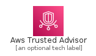
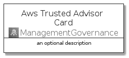

# AwsTrustedAdvisor


```text
aws-q1-2022/Architecture/ManagementGovernance/AwsTrustedAdvisor
```

```text
include('aws-q1-2022/Architecture/ManagementGovernance/AwsTrustedAdvisor')
```


| Illustration | AwsTrustedAdvisor | AwsTrustedAdvisorCard | AwsTrustedAdvisorGroup |
| :---: | :---: | :---: | :---: |
|  |  |  |  |


## AwsTrustedAdvisor

### Load remotely
```plantuml
@startuml
' configures the library
!global $LIB_BASE_LOCATION="https://raw.githubusercontent.com/tmorin/plantuml-libs/master/distribution"

' loads the library's bootstrap
!include $LIB_BASE_LOCATION/bootstrap.puml

' loads the package bootstrap
include('aws-q1-2022/bootstrap')

' loads the Item which embeds the element AwsTrustedAdvisor
include('aws-q1-2022/Architecture/ManagementGovernance/AwsTrustedAdvisor')

' renders the element
AwsTrustedAdvisor('AwsTrustedAdvisor', 'Aws Trusted Advisor', 'an optional tech label')
@enduml
```

### Load locally
```plantuml
@startuml
' configures the library
!global $INCLUSION_MODE="local"
!global $LIB_BASE_LOCATION="../../.."

' loads the library's bootstrap
!include $LIB_BASE_LOCATION/bootstrap.puml

' loads the package bootstrap
include('aws-q1-2022/bootstrap')

' loads the Item which embeds the element AwsTrustedAdvisor
include('aws-q1-2022/Architecture/ManagementGovernance/AwsTrustedAdvisor')

' renders the element
AwsTrustedAdvisor('AwsTrustedAdvisor', 'Aws Trusted Advisor', 'an optional tech label')
@enduml
```

## AwsTrustedAdvisorCard

### Load remotely
```plantuml
@startuml
' configures the library
!global $LIB_BASE_LOCATION="https://raw.githubusercontent.com/tmorin/plantuml-libs/master/distribution"

' loads the library's bootstrap
!include $LIB_BASE_LOCATION/bootstrap.puml

' loads the package bootstrap
include('aws-q1-2022/bootstrap')

' loads the Item which embeds the element AwsTrustedAdvisorCard
include('aws-q1-2022/Architecture/ManagementGovernance/AwsTrustedAdvisor')

' renders the element
AwsTrustedAdvisorCard('AwsTrustedAdvisorCard', 'Aws Trusted Advisor Card', 'an optional description')
@enduml
```

### Load locally
```plantuml
@startuml
' configures the library
!global $INCLUSION_MODE="local"
!global $LIB_BASE_LOCATION="../../.."

' loads the library's bootstrap
!include $LIB_BASE_LOCATION/bootstrap.puml

' loads the package bootstrap
include('aws-q1-2022/bootstrap')

' loads the Item which embeds the element AwsTrustedAdvisorCard
include('aws-q1-2022/Architecture/ManagementGovernance/AwsTrustedAdvisor')

' renders the element
AwsTrustedAdvisorCard('AwsTrustedAdvisorCard', 'Aws Trusted Advisor Card', 'an optional description')
@enduml
```

## AwsTrustedAdvisorGroup

### Load remotely
```plantuml
@startuml
' configures the library
!global $LIB_BASE_LOCATION="https://raw.githubusercontent.com/tmorin/plantuml-libs/master/distribution"

' loads the library's bootstrap
!include $LIB_BASE_LOCATION/bootstrap.puml

' loads the package bootstrap
include('aws-q1-2022/bootstrap')

' loads the Item which embeds the element AwsTrustedAdvisorGroup
include('aws-q1-2022/Architecture/ManagementGovernance/AwsTrustedAdvisor')

' renders the element
AwsTrustedAdvisorGroup('AwsTrustedAdvisorGroup', 'Aws Trusted Advisor Group', 'an optional tech label') {
    note as note
        the content of the group
    end note
}
@enduml
```

### Load locally
```plantuml
@startuml
' configures the library
!global $INCLUSION_MODE="local"
!global $LIB_BASE_LOCATION="../../.."

' loads the library's bootstrap
!include $LIB_BASE_LOCATION/bootstrap.puml

' loads the package bootstrap
include('aws-q1-2022/bootstrap')

' loads the Item which embeds the element AwsTrustedAdvisorGroup
include('aws-q1-2022/Architecture/ManagementGovernance/AwsTrustedAdvisor')

' renders the element
AwsTrustedAdvisorGroup('AwsTrustedAdvisorGroup', 'Aws Trusted Advisor Group', 'an optional tech label') {
    note as note
        the content of the group
    end note
}
@enduml
```

