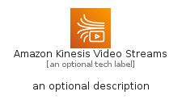
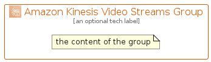

# AmazonKinesisVideoStreams


```text
aws-q1-2022/Architecture/MediaServices/AmazonKinesisVideoStreams
```

```text
include('aws-q1-2022/Architecture/MediaServices/AmazonKinesisVideoStreams')
```


| Illustration | AmazonKinesisVideoStreams | AmazonKinesisVideoStreamsCard | AmazonKinesisVideoStreamsGroup |
| :---: | :---: | :---: | :---: |
|  |  |  |  |


## AmazonKinesisVideoStreams

### Load remotely
```plantuml
@startuml
' configures the library
!global $LIB_BASE_LOCATION="https://raw.githubusercontent.com/tmorin/plantuml-libs/master/distribution"

' loads the library's bootstrap
!include $LIB_BASE_LOCATION/bootstrap.puml

' loads the package bootstrap
include('aws-q1-2022/bootstrap')

' loads the Item which embeds the element AmazonKinesisVideoStreams
include('aws-q1-2022/Architecture/MediaServices/AmazonKinesisVideoStreams')

' renders the element
AmazonKinesisVideoStreams('AmazonKinesisVideoStreams', 'Amazon Kinesis Video Streams', 'an optional tech label', 'an optional description')
@enduml
```

### Load locally
```plantuml
@startuml
' configures the library
!global $INCLUSION_MODE="local"
!global $LIB_BASE_LOCATION="../../.."

' loads the library's bootstrap
!include $LIB_BASE_LOCATION/bootstrap.puml

' loads the package bootstrap
include('aws-q1-2022/bootstrap')

' loads the Item which embeds the element AmazonKinesisVideoStreams
include('aws-q1-2022/Architecture/MediaServices/AmazonKinesisVideoStreams')

' renders the element
AmazonKinesisVideoStreams('AmazonKinesisVideoStreams', 'Amazon Kinesis Video Streams', 'an optional tech label', 'an optional description')
@enduml
```

## AmazonKinesisVideoStreamsCard

### Load remotely
```plantuml
@startuml
' configures the library
!global $LIB_BASE_LOCATION="https://raw.githubusercontent.com/tmorin/plantuml-libs/master/distribution"

' loads the library's bootstrap
!include $LIB_BASE_LOCATION/bootstrap.puml

' loads the package bootstrap
include('aws-q1-2022/bootstrap')

' loads the Item which embeds the element AmazonKinesisVideoStreamsCard
include('aws-q1-2022/Architecture/MediaServices/AmazonKinesisVideoStreams')

' renders the element
AmazonKinesisVideoStreamsCard('AmazonKinesisVideoStreamsCard', 'Amazon Kinesis Video Streams Card', 'an optional description')
@enduml
```

### Load locally
```plantuml
@startuml
' configures the library
!global $INCLUSION_MODE="local"
!global $LIB_BASE_LOCATION="../../.."

' loads the library's bootstrap
!include $LIB_BASE_LOCATION/bootstrap.puml

' loads the package bootstrap
include('aws-q1-2022/bootstrap')

' loads the Item which embeds the element AmazonKinesisVideoStreamsCard
include('aws-q1-2022/Architecture/MediaServices/AmazonKinesisVideoStreams')

' renders the element
AmazonKinesisVideoStreamsCard('AmazonKinesisVideoStreamsCard', 'Amazon Kinesis Video Streams Card', 'an optional description')
@enduml
```

## AmazonKinesisVideoStreamsGroup

### Load remotely
```plantuml
@startuml
' configures the library
!global $LIB_BASE_LOCATION="https://raw.githubusercontent.com/tmorin/plantuml-libs/master/distribution"

' loads the library's bootstrap
!include $LIB_BASE_LOCATION/bootstrap.puml

' loads the package bootstrap
include('aws-q1-2022/bootstrap')

' loads the Item which embeds the element AmazonKinesisVideoStreamsGroup
include('aws-q1-2022/Architecture/MediaServices/AmazonKinesisVideoStreams')

' renders the element
AmazonKinesisVideoStreamsGroup('AmazonKinesisVideoStreamsGroup', 'Amazon Kinesis Video Streams Group', 'an optional tech label') {
    note as note
        the content of the group
    end note
}
@enduml
```

### Load locally
```plantuml
@startuml
' configures the library
!global $INCLUSION_MODE="local"
!global $LIB_BASE_LOCATION="../../.."

' loads the library's bootstrap
!include $LIB_BASE_LOCATION/bootstrap.puml

' loads the package bootstrap
include('aws-q1-2022/bootstrap')

' loads the Item which embeds the element AmazonKinesisVideoStreamsGroup
include('aws-q1-2022/Architecture/MediaServices/AmazonKinesisVideoStreams')

' renders the element
AmazonKinesisVideoStreamsGroup('AmazonKinesisVideoStreamsGroup', 'Amazon Kinesis Video Streams Group', 'an optional tech label') {
    note as note
        the content of the group
    end note
}
@enduml
```

