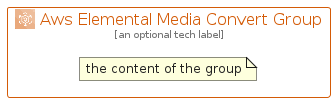

# AwsElementalMediaConvert


```text
aws-q1-2022/Architecture/MediaServices/AwsElementalMediaConvert
```

```text
include('aws-q1-2022/Architecture/MediaServices/AwsElementalMediaConvert')
```


| Illustration | AwsElementalMediaConvert | AwsElementalMediaConvertCard | AwsElementalMediaConvertGroup |
| :---: | :---: | :---: | :---: |
|  |  |  |  |


## AwsElementalMediaConvert

### Load remotely
```plantuml
@startuml
' configures the library
!global $LIB_BASE_LOCATION="https://raw.githubusercontent.com/tmorin/plantuml-libs/master/distribution"

' loads the library's bootstrap
!include $LIB_BASE_LOCATION/bootstrap.puml

' loads the package bootstrap
include('aws-q1-2022/bootstrap')

' loads the Item which embeds the element AwsElementalMediaConvert
include('aws-q1-2022/Architecture/MediaServices/AwsElementalMediaConvert')

' renders the element
AwsElementalMediaConvert('AwsElementalMediaConvert', 'Aws Elemental Media Convert', 'an optional tech label', 'an optional description')
@enduml
```

### Load locally
```plantuml
@startuml
' configures the library
!global $INCLUSION_MODE="local"
!global $LIB_BASE_LOCATION="../../.."

' loads the library's bootstrap
!include $LIB_BASE_LOCATION/bootstrap.puml

' loads the package bootstrap
include('aws-q1-2022/bootstrap')

' loads the Item which embeds the element AwsElementalMediaConvert
include('aws-q1-2022/Architecture/MediaServices/AwsElementalMediaConvert')

' renders the element
AwsElementalMediaConvert('AwsElementalMediaConvert', 'Aws Elemental Media Convert', 'an optional tech label', 'an optional description')
@enduml
```

## AwsElementalMediaConvertCard

### Load remotely
```plantuml
@startuml
' configures the library
!global $LIB_BASE_LOCATION="https://raw.githubusercontent.com/tmorin/plantuml-libs/master/distribution"

' loads the library's bootstrap
!include $LIB_BASE_LOCATION/bootstrap.puml

' loads the package bootstrap
include('aws-q1-2022/bootstrap')

' loads the Item which embeds the element AwsElementalMediaConvertCard
include('aws-q1-2022/Architecture/MediaServices/AwsElementalMediaConvert')

' renders the element
AwsElementalMediaConvertCard('AwsElementalMediaConvertCard', 'Aws Elemental Media Convert Card', 'an optional description')
@enduml
```

### Load locally
```plantuml
@startuml
' configures the library
!global $INCLUSION_MODE="local"
!global $LIB_BASE_LOCATION="../../.."

' loads the library's bootstrap
!include $LIB_BASE_LOCATION/bootstrap.puml

' loads the package bootstrap
include('aws-q1-2022/bootstrap')

' loads the Item which embeds the element AwsElementalMediaConvertCard
include('aws-q1-2022/Architecture/MediaServices/AwsElementalMediaConvert')

' renders the element
AwsElementalMediaConvertCard('AwsElementalMediaConvertCard', 'Aws Elemental Media Convert Card', 'an optional description')
@enduml
```

## AwsElementalMediaConvertGroup

### Load remotely
```plantuml
@startuml
' configures the library
!global $LIB_BASE_LOCATION="https://raw.githubusercontent.com/tmorin/plantuml-libs/master/distribution"

' loads the library's bootstrap
!include $LIB_BASE_LOCATION/bootstrap.puml

' loads the package bootstrap
include('aws-q1-2022/bootstrap')

' loads the Item which embeds the element AwsElementalMediaConvertGroup
include('aws-q1-2022/Architecture/MediaServices/AwsElementalMediaConvert')

' renders the element
AwsElementalMediaConvertGroup('AwsElementalMediaConvertGroup', 'Aws Elemental Media Convert Group', 'an optional tech label') {
    note as note
        the content of the group
    end note
}
@enduml
```

### Load locally
```plantuml
@startuml
' configures the library
!global $INCLUSION_MODE="local"
!global $LIB_BASE_LOCATION="../../.."

' loads the library's bootstrap
!include $LIB_BASE_LOCATION/bootstrap.puml

' loads the package bootstrap
include('aws-q1-2022/bootstrap')

' loads the Item which embeds the element AwsElementalMediaConvertGroup
include('aws-q1-2022/Architecture/MediaServices/AwsElementalMediaConvert')

' renders the element
AwsElementalMediaConvertGroup('AwsElementalMediaConvertGroup', 'Aws Elemental Media Convert Group', 'an optional tech label') {
    note as note
        the content of the group
    end note
}
@enduml
```

