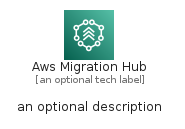
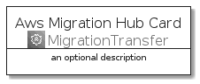
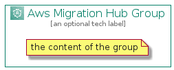

# AwsMigrationHub


```text
aws-q1-2022/Architecture/MigrationTransfer/AwsMigrationHub
```

```text
include('aws-q1-2022/Architecture/MigrationTransfer/AwsMigrationHub')
```


| Illustration | AwsMigrationHub | AwsMigrationHubCard | AwsMigrationHubGroup |
| :---: | :---: | :---: | :---: |
|  |  |  |  |


## AwsMigrationHub

### Load remotely
```plantuml
@startuml
' configures the library
!global $LIB_BASE_LOCATION="https://raw.githubusercontent.com/tmorin/plantuml-libs/master/distribution"

' loads the library's bootstrap
!include $LIB_BASE_LOCATION/bootstrap.puml

' loads the package bootstrap
include('aws-q1-2022/bootstrap')

' loads the Item which embeds the element AwsMigrationHub
include('aws-q1-2022/Architecture/MigrationTransfer/AwsMigrationHub')

' renders the element
AwsMigrationHub('AwsMigrationHub', 'Aws Migration Hub', 'an optional tech label')
@enduml
```

### Load locally
```plantuml
@startuml
' configures the library
!global $INCLUSION_MODE="local"
!global $LIB_BASE_LOCATION="../../.."

' loads the library's bootstrap
!include $LIB_BASE_LOCATION/bootstrap.puml

' loads the package bootstrap
include('aws-q1-2022/bootstrap')

' loads the Item which embeds the element AwsMigrationHub
include('aws-q1-2022/Architecture/MigrationTransfer/AwsMigrationHub')

' renders the element
AwsMigrationHub('AwsMigrationHub', 'Aws Migration Hub', 'an optional tech label')
@enduml
```

## AwsMigrationHubCard

### Load remotely
```plantuml
@startuml
' configures the library
!global $LIB_BASE_LOCATION="https://raw.githubusercontent.com/tmorin/plantuml-libs/master/distribution"

' loads the library's bootstrap
!include $LIB_BASE_LOCATION/bootstrap.puml

' loads the package bootstrap
include('aws-q1-2022/bootstrap')

' loads the Item which embeds the element AwsMigrationHubCard
include('aws-q1-2022/Architecture/MigrationTransfer/AwsMigrationHub')

' renders the element
AwsMigrationHubCard('AwsMigrationHubCard', 'Aws Migration Hub Card', 'an optional description')
@enduml
```

### Load locally
```plantuml
@startuml
' configures the library
!global $INCLUSION_MODE="local"
!global $LIB_BASE_LOCATION="../../.."

' loads the library's bootstrap
!include $LIB_BASE_LOCATION/bootstrap.puml

' loads the package bootstrap
include('aws-q1-2022/bootstrap')

' loads the Item which embeds the element AwsMigrationHubCard
include('aws-q1-2022/Architecture/MigrationTransfer/AwsMigrationHub')

' renders the element
AwsMigrationHubCard('AwsMigrationHubCard', 'Aws Migration Hub Card', 'an optional description')
@enduml
```

## AwsMigrationHubGroup

### Load remotely
```plantuml
@startuml
' configures the library
!global $LIB_BASE_LOCATION="https://raw.githubusercontent.com/tmorin/plantuml-libs/master/distribution"

' loads the library's bootstrap
!include $LIB_BASE_LOCATION/bootstrap.puml

' loads the package bootstrap
include('aws-q1-2022/bootstrap')

' loads the Item which embeds the element AwsMigrationHubGroup
include('aws-q1-2022/Architecture/MigrationTransfer/AwsMigrationHub')

' renders the element
AwsMigrationHubGroup('AwsMigrationHubGroup', 'Aws Migration Hub Group', 'an optional tech label') {
    note as note
        the content of the group
    end note
}
@enduml
```

### Load locally
```plantuml
@startuml
' configures the library
!global $INCLUSION_MODE="local"
!global $LIB_BASE_LOCATION="../../.."

' loads the library's bootstrap
!include $LIB_BASE_LOCATION/bootstrap.puml

' loads the package bootstrap
include('aws-q1-2022/bootstrap')

' loads the Item which embeds the element AwsMigrationHubGroup
include('aws-q1-2022/Architecture/MigrationTransfer/AwsMigrationHub')

' renders the element
AwsMigrationHubGroup('AwsMigrationHubGroup', 'Aws Migration Hub Group', 'an optional tech label') {
    note as note
        the content of the group
    end note
}
@enduml
```

