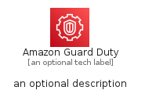
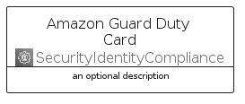
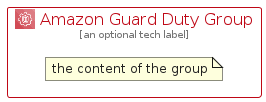

# AmazonGuardDuty


```text
aws-q1-2022/Architecture/SecurityIdentityCompliance/AmazonGuardDuty
```

```text
include('aws-q1-2022/Architecture/SecurityIdentityCompliance/AmazonGuardDuty')
```


| Illustration | AmazonGuardDuty | AmazonGuardDutyCard | AmazonGuardDutyGroup |
| :---: | :---: | :---: | :---: |
|  |  |  |  |


## AmazonGuardDuty

### Load remotely
```plantuml
@startuml
' configures the library
!global $LIB_BASE_LOCATION="https://raw.githubusercontent.com/tmorin/plantuml-libs/master/distribution"

' loads the library's bootstrap
!include $LIB_BASE_LOCATION/bootstrap.puml

' loads the package bootstrap
include('aws-q1-2022/bootstrap')

' loads the Item which embeds the element AmazonGuardDuty
include('aws-q1-2022/Architecture/SecurityIdentityCompliance/AmazonGuardDuty')

' renders the element
AmazonGuardDuty('AmazonGuardDuty', 'Amazon Guard Duty', 'an optional tech label')
@enduml
```

### Load locally
```plantuml
@startuml
' configures the library
!global $INCLUSION_MODE="local"
!global $LIB_BASE_LOCATION="../../.."

' loads the library's bootstrap
!include $LIB_BASE_LOCATION/bootstrap.puml

' loads the package bootstrap
include('aws-q1-2022/bootstrap')

' loads the Item which embeds the element AmazonGuardDuty
include('aws-q1-2022/Architecture/SecurityIdentityCompliance/AmazonGuardDuty')

' renders the element
AmazonGuardDuty('AmazonGuardDuty', 'Amazon Guard Duty', 'an optional tech label')
@enduml
```

## AmazonGuardDutyCard

### Load remotely
```plantuml
@startuml
' configures the library
!global $LIB_BASE_LOCATION="https://raw.githubusercontent.com/tmorin/plantuml-libs/master/distribution"

' loads the library's bootstrap
!include $LIB_BASE_LOCATION/bootstrap.puml

' loads the package bootstrap
include('aws-q1-2022/bootstrap')

' loads the Item which embeds the element AmazonGuardDutyCard
include('aws-q1-2022/Architecture/SecurityIdentityCompliance/AmazonGuardDuty')

' renders the element
AmazonGuardDutyCard('AmazonGuardDutyCard', 'Amazon Guard Duty Card', 'an optional description')
@enduml
```

### Load locally
```plantuml
@startuml
' configures the library
!global $INCLUSION_MODE="local"
!global $LIB_BASE_LOCATION="../../.."

' loads the library's bootstrap
!include $LIB_BASE_LOCATION/bootstrap.puml

' loads the package bootstrap
include('aws-q1-2022/bootstrap')

' loads the Item which embeds the element AmazonGuardDutyCard
include('aws-q1-2022/Architecture/SecurityIdentityCompliance/AmazonGuardDuty')

' renders the element
AmazonGuardDutyCard('AmazonGuardDutyCard', 'Amazon Guard Duty Card', 'an optional description')
@enduml
```

## AmazonGuardDutyGroup

### Load remotely
```plantuml
@startuml
' configures the library
!global $LIB_BASE_LOCATION="https://raw.githubusercontent.com/tmorin/plantuml-libs/master/distribution"

' loads the library's bootstrap
!include $LIB_BASE_LOCATION/bootstrap.puml

' loads the package bootstrap
include('aws-q1-2022/bootstrap')

' loads the Item which embeds the element AmazonGuardDutyGroup
include('aws-q1-2022/Architecture/SecurityIdentityCompliance/AmazonGuardDuty')

' renders the element
AmazonGuardDutyGroup('AmazonGuardDutyGroup', 'Amazon Guard Duty Group', 'an optional tech label') {
    note as note
        the content of the group
    end note
}
@enduml
```

### Load locally
```plantuml
@startuml
' configures the library
!global $INCLUSION_MODE="local"
!global $LIB_BASE_LOCATION="../../.."

' loads the library's bootstrap
!include $LIB_BASE_LOCATION/bootstrap.puml

' loads the package bootstrap
include('aws-q1-2022/bootstrap')

' loads the Item which embeds the element AmazonGuardDutyGroup
include('aws-q1-2022/Architecture/SecurityIdentityCompliance/AmazonGuardDuty')

' renders the element
AmazonGuardDutyGroup('AmazonGuardDutyGroup', 'Amazon Guard Duty Group', 'an optional tech label') {
    note as note
        the content of the group
    end note
}
@enduml
```

