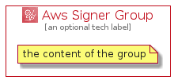

# AwsSigner


```text
aws-q1-2022/Architecture/SecurityIdentityCompliance/AwsSigner
```

```text
include('aws-q1-2022/Architecture/SecurityIdentityCompliance/AwsSigner')
```


| Illustration | AwsSigner | AwsSignerCard | AwsSignerGroup |
| :---: | :---: | :---: | :---: |
|  |  |  |  |


## AwsSigner

### Load remotely
```plantuml
@startuml
' configures the library
!global $LIB_BASE_LOCATION="https://raw.githubusercontent.com/tmorin/plantuml-libs/master/distribution"

' loads the library's bootstrap
!include $LIB_BASE_LOCATION/bootstrap.puml

' loads the package bootstrap
include('aws-q1-2022/bootstrap')

' loads the Item which embeds the element AwsSigner
include('aws-q1-2022/Architecture/SecurityIdentityCompliance/AwsSigner')

' renders the element
AwsSigner('AwsSigner', 'Aws Signer', 'an optional tech label')
@enduml
```

### Load locally
```plantuml
@startuml
' configures the library
!global $INCLUSION_MODE="local"
!global $LIB_BASE_LOCATION="../../.."

' loads the library's bootstrap
!include $LIB_BASE_LOCATION/bootstrap.puml

' loads the package bootstrap
include('aws-q1-2022/bootstrap')

' loads the Item which embeds the element AwsSigner
include('aws-q1-2022/Architecture/SecurityIdentityCompliance/AwsSigner')

' renders the element
AwsSigner('AwsSigner', 'Aws Signer', 'an optional tech label')
@enduml
```

## AwsSignerCard

### Load remotely
```plantuml
@startuml
' configures the library
!global $LIB_BASE_LOCATION="https://raw.githubusercontent.com/tmorin/plantuml-libs/master/distribution"

' loads the library's bootstrap
!include $LIB_BASE_LOCATION/bootstrap.puml

' loads the package bootstrap
include('aws-q1-2022/bootstrap')

' loads the Item which embeds the element AwsSignerCard
include('aws-q1-2022/Architecture/SecurityIdentityCompliance/AwsSigner')

' renders the element
AwsSignerCard('AwsSignerCard', 'Aws Signer Card', 'an optional description')
@enduml
```

### Load locally
```plantuml
@startuml
' configures the library
!global $INCLUSION_MODE="local"
!global $LIB_BASE_LOCATION="../../.."

' loads the library's bootstrap
!include $LIB_BASE_LOCATION/bootstrap.puml

' loads the package bootstrap
include('aws-q1-2022/bootstrap')

' loads the Item which embeds the element AwsSignerCard
include('aws-q1-2022/Architecture/SecurityIdentityCompliance/AwsSigner')

' renders the element
AwsSignerCard('AwsSignerCard', 'Aws Signer Card', 'an optional description')
@enduml
```

## AwsSignerGroup

### Load remotely
```plantuml
@startuml
' configures the library
!global $LIB_BASE_LOCATION="https://raw.githubusercontent.com/tmorin/plantuml-libs/master/distribution"

' loads the library's bootstrap
!include $LIB_BASE_LOCATION/bootstrap.puml

' loads the package bootstrap
include('aws-q1-2022/bootstrap')

' loads the Item which embeds the element AwsSignerGroup
include('aws-q1-2022/Architecture/SecurityIdentityCompliance/AwsSigner')

' renders the element
AwsSignerGroup('AwsSignerGroup', 'Aws Signer Group', 'an optional tech label') {
    note as note
        the content of the group
    end note
}
@enduml
```

### Load locally
```plantuml
@startuml
' configures the library
!global $INCLUSION_MODE="local"
!global $LIB_BASE_LOCATION="../../.."

' loads the library's bootstrap
!include $LIB_BASE_LOCATION/bootstrap.puml

' loads the package bootstrap
include('aws-q1-2022/bootstrap')

' loads the Item which embeds the element AwsSignerGroup
include('aws-q1-2022/Architecture/SecurityIdentityCompliance/AwsSigner')

' renders the element
AwsSignerGroup('AwsSignerGroup', 'Aws Signer Group', 'an optional tech label') {
    note as note
        the content of the group
    end note
}
@enduml
```

