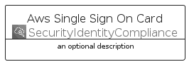
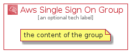

# AwsSingleSignOn


```text
aws-q1-2022/Architecture/SecurityIdentityCompliance/AwsSingleSignOn
```

```text
include('aws-q1-2022/Architecture/SecurityIdentityCompliance/AwsSingleSignOn')
```


| Illustration | AwsSingleSignOn | AwsSingleSignOnCard | AwsSingleSignOnGroup |
| :---: | :---: | :---: | :---: |
|  |  |  |  |


## AwsSingleSignOn

### Load remotely
```plantuml
@startuml
' configures the library
!global $LIB_BASE_LOCATION="https://raw.githubusercontent.com/tmorin/plantuml-libs/master/distribution"

' loads the library's bootstrap
!include $LIB_BASE_LOCATION/bootstrap.puml

' loads the package bootstrap
include('aws-q1-2022/bootstrap')

' loads the Item which embeds the element AwsSingleSignOn
include('aws-q1-2022/Architecture/SecurityIdentityCompliance/AwsSingleSignOn')

' renders the element
AwsSingleSignOn('AwsSingleSignOn', 'Aws Single Sign On', 'an optional tech label')
@enduml
```

### Load locally
```plantuml
@startuml
' configures the library
!global $INCLUSION_MODE="local"
!global $LIB_BASE_LOCATION="../../.."

' loads the library's bootstrap
!include $LIB_BASE_LOCATION/bootstrap.puml

' loads the package bootstrap
include('aws-q1-2022/bootstrap')

' loads the Item which embeds the element AwsSingleSignOn
include('aws-q1-2022/Architecture/SecurityIdentityCompliance/AwsSingleSignOn')

' renders the element
AwsSingleSignOn('AwsSingleSignOn', 'Aws Single Sign On', 'an optional tech label')
@enduml
```

## AwsSingleSignOnCard

### Load remotely
```plantuml
@startuml
' configures the library
!global $LIB_BASE_LOCATION="https://raw.githubusercontent.com/tmorin/plantuml-libs/master/distribution"

' loads the library's bootstrap
!include $LIB_BASE_LOCATION/bootstrap.puml

' loads the package bootstrap
include('aws-q1-2022/bootstrap')

' loads the Item which embeds the element AwsSingleSignOnCard
include('aws-q1-2022/Architecture/SecurityIdentityCompliance/AwsSingleSignOn')

' renders the element
AwsSingleSignOnCard('AwsSingleSignOnCard', 'Aws Single Sign On Card', 'an optional description')
@enduml
```

### Load locally
```plantuml
@startuml
' configures the library
!global $INCLUSION_MODE="local"
!global $LIB_BASE_LOCATION="../../.."

' loads the library's bootstrap
!include $LIB_BASE_LOCATION/bootstrap.puml

' loads the package bootstrap
include('aws-q1-2022/bootstrap')

' loads the Item which embeds the element AwsSingleSignOnCard
include('aws-q1-2022/Architecture/SecurityIdentityCompliance/AwsSingleSignOn')

' renders the element
AwsSingleSignOnCard('AwsSingleSignOnCard', 'Aws Single Sign On Card', 'an optional description')
@enduml
```

## AwsSingleSignOnGroup

### Load remotely
```plantuml
@startuml
' configures the library
!global $LIB_BASE_LOCATION="https://raw.githubusercontent.com/tmorin/plantuml-libs/master/distribution"

' loads the library's bootstrap
!include $LIB_BASE_LOCATION/bootstrap.puml

' loads the package bootstrap
include('aws-q1-2022/bootstrap')

' loads the Item which embeds the element AwsSingleSignOnGroup
include('aws-q1-2022/Architecture/SecurityIdentityCompliance/AwsSingleSignOn')

' renders the element
AwsSingleSignOnGroup('AwsSingleSignOnGroup', 'Aws Single Sign On Group', 'an optional tech label') {
    note as note
        the content of the group
    end note
}
@enduml
```

### Load locally
```plantuml
@startuml
' configures the library
!global $INCLUSION_MODE="local"
!global $LIB_BASE_LOCATION="../../.."

' loads the library's bootstrap
!include $LIB_BASE_LOCATION/bootstrap.puml

' loads the package bootstrap
include('aws-q1-2022/bootstrap')

' loads the Item which embeds the element AwsSingleSignOnGroup
include('aws-q1-2022/Architecture/SecurityIdentityCompliance/AwsSingleSignOn')

' renders the element
AwsSingleSignOnGroup('AwsSingleSignOnGroup', 'Aws Single Sign On Group', 'an optional tech label') {
    note as note
        the content of the group
    end note
}
@enduml
```

