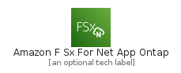
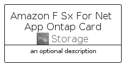
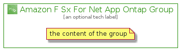

# AmazonFSxForNetAppOntap


```text
aws-q1-2022/Architecture/Storage/AmazonFSxForNetAppOntap
```

```text
include('aws-q1-2022/Architecture/Storage/AmazonFSxForNetAppOntap')
```


| Illustration | AmazonFSxForNetAppOntap | AmazonFSxForNetAppOntapCard | AmazonFSxForNetAppOntapGroup |
| :---: | :---: | :---: | :---: |
|  |  |  |  |


## AmazonFSxForNetAppOntap

### Load remotely
```plantuml
@startuml
' configures the library
!global $LIB_BASE_LOCATION="https://raw.githubusercontent.com/tmorin/plantuml-libs/master/distribution"

' loads the library's bootstrap
!include $LIB_BASE_LOCATION/bootstrap.puml

' loads the package bootstrap
include('aws-q1-2022/bootstrap')

' loads the Item which embeds the element AmazonFSxForNetAppOntap
include('aws-q1-2022/Architecture/Storage/AmazonFSxForNetAppOntap')

' renders the element
AmazonFSxForNetAppOntap('AmazonFSxForNetAppOntap', 'Amazon F Sx For Net App Ontap', 'an optional tech label', 'an optional description')
@enduml
```

### Load locally
```plantuml
@startuml
' configures the library
!global $INCLUSION_MODE="local"
!global $LIB_BASE_LOCATION="../../.."

' loads the library's bootstrap
!include $LIB_BASE_LOCATION/bootstrap.puml

' loads the package bootstrap
include('aws-q1-2022/bootstrap')

' loads the Item which embeds the element AmazonFSxForNetAppOntap
include('aws-q1-2022/Architecture/Storage/AmazonFSxForNetAppOntap')

' renders the element
AmazonFSxForNetAppOntap('AmazonFSxForNetAppOntap', 'Amazon F Sx For Net App Ontap', 'an optional tech label', 'an optional description')
@enduml
```

## AmazonFSxForNetAppOntapCard

### Load remotely
```plantuml
@startuml
' configures the library
!global $LIB_BASE_LOCATION="https://raw.githubusercontent.com/tmorin/plantuml-libs/master/distribution"

' loads the library's bootstrap
!include $LIB_BASE_LOCATION/bootstrap.puml

' loads the package bootstrap
include('aws-q1-2022/bootstrap')

' loads the Item which embeds the element AmazonFSxForNetAppOntapCard
include('aws-q1-2022/Architecture/Storage/AmazonFSxForNetAppOntap')

' renders the element
AmazonFSxForNetAppOntapCard('AmazonFSxForNetAppOntapCard', 'Amazon F Sx For Net App Ontap Card', 'an optional description')
@enduml
```

### Load locally
```plantuml
@startuml
' configures the library
!global $INCLUSION_MODE="local"
!global $LIB_BASE_LOCATION="../../.."

' loads the library's bootstrap
!include $LIB_BASE_LOCATION/bootstrap.puml

' loads the package bootstrap
include('aws-q1-2022/bootstrap')

' loads the Item which embeds the element AmazonFSxForNetAppOntapCard
include('aws-q1-2022/Architecture/Storage/AmazonFSxForNetAppOntap')

' renders the element
AmazonFSxForNetAppOntapCard('AmazonFSxForNetAppOntapCard', 'Amazon F Sx For Net App Ontap Card', 'an optional description')
@enduml
```

## AmazonFSxForNetAppOntapGroup

### Load remotely
```plantuml
@startuml
' configures the library
!global $LIB_BASE_LOCATION="https://raw.githubusercontent.com/tmorin/plantuml-libs/master/distribution"

' loads the library's bootstrap
!include $LIB_BASE_LOCATION/bootstrap.puml

' loads the package bootstrap
include('aws-q1-2022/bootstrap')

' loads the Item which embeds the element AmazonFSxForNetAppOntapGroup
include('aws-q1-2022/Architecture/Storage/AmazonFSxForNetAppOntap')

' renders the element
AmazonFSxForNetAppOntapGroup('AmazonFSxForNetAppOntapGroup', 'Amazon F Sx For Net App Ontap Group', 'an optional tech label') {
    note as note
        the content of the group
    end note
}
@enduml
```

### Load locally
```plantuml
@startuml
' configures the library
!global $INCLUSION_MODE="local"
!global $LIB_BASE_LOCATION="../../.."

' loads the library's bootstrap
!include $LIB_BASE_LOCATION/bootstrap.puml

' loads the package bootstrap
include('aws-q1-2022/bootstrap')

' loads the Item which embeds the element AmazonFSxForNetAppOntapGroup
include('aws-q1-2022/Architecture/Storage/AmazonFSxForNetAppOntap')

' renders the element
AmazonFSxForNetAppOntapGroup('AmazonFSxForNetAppOntapGroup', 'Amazon F Sx For Net App Ontap Group', 'an optional tech label') {
    note as note
        the content of the group
    end note
}
@enduml
```

