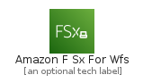
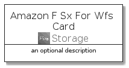
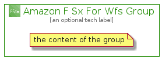

# AmazonFSxForWfs


```text
aws-q1-2022/Architecture/Storage/AmazonFSxForWfs
```

```text
include('aws-q1-2022/Architecture/Storage/AmazonFSxForWfs')
```


| Illustration | AmazonFSxForWfs | AmazonFSxForWfsCard | AmazonFSxForWfsGroup |
| :---: | :---: | :---: | :---: |
|  |  |  |  |


## AmazonFSxForWfs

### Load remotely
```plantuml
@startuml
' configures the library
!global $LIB_BASE_LOCATION="https://raw.githubusercontent.com/tmorin/plantuml-libs/master/distribution"

' loads the library's bootstrap
!include $LIB_BASE_LOCATION/bootstrap.puml

' loads the package bootstrap
include('aws-q1-2022/bootstrap')

' loads the Item which embeds the element AmazonFSxForWfs
include('aws-q1-2022/Architecture/Storage/AmazonFSxForWfs')

' renders the element
AmazonFSxForWfs('AmazonFSxForWfs', 'Amazon F Sx For Wfs', 'an optional tech label', 'an optional description')
@enduml
```

### Load locally
```plantuml
@startuml
' configures the library
!global $INCLUSION_MODE="local"
!global $LIB_BASE_LOCATION="../../.."

' loads the library's bootstrap
!include $LIB_BASE_LOCATION/bootstrap.puml

' loads the package bootstrap
include('aws-q1-2022/bootstrap')

' loads the Item which embeds the element AmazonFSxForWfs
include('aws-q1-2022/Architecture/Storage/AmazonFSxForWfs')

' renders the element
AmazonFSxForWfs('AmazonFSxForWfs', 'Amazon F Sx For Wfs', 'an optional tech label', 'an optional description')
@enduml
```

## AmazonFSxForWfsCard

### Load remotely
```plantuml
@startuml
' configures the library
!global $LIB_BASE_LOCATION="https://raw.githubusercontent.com/tmorin/plantuml-libs/master/distribution"

' loads the library's bootstrap
!include $LIB_BASE_LOCATION/bootstrap.puml

' loads the package bootstrap
include('aws-q1-2022/bootstrap')

' loads the Item which embeds the element AmazonFSxForWfsCard
include('aws-q1-2022/Architecture/Storage/AmazonFSxForWfs')

' renders the element
AmazonFSxForWfsCard('AmazonFSxForWfsCard', 'Amazon F Sx For Wfs Card', 'an optional description')
@enduml
```

### Load locally
```plantuml
@startuml
' configures the library
!global $INCLUSION_MODE="local"
!global $LIB_BASE_LOCATION="../../.."

' loads the library's bootstrap
!include $LIB_BASE_LOCATION/bootstrap.puml

' loads the package bootstrap
include('aws-q1-2022/bootstrap')

' loads the Item which embeds the element AmazonFSxForWfsCard
include('aws-q1-2022/Architecture/Storage/AmazonFSxForWfs')

' renders the element
AmazonFSxForWfsCard('AmazonFSxForWfsCard', 'Amazon F Sx For Wfs Card', 'an optional description')
@enduml
```

## AmazonFSxForWfsGroup

### Load remotely
```plantuml
@startuml
' configures the library
!global $LIB_BASE_LOCATION="https://raw.githubusercontent.com/tmorin/plantuml-libs/master/distribution"

' loads the library's bootstrap
!include $LIB_BASE_LOCATION/bootstrap.puml

' loads the package bootstrap
include('aws-q1-2022/bootstrap')

' loads the Item which embeds the element AmazonFSxForWfsGroup
include('aws-q1-2022/Architecture/Storage/AmazonFSxForWfs')

' renders the element
AmazonFSxForWfsGroup('AmazonFSxForWfsGroup', 'Amazon F Sx For Wfs Group', 'an optional tech label') {
    note as note
        the content of the group
    end note
}
@enduml
```

### Load locally
```plantuml
@startuml
' configures the library
!global $INCLUSION_MODE="local"
!global $LIB_BASE_LOCATION="../../.."

' loads the library's bootstrap
!include $LIB_BASE_LOCATION/bootstrap.puml

' loads the package bootstrap
include('aws-q1-2022/bootstrap')

' loads the Item which embeds the element AmazonFSxForWfsGroup
include('aws-q1-2022/Architecture/Storage/AmazonFSxForWfs')

' renders the element
AmazonFSxForWfsGroup('AmazonFSxForWfsGroup', 'Amazon F Sx For Wfs Group', 'an optional tech label') {
    note as note
        the content of the group
    end note
}
@enduml
```

