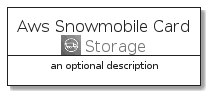
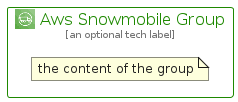

# AwsSnowmobile


```text
aws-q1-2022/Architecture/Storage/AwsSnowmobile
```

```text
include('aws-q1-2022/Architecture/Storage/AwsSnowmobile')
```


| Illustration | AwsSnowmobile | AwsSnowmobileCard | AwsSnowmobileGroup |
| :---: | :---: | :---: | :---: |
|  |  |  |  |


## AwsSnowmobile

### Load remotely
```plantuml
@startuml
' configures the library
!global $LIB_BASE_LOCATION="https://raw.githubusercontent.com/tmorin/plantuml-libs/master/distribution"

' loads the library's bootstrap
!include $LIB_BASE_LOCATION/bootstrap.puml

' loads the package bootstrap
include('aws-q1-2022/bootstrap')

' loads the Item which embeds the element AwsSnowmobile
include('aws-q1-2022/Architecture/Storage/AwsSnowmobile')

' renders the element
AwsSnowmobile('AwsSnowmobile', 'Aws Snowmobile', 'an optional tech label', 'an optional description')
@enduml
```

### Load locally
```plantuml
@startuml
' configures the library
!global $INCLUSION_MODE="local"
!global $LIB_BASE_LOCATION="../../.."

' loads the library's bootstrap
!include $LIB_BASE_LOCATION/bootstrap.puml

' loads the package bootstrap
include('aws-q1-2022/bootstrap')

' loads the Item which embeds the element AwsSnowmobile
include('aws-q1-2022/Architecture/Storage/AwsSnowmobile')

' renders the element
AwsSnowmobile('AwsSnowmobile', 'Aws Snowmobile', 'an optional tech label', 'an optional description')
@enduml
```

## AwsSnowmobileCard

### Load remotely
```plantuml
@startuml
' configures the library
!global $LIB_BASE_LOCATION="https://raw.githubusercontent.com/tmorin/plantuml-libs/master/distribution"

' loads the library's bootstrap
!include $LIB_BASE_LOCATION/bootstrap.puml

' loads the package bootstrap
include('aws-q1-2022/bootstrap')

' loads the Item which embeds the element AwsSnowmobileCard
include('aws-q1-2022/Architecture/Storage/AwsSnowmobile')

' renders the element
AwsSnowmobileCard('AwsSnowmobileCard', 'Aws Snowmobile Card', 'an optional description')
@enduml
```

### Load locally
```plantuml
@startuml
' configures the library
!global $INCLUSION_MODE="local"
!global $LIB_BASE_LOCATION="../../.."

' loads the library's bootstrap
!include $LIB_BASE_LOCATION/bootstrap.puml

' loads the package bootstrap
include('aws-q1-2022/bootstrap')

' loads the Item which embeds the element AwsSnowmobileCard
include('aws-q1-2022/Architecture/Storage/AwsSnowmobile')

' renders the element
AwsSnowmobileCard('AwsSnowmobileCard', 'Aws Snowmobile Card', 'an optional description')
@enduml
```

## AwsSnowmobileGroup

### Load remotely
```plantuml
@startuml
' configures the library
!global $LIB_BASE_LOCATION="https://raw.githubusercontent.com/tmorin/plantuml-libs/master/distribution"

' loads the library's bootstrap
!include $LIB_BASE_LOCATION/bootstrap.puml

' loads the package bootstrap
include('aws-q1-2022/bootstrap')

' loads the Item which embeds the element AwsSnowmobileGroup
include('aws-q1-2022/Architecture/Storage/AwsSnowmobile')

' renders the element
AwsSnowmobileGroup('AwsSnowmobileGroup', 'Aws Snowmobile Group', 'an optional tech label') {
    note as note
        the content of the group
    end note
}
@enduml
```

### Load locally
```plantuml
@startuml
' configures the library
!global $INCLUSION_MODE="local"
!global $LIB_BASE_LOCATION="../../.."

' loads the library's bootstrap
!include $LIB_BASE_LOCATION/bootstrap.puml

' loads the package bootstrap
include('aws-q1-2022/bootstrap')

' loads the Item which embeds the element AwsSnowmobileGroup
include('aws-q1-2022/Architecture/Storage/AwsSnowmobile')

' renders the element
AwsSnowmobileGroup('AwsSnowmobileGroup', 'Aws Snowmobile Group', 'an optional tech label') {
    note as note
        the content of the group
    end note
}
@enduml
```

