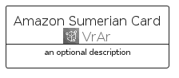
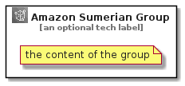

# AmazonSumerian


```text
aws-q1-2022/Architecture/VrAr/AmazonSumerian
```

```text
include('aws-q1-2022/Architecture/VrAr/AmazonSumerian')
```


| Illustration | AmazonSumerian | AmazonSumerianCard | AmazonSumerianGroup |
| :---: | :---: | :---: | :---: |
|  |  |  |  |


## AmazonSumerian

### Load remotely
```plantuml
@startuml
' configures the library
!global $LIB_BASE_LOCATION="https://raw.githubusercontent.com/tmorin/plantuml-libs/master/distribution"

' loads the library's bootstrap
!include $LIB_BASE_LOCATION/bootstrap.puml

' loads the package bootstrap
include('aws-q1-2022/bootstrap')

' loads the Item which embeds the element AmazonSumerian
include('aws-q1-2022/Architecture/VrAr/AmazonSumerian')

' renders the element
AmazonSumerian('AmazonSumerian', 'Amazon Sumerian', 'an optional tech label', 'an optional description')
@enduml
```

### Load locally
```plantuml
@startuml
' configures the library
!global $INCLUSION_MODE="local"
!global $LIB_BASE_LOCATION="../../.."

' loads the library's bootstrap
!include $LIB_BASE_LOCATION/bootstrap.puml

' loads the package bootstrap
include('aws-q1-2022/bootstrap')

' loads the Item which embeds the element AmazonSumerian
include('aws-q1-2022/Architecture/VrAr/AmazonSumerian')

' renders the element
AmazonSumerian('AmazonSumerian', 'Amazon Sumerian', 'an optional tech label', 'an optional description')
@enduml
```

## AmazonSumerianCard

### Load remotely
```plantuml
@startuml
' configures the library
!global $LIB_BASE_LOCATION="https://raw.githubusercontent.com/tmorin/plantuml-libs/master/distribution"

' loads the library's bootstrap
!include $LIB_BASE_LOCATION/bootstrap.puml

' loads the package bootstrap
include('aws-q1-2022/bootstrap')

' loads the Item which embeds the element AmazonSumerianCard
include('aws-q1-2022/Architecture/VrAr/AmazonSumerian')

' renders the element
AmazonSumerianCard('AmazonSumerianCard', 'Amazon Sumerian Card', 'an optional description')
@enduml
```

### Load locally
```plantuml
@startuml
' configures the library
!global $INCLUSION_MODE="local"
!global $LIB_BASE_LOCATION="../../.."

' loads the library's bootstrap
!include $LIB_BASE_LOCATION/bootstrap.puml

' loads the package bootstrap
include('aws-q1-2022/bootstrap')

' loads the Item which embeds the element AmazonSumerianCard
include('aws-q1-2022/Architecture/VrAr/AmazonSumerian')

' renders the element
AmazonSumerianCard('AmazonSumerianCard', 'Amazon Sumerian Card', 'an optional description')
@enduml
```

## AmazonSumerianGroup

### Load remotely
```plantuml
@startuml
' configures the library
!global $LIB_BASE_LOCATION="https://raw.githubusercontent.com/tmorin/plantuml-libs/master/distribution"

' loads the library's bootstrap
!include $LIB_BASE_LOCATION/bootstrap.puml

' loads the package bootstrap
include('aws-q1-2022/bootstrap')

' loads the Item which embeds the element AmazonSumerianGroup
include('aws-q1-2022/Architecture/VrAr/AmazonSumerian')

' renders the element
AmazonSumerianGroup('AmazonSumerianGroup', 'Amazon Sumerian Group', 'an optional tech label') {
    note as note
        the content of the group
    end note
}
@enduml
```

### Load locally
```plantuml
@startuml
' configures the library
!global $INCLUSION_MODE="local"
!global $LIB_BASE_LOCATION="../../.."

' loads the library's bootstrap
!include $LIB_BASE_LOCATION/bootstrap.puml

' loads the package bootstrap
include('aws-q1-2022/bootstrap')

' loads the Item which embeds the element AmazonSumerianGroup
include('aws-q1-2022/Architecture/VrAr/AmazonSumerian')

' renders the element
AmazonSumerianGroup('AmazonSumerianGroup', 'Amazon Sumerian Group', 'an optional tech label') {
    note as note
        the content of the group
    end note
}
@enduml
```

