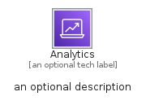
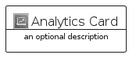
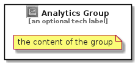

# Analytics


```text
aws-q1-2022/Category/Analytics
```

```text
include('aws-q1-2022/Category/Analytics')
```


| Illustration | Analytics | AnalyticsCard | AnalyticsGroup |
| :---: | :---: | :---: | :---: |
|  |  |  |  |


## Analytics

### Load remotely
```plantuml
@startuml
' configures the library
!global $LIB_BASE_LOCATION="https://raw.githubusercontent.com/tmorin/plantuml-libs/master/distribution"

' loads the library's bootstrap
!include $LIB_BASE_LOCATION/bootstrap.puml

' loads the package bootstrap
include('aws-q1-2022/bootstrap')

' loads the Item which embeds the element Analytics
include('aws-q1-2022/Category/Analytics')

' renders the element
Analytics('Analytics', 'Analytics', 'an optional tech label')
@enduml
```

### Load locally
```plantuml
@startuml
' configures the library
!global $INCLUSION_MODE="local"
!global $LIB_BASE_LOCATION="../.."

' loads the library's bootstrap
!include $LIB_BASE_LOCATION/bootstrap.puml

' loads the package bootstrap
include('aws-q1-2022/bootstrap')

' loads the Item which embeds the element Analytics
include('aws-q1-2022/Category/Analytics')

' renders the element
Analytics('Analytics', 'Analytics', 'an optional tech label')
@enduml
```

## AnalyticsCard

### Load remotely
```plantuml
@startuml
' configures the library
!global $LIB_BASE_LOCATION="https://raw.githubusercontent.com/tmorin/plantuml-libs/master/distribution"

' loads the library's bootstrap
!include $LIB_BASE_LOCATION/bootstrap.puml

' loads the package bootstrap
include('aws-q1-2022/bootstrap')

' loads the Item which embeds the element AnalyticsCard
include('aws-q1-2022/Category/Analytics')

' renders the element
AnalyticsCard('AnalyticsCard', 'Analytics Card', 'an optional description')
@enduml
```

### Load locally
```plantuml
@startuml
' configures the library
!global $INCLUSION_MODE="local"
!global $LIB_BASE_LOCATION="../.."

' loads the library's bootstrap
!include $LIB_BASE_LOCATION/bootstrap.puml

' loads the package bootstrap
include('aws-q1-2022/bootstrap')

' loads the Item which embeds the element AnalyticsCard
include('aws-q1-2022/Category/Analytics')

' renders the element
AnalyticsCard('AnalyticsCard', 'Analytics Card', 'an optional description')
@enduml
```

## AnalyticsGroup

### Load remotely
```plantuml
@startuml
' configures the library
!global $LIB_BASE_LOCATION="https://raw.githubusercontent.com/tmorin/plantuml-libs/master/distribution"

' loads the library's bootstrap
!include $LIB_BASE_LOCATION/bootstrap.puml

' loads the package bootstrap
include('aws-q1-2022/bootstrap')

' loads the Item which embeds the element AnalyticsGroup
include('aws-q1-2022/Category/Analytics')

' renders the element
AnalyticsGroup('AnalyticsGroup', 'Analytics Group', 'an optional tech label') {
    note as note
        the content of the group
    end note
}
@enduml
```

### Load locally
```plantuml
@startuml
' configures the library
!global $INCLUSION_MODE="local"
!global $LIB_BASE_LOCATION="../.."

' loads the library's bootstrap
!include $LIB_BASE_LOCATION/bootstrap.puml

' loads the package bootstrap
include('aws-q1-2022/bootstrap')

' loads the Item which embeds the element AnalyticsGroup
include('aws-q1-2022/Category/Analytics')

' renders the element
AnalyticsGroup('AnalyticsGroup', 'Analytics Group', 'an optional tech label') {
    note as note
        the content of the group
    end note
}
@enduml
```

