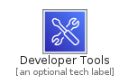
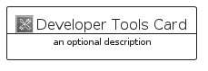
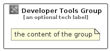

# DeveloperTools


```text
aws-q1-2022/Category/DeveloperTools
```

```text
include('aws-q1-2022/Category/DeveloperTools')
```


| Illustration | DeveloperTools | DeveloperToolsCard | DeveloperToolsGroup |
| :---: | :---: | :---: | :---: |
|  |  |  |  |


## DeveloperTools

### Load remotely
```plantuml
@startuml
' configures the library
!global $LIB_BASE_LOCATION="https://raw.githubusercontent.com/tmorin/plantuml-libs/master/distribution"

' loads the library's bootstrap
!include $LIB_BASE_LOCATION/bootstrap.puml

' loads the package bootstrap
include('aws-q1-2022/bootstrap')

' loads the Item which embeds the element DeveloperTools
include('aws-q1-2022/Category/DeveloperTools')

' renders the element
DeveloperTools('DeveloperTools', 'Developer Tools', 'an optional tech label')
@enduml
```

### Load locally
```plantuml
@startuml
' configures the library
!global $INCLUSION_MODE="local"
!global $LIB_BASE_LOCATION="../.."

' loads the library's bootstrap
!include $LIB_BASE_LOCATION/bootstrap.puml

' loads the package bootstrap
include('aws-q1-2022/bootstrap')

' loads the Item which embeds the element DeveloperTools
include('aws-q1-2022/Category/DeveloperTools')

' renders the element
DeveloperTools('DeveloperTools', 'Developer Tools', 'an optional tech label')
@enduml
```

## DeveloperToolsCard

### Load remotely
```plantuml
@startuml
' configures the library
!global $LIB_BASE_LOCATION="https://raw.githubusercontent.com/tmorin/plantuml-libs/master/distribution"

' loads the library's bootstrap
!include $LIB_BASE_LOCATION/bootstrap.puml

' loads the package bootstrap
include('aws-q1-2022/bootstrap')

' loads the Item which embeds the element DeveloperToolsCard
include('aws-q1-2022/Category/DeveloperTools')

' renders the element
DeveloperToolsCard('DeveloperToolsCard', 'Developer Tools Card', 'an optional description')
@enduml
```

### Load locally
```plantuml
@startuml
' configures the library
!global $INCLUSION_MODE="local"
!global $LIB_BASE_LOCATION="../.."

' loads the library's bootstrap
!include $LIB_BASE_LOCATION/bootstrap.puml

' loads the package bootstrap
include('aws-q1-2022/bootstrap')

' loads the Item which embeds the element DeveloperToolsCard
include('aws-q1-2022/Category/DeveloperTools')

' renders the element
DeveloperToolsCard('DeveloperToolsCard', 'Developer Tools Card', 'an optional description')
@enduml
```

## DeveloperToolsGroup

### Load remotely
```plantuml
@startuml
' configures the library
!global $LIB_BASE_LOCATION="https://raw.githubusercontent.com/tmorin/plantuml-libs/master/distribution"

' loads the library's bootstrap
!include $LIB_BASE_LOCATION/bootstrap.puml

' loads the package bootstrap
include('aws-q1-2022/bootstrap')

' loads the Item which embeds the element DeveloperToolsGroup
include('aws-q1-2022/Category/DeveloperTools')

' renders the element
DeveloperToolsGroup('DeveloperToolsGroup', 'Developer Tools Group', 'an optional tech label') {
    note as note
        the content of the group
    end note
}
@enduml
```

### Load locally
```plantuml
@startuml
' configures the library
!global $INCLUSION_MODE="local"
!global $LIB_BASE_LOCATION="../.."

' loads the library's bootstrap
!include $LIB_BASE_LOCATION/bootstrap.puml

' loads the package bootstrap
include('aws-q1-2022/bootstrap')

' loads the Item which embeds the element DeveloperToolsGroup
include('aws-q1-2022/Category/DeveloperTools')

' renders the element
DeveloperToolsGroup('DeveloperToolsGroup', 'Developer Tools Group', 'an optional tech label') {
    note as note
        the content of the group
    end note
}
@enduml
```

