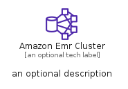
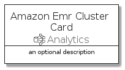
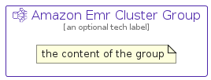

# AmazonEmrCluster


```text
aws-q1-2022/Resource/Analytics/AmazonEmrCluster
```

```text
include('aws-q1-2022/Resource/Analytics/AmazonEmrCluster')
```


| Illustration | AmazonEmrCluster | AmazonEmrClusterCard | AmazonEmrClusterGroup |
| :---: | :---: | :---: | :---: |
|  |  |  |  |


## AmazonEmrCluster

### Load remotely
```plantuml
@startuml
' configures the library
!global $LIB_BASE_LOCATION="https://raw.githubusercontent.com/tmorin/plantuml-libs/master/distribution"

' loads the library's bootstrap
!include $LIB_BASE_LOCATION/bootstrap.puml

' loads the package bootstrap
include('aws-q1-2022/bootstrap')

' loads the Item which embeds the element AmazonEmrCluster
include('aws-q1-2022/Resource/Analytics/AmazonEmrCluster')

' renders the element
AmazonEmrCluster('AmazonEmrCluster', 'Amazon Emr Cluster', 'an optional tech label')
@enduml
```

### Load locally
```plantuml
@startuml
' configures the library
!global $INCLUSION_MODE="local"
!global $LIB_BASE_LOCATION="../../.."

' loads the library's bootstrap
!include $LIB_BASE_LOCATION/bootstrap.puml

' loads the package bootstrap
include('aws-q1-2022/bootstrap')

' loads the Item which embeds the element AmazonEmrCluster
include('aws-q1-2022/Resource/Analytics/AmazonEmrCluster')

' renders the element
AmazonEmrCluster('AmazonEmrCluster', 'Amazon Emr Cluster', 'an optional tech label')
@enduml
```

## AmazonEmrClusterCard

### Load remotely
```plantuml
@startuml
' configures the library
!global $LIB_BASE_LOCATION="https://raw.githubusercontent.com/tmorin/plantuml-libs/master/distribution"

' loads the library's bootstrap
!include $LIB_BASE_LOCATION/bootstrap.puml

' loads the package bootstrap
include('aws-q1-2022/bootstrap')

' loads the Item which embeds the element AmazonEmrClusterCard
include('aws-q1-2022/Resource/Analytics/AmazonEmrCluster')

' renders the element
AmazonEmrClusterCard('AmazonEmrClusterCard', 'Amazon Emr Cluster Card', 'an optional description')
@enduml
```

### Load locally
```plantuml
@startuml
' configures the library
!global $INCLUSION_MODE="local"
!global $LIB_BASE_LOCATION="../../.."

' loads the library's bootstrap
!include $LIB_BASE_LOCATION/bootstrap.puml

' loads the package bootstrap
include('aws-q1-2022/bootstrap')

' loads the Item which embeds the element AmazonEmrClusterCard
include('aws-q1-2022/Resource/Analytics/AmazonEmrCluster')

' renders the element
AmazonEmrClusterCard('AmazonEmrClusterCard', 'Amazon Emr Cluster Card', 'an optional description')
@enduml
```

## AmazonEmrClusterGroup

### Load remotely
```plantuml
@startuml
' configures the library
!global $LIB_BASE_LOCATION="https://raw.githubusercontent.com/tmorin/plantuml-libs/master/distribution"

' loads the library's bootstrap
!include $LIB_BASE_LOCATION/bootstrap.puml

' loads the package bootstrap
include('aws-q1-2022/bootstrap')

' loads the Item which embeds the element AmazonEmrClusterGroup
include('aws-q1-2022/Resource/Analytics/AmazonEmrCluster')

' renders the element
AmazonEmrClusterGroup('AmazonEmrClusterGroup', 'Amazon Emr Cluster Group', 'an optional tech label') {
    note as note
        the content of the group
    end note
}
@enduml
```

### Load locally
```plantuml
@startuml
' configures the library
!global $INCLUSION_MODE="local"
!global $LIB_BASE_LOCATION="../../.."

' loads the library's bootstrap
!include $LIB_BASE_LOCATION/bootstrap.puml

' loads the package bootstrap
include('aws-q1-2022/bootstrap')

' loads the Item which embeds the element AmazonEmrClusterGroup
include('aws-q1-2022/Resource/Analytics/AmazonEmrCluster')

' renders the element
AmazonEmrClusterGroup('AmazonEmrClusterGroup', 'Amazon Emr Cluster Group', 'an optional tech label') {
    note as note
        the content of the group
    end note
}
@enduml
```

