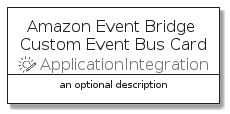

# AmazonEventBridgeCustomEventBus


```text
aws-q1-2022/Resource/ApplicationIntegration/AmazonEventBridgeCustomEventBus
```

```text
include('aws-q1-2022/Resource/ApplicationIntegration/AmazonEventBridgeCustomEventBus')
```


| Illustration | AmazonEventBridgeCustomEventBus | AmazonEventBridgeCustomEventBusCard | AmazonEventBridgeCustomEventBusGroup |
| :---: | :---: | :---: | :---: |
|  |  |  |  |


## AmazonEventBridgeCustomEventBus

### Load remotely
```plantuml
@startuml
' configures the library
!global $LIB_BASE_LOCATION="https://raw.githubusercontent.com/tmorin/plantuml-libs/master/distribution"

' loads the library's bootstrap
!include $LIB_BASE_LOCATION/bootstrap.puml

' loads the package bootstrap
include('aws-q1-2022/bootstrap')

' loads the Item which embeds the element AmazonEventBridgeCustomEventBus
include('aws-q1-2022/Resource/ApplicationIntegration/AmazonEventBridgeCustomEventBus')

' renders the element
AmazonEventBridgeCustomEventBus('AmazonEventBridgeCustomEventBus', 'Amazon Event Bridge Custom Event Bus', 'an optional tech label')
@enduml
```

### Load locally
```plantuml
@startuml
' configures the library
!global $INCLUSION_MODE="local"
!global $LIB_BASE_LOCATION="../../.."

' loads the library's bootstrap
!include $LIB_BASE_LOCATION/bootstrap.puml

' loads the package bootstrap
include('aws-q1-2022/bootstrap')

' loads the Item which embeds the element AmazonEventBridgeCustomEventBus
include('aws-q1-2022/Resource/ApplicationIntegration/AmazonEventBridgeCustomEventBus')

' renders the element
AmazonEventBridgeCustomEventBus('AmazonEventBridgeCustomEventBus', 'Amazon Event Bridge Custom Event Bus', 'an optional tech label')
@enduml
```

## AmazonEventBridgeCustomEventBusCard

### Load remotely
```plantuml
@startuml
' configures the library
!global $LIB_BASE_LOCATION="https://raw.githubusercontent.com/tmorin/plantuml-libs/master/distribution"

' loads the library's bootstrap
!include $LIB_BASE_LOCATION/bootstrap.puml

' loads the package bootstrap
include('aws-q1-2022/bootstrap')

' loads the Item which embeds the element AmazonEventBridgeCustomEventBusCard
include('aws-q1-2022/Resource/ApplicationIntegration/AmazonEventBridgeCustomEventBus')

' renders the element
AmazonEventBridgeCustomEventBusCard('AmazonEventBridgeCustomEventBusCard', 'Amazon Event Bridge Custom Event Bus Card', 'an optional description')
@enduml
```

### Load locally
```plantuml
@startuml
' configures the library
!global $INCLUSION_MODE="local"
!global $LIB_BASE_LOCATION="../../.."

' loads the library's bootstrap
!include $LIB_BASE_LOCATION/bootstrap.puml

' loads the package bootstrap
include('aws-q1-2022/bootstrap')

' loads the Item which embeds the element AmazonEventBridgeCustomEventBusCard
include('aws-q1-2022/Resource/ApplicationIntegration/AmazonEventBridgeCustomEventBus')

' renders the element
AmazonEventBridgeCustomEventBusCard('AmazonEventBridgeCustomEventBusCard', 'Amazon Event Bridge Custom Event Bus Card', 'an optional description')
@enduml
```

## AmazonEventBridgeCustomEventBusGroup

### Load remotely
```plantuml
@startuml
' configures the library
!global $LIB_BASE_LOCATION="https://raw.githubusercontent.com/tmorin/plantuml-libs/master/distribution"

' loads the library's bootstrap
!include $LIB_BASE_LOCATION/bootstrap.puml

' loads the package bootstrap
include('aws-q1-2022/bootstrap')

' loads the Item which embeds the element AmazonEventBridgeCustomEventBusGroup
include('aws-q1-2022/Resource/ApplicationIntegration/AmazonEventBridgeCustomEventBus')

' renders the element
AmazonEventBridgeCustomEventBusGroup('AmazonEventBridgeCustomEventBusGroup', 'Amazon Event Bridge Custom Event Bus Group', 'an optional tech label') {
    note as note
        the content of the group
    end note
}
@enduml
```

### Load locally
```plantuml
@startuml
' configures the library
!global $INCLUSION_MODE="local"
!global $LIB_BASE_LOCATION="../../.."

' loads the library's bootstrap
!include $LIB_BASE_LOCATION/bootstrap.puml

' loads the package bootstrap
include('aws-q1-2022/bootstrap')

' loads the Item which embeds the element AmazonEventBridgeCustomEventBusGroup
include('aws-q1-2022/Resource/ApplicationIntegration/AmazonEventBridgeCustomEventBus')

' renders the element
AmazonEventBridgeCustomEventBusGroup('AmazonEventBridgeCustomEventBusGroup', 'Amazon Event Bridge Custom Event Bus Group', 'an optional tech label') {
    note as note
        the content of the group
    end note
}
@enduml
```

