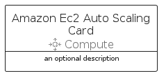
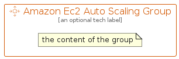

# AmazonEc2AutoScaling


```text
aws-q1-2022/Resource/Compute/AmazonEc2AutoScaling
```

```text
include('aws-q1-2022/Resource/Compute/AmazonEc2AutoScaling')
```


| Illustration | AmazonEc2AutoScaling | AmazonEc2AutoScalingCard | AmazonEc2AutoScalingGroup |
| :---: | :---: | :---: | :---: |
|  |  |  |  |


## AmazonEc2AutoScaling

### Load remotely
```plantuml
@startuml
' configures the library
!global $LIB_BASE_LOCATION="https://raw.githubusercontent.com/tmorin/plantuml-libs/master/distribution"

' loads the library's bootstrap
!include $LIB_BASE_LOCATION/bootstrap.puml

' loads the package bootstrap
include('aws-q1-2022/bootstrap')

' loads the Item which embeds the element AmazonEc2AutoScaling
include('aws-q1-2022/Resource/Compute/AmazonEc2AutoScaling')

' renders the element
AmazonEc2AutoScaling('AmazonEc2AutoScaling', 'Amazon Ec2 Auto Scaling', 'an optional tech label')
@enduml
```

### Load locally
```plantuml
@startuml
' configures the library
!global $INCLUSION_MODE="local"
!global $LIB_BASE_LOCATION="../../.."

' loads the library's bootstrap
!include $LIB_BASE_LOCATION/bootstrap.puml

' loads the package bootstrap
include('aws-q1-2022/bootstrap')

' loads the Item which embeds the element AmazonEc2AutoScaling
include('aws-q1-2022/Resource/Compute/AmazonEc2AutoScaling')

' renders the element
AmazonEc2AutoScaling('AmazonEc2AutoScaling', 'Amazon Ec2 Auto Scaling', 'an optional tech label')
@enduml
```

## AmazonEc2AutoScalingCard

### Load remotely
```plantuml
@startuml
' configures the library
!global $LIB_BASE_LOCATION="https://raw.githubusercontent.com/tmorin/plantuml-libs/master/distribution"

' loads the library's bootstrap
!include $LIB_BASE_LOCATION/bootstrap.puml

' loads the package bootstrap
include('aws-q1-2022/bootstrap')

' loads the Item which embeds the element AmazonEc2AutoScalingCard
include('aws-q1-2022/Resource/Compute/AmazonEc2AutoScaling')

' renders the element
AmazonEc2AutoScalingCard('AmazonEc2AutoScalingCard', 'Amazon Ec2 Auto Scaling Card', 'an optional description')
@enduml
```

### Load locally
```plantuml
@startuml
' configures the library
!global $INCLUSION_MODE="local"
!global $LIB_BASE_LOCATION="../../.."

' loads the library's bootstrap
!include $LIB_BASE_LOCATION/bootstrap.puml

' loads the package bootstrap
include('aws-q1-2022/bootstrap')

' loads the Item which embeds the element AmazonEc2AutoScalingCard
include('aws-q1-2022/Resource/Compute/AmazonEc2AutoScaling')

' renders the element
AmazonEc2AutoScalingCard('AmazonEc2AutoScalingCard', 'Amazon Ec2 Auto Scaling Card', 'an optional description')
@enduml
```

## AmazonEc2AutoScalingGroup

### Load remotely
```plantuml
@startuml
' configures the library
!global $LIB_BASE_LOCATION="https://raw.githubusercontent.com/tmorin/plantuml-libs/master/distribution"

' loads the library's bootstrap
!include $LIB_BASE_LOCATION/bootstrap.puml

' loads the package bootstrap
include('aws-q1-2022/bootstrap')

' loads the Item which embeds the element AmazonEc2AutoScalingGroup
include('aws-q1-2022/Resource/Compute/AmazonEc2AutoScaling')

' renders the element
AmazonEc2AutoScalingGroup('AmazonEc2AutoScalingGroup', 'Amazon Ec2 Auto Scaling Group', 'an optional tech label') {
    note as note
        the content of the group
    end note
}
@enduml
```

### Load locally
```plantuml
@startuml
' configures the library
!global $INCLUSION_MODE="local"
!global $LIB_BASE_LOCATION="../../.."

' loads the library's bootstrap
!include $LIB_BASE_LOCATION/bootstrap.puml

' loads the package bootstrap
include('aws-q1-2022/bootstrap')

' loads the Item which embeds the element AmazonEc2AutoScalingGroup
include('aws-q1-2022/Resource/Compute/AmazonEc2AutoScaling')

' renders the element
AmazonEc2AutoScalingGroup('AmazonEc2AutoScalingGroup', 'Amazon Ec2 Auto Scaling Group', 'an optional tech label') {
    note as note
        the content of the group
    end note
}
@enduml
```

