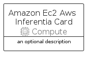
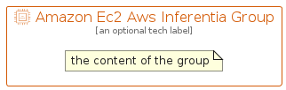

# AmazonEc2AwsInferentia


```text
aws-q1-2022/Resource/Compute/AmazonEc2AwsInferentia
```

```text
include('aws-q1-2022/Resource/Compute/AmazonEc2AwsInferentia')
```


| Illustration | AmazonEc2AwsInferentia | AmazonEc2AwsInferentiaCard | AmazonEc2AwsInferentiaGroup |
| :---: | :---: | :---: | :---: |
|  |  |  |  |


## AmazonEc2AwsInferentia

### Load remotely
```plantuml
@startuml
' configures the library
!global $LIB_BASE_LOCATION="https://raw.githubusercontent.com/tmorin/plantuml-libs/master/distribution"

' loads the library's bootstrap
!include $LIB_BASE_LOCATION/bootstrap.puml

' loads the package bootstrap
include('aws-q1-2022/bootstrap')

' loads the Item which embeds the element AmazonEc2AwsInferentia
include('aws-q1-2022/Resource/Compute/AmazonEc2AwsInferentia')

' renders the element
AmazonEc2AwsInferentia('AmazonEc2AwsInferentia', 'Amazon Ec2 Aws Inferentia', 'an optional tech label', 'an optional description')
@enduml
```

### Load locally
```plantuml
@startuml
' configures the library
!global $INCLUSION_MODE="local"
!global $LIB_BASE_LOCATION="../../.."

' loads the library's bootstrap
!include $LIB_BASE_LOCATION/bootstrap.puml

' loads the package bootstrap
include('aws-q1-2022/bootstrap')

' loads the Item which embeds the element AmazonEc2AwsInferentia
include('aws-q1-2022/Resource/Compute/AmazonEc2AwsInferentia')

' renders the element
AmazonEc2AwsInferentia('AmazonEc2AwsInferentia', 'Amazon Ec2 Aws Inferentia', 'an optional tech label', 'an optional description')
@enduml
```

## AmazonEc2AwsInferentiaCard

### Load remotely
```plantuml
@startuml
' configures the library
!global $LIB_BASE_LOCATION="https://raw.githubusercontent.com/tmorin/plantuml-libs/master/distribution"

' loads the library's bootstrap
!include $LIB_BASE_LOCATION/bootstrap.puml

' loads the package bootstrap
include('aws-q1-2022/bootstrap')

' loads the Item which embeds the element AmazonEc2AwsInferentiaCard
include('aws-q1-2022/Resource/Compute/AmazonEc2AwsInferentia')

' renders the element
AmazonEc2AwsInferentiaCard('AmazonEc2AwsInferentiaCard', 'Amazon Ec2 Aws Inferentia Card', 'an optional description')
@enduml
```

### Load locally
```plantuml
@startuml
' configures the library
!global $INCLUSION_MODE="local"
!global $LIB_BASE_LOCATION="../../.."

' loads the library's bootstrap
!include $LIB_BASE_LOCATION/bootstrap.puml

' loads the package bootstrap
include('aws-q1-2022/bootstrap')

' loads the Item which embeds the element AmazonEc2AwsInferentiaCard
include('aws-q1-2022/Resource/Compute/AmazonEc2AwsInferentia')

' renders the element
AmazonEc2AwsInferentiaCard('AmazonEc2AwsInferentiaCard', 'Amazon Ec2 Aws Inferentia Card', 'an optional description')
@enduml
```

## AmazonEc2AwsInferentiaGroup

### Load remotely
```plantuml
@startuml
' configures the library
!global $LIB_BASE_LOCATION="https://raw.githubusercontent.com/tmorin/plantuml-libs/master/distribution"

' loads the library's bootstrap
!include $LIB_BASE_LOCATION/bootstrap.puml

' loads the package bootstrap
include('aws-q1-2022/bootstrap')

' loads the Item which embeds the element AmazonEc2AwsInferentiaGroup
include('aws-q1-2022/Resource/Compute/AmazonEc2AwsInferentia')

' renders the element
AmazonEc2AwsInferentiaGroup('AmazonEc2AwsInferentiaGroup', 'Amazon Ec2 Aws Inferentia Group', 'an optional tech label') {
    note as note
        the content of the group
    end note
}
@enduml
```

### Load locally
```plantuml
@startuml
' configures the library
!global $INCLUSION_MODE="local"
!global $LIB_BASE_LOCATION="../../.."

' loads the library's bootstrap
!include $LIB_BASE_LOCATION/bootstrap.puml

' loads the package bootstrap
include('aws-q1-2022/bootstrap')

' loads the Item which embeds the element AmazonEc2AwsInferentiaGroup
include('aws-q1-2022/Resource/Compute/AmazonEc2AwsInferentia')

' renders the element
AmazonEc2AwsInferentiaGroup('AmazonEc2AwsInferentiaGroup', 'Amazon Ec2 Aws Inferentia Group', 'an optional tech label') {
    note as note
        the content of the group
    end note
}
@enduml
```

