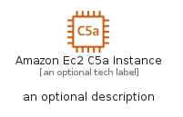
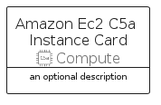
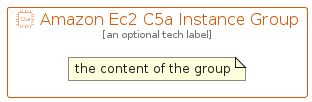

# AmazonEc2C5AInstance


```text
aws-q1-2022/Resource/Compute/AmazonEc2C5AInstance
```

```text
include('aws-q1-2022/Resource/Compute/AmazonEc2C5AInstance')
```


| Illustration | AmazonEc2C5AInstance | AmazonEc2C5AInstanceCard | AmazonEc2C5AInstanceGroup |
| :---: | :---: | :---: | :---: |
|  |  |  |  |


## AmazonEc2C5AInstance

### Load remotely
```plantuml
@startuml
' configures the library
!global $LIB_BASE_LOCATION="https://raw.githubusercontent.com/tmorin/plantuml-libs/master/distribution"

' loads the library's bootstrap
!include $LIB_BASE_LOCATION/bootstrap.puml

' loads the package bootstrap
include('aws-q1-2022/bootstrap')

' loads the Item which embeds the element AmazonEc2C5AInstance
include('aws-q1-2022/Resource/Compute/AmazonEc2C5AInstance')

' renders the element
AmazonEc2C5AInstance('AmazonEc2C5aInstance', 'Amazon Ec2 C5a Instance', 'an optional tech label', 'an optional description')
@enduml
```

### Load locally
```plantuml
@startuml
' configures the library
!global $INCLUSION_MODE="local"
!global $LIB_BASE_LOCATION="../../.."

' loads the library's bootstrap
!include $LIB_BASE_LOCATION/bootstrap.puml

' loads the package bootstrap
include('aws-q1-2022/bootstrap')

' loads the Item which embeds the element AmazonEc2C5AInstance
include('aws-q1-2022/Resource/Compute/AmazonEc2C5AInstance')

' renders the element
AmazonEc2C5AInstance('AmazonEc2C5aInstance', 'Amazon Ec2 C5a Instance', 'an optional tech label', 'an optional description')
@enduml
```

## AmazonEc2C5AInstanceCard

### Load remotely
```plantuml
@startuml
' configures the library
!global $LIB_BASE_LOCATION="https://raw.githubusercontent.com/tmorin/plantuml-libs/master/distribution"

' loads the library's bootstrap
!include $LIB_BASE_LOCATION/bootstrap.puml

' loads the package bootstrap
include('aws-q1-2022/bootstrap')

' loads the Item which embeds the element AmazonEc2C5AInstanceCard
include('aws-q1-2022/Resource/Compute/AmazonEc2C5AInstance')

' renders the element
AmazonEc2C5AInstanceCard('AmazonEc2C5aInstanceCard', 'Amazon Ec2 C5a Instance Card', 'an optional description')
@enduml
```

### Load locally
```plantuml
@startuml
' configures the library
!global $INCLUSION_MODE="local"
!global $LIB_BASE_LOCATION="../../.."

' loads the library's bootstrap
!include $LIB_BASE_LOCATION/bootstrap.puml

' loads the package bootstrap
include('aws-q1-2022/bootstrap')

' loads the Item which embeds the element AmazonEc2C5AInstanceCard
include('aws-q1-2022/Resource/Compute/AmazonEc2C5AInstance')

' renders the element
AmazonEc2C5AInstanceCard('AmazonEc2C5aInstanceCard', 'Amazon Ec2 C5a Instance Card', 'an optional description')
@enduml
```

## AmazonEc2C5AInstanceGroup

### Load remotely
```plantuml
@startuml
' configures the library
!global $LIB_BASE_LOCATION="https://raw.githubusercontent.com/tmorin/plantuml-libs/master/distribution"

' loads the library's bootstrap
!include $LIB_BASE_LOCATION/bootstrap.puml

' loads the package bootstrap
include('aws-q1-2022/bootstrap')

' loads the Item which embeds the element AmazonEc2C5AInstanceGroup
include('aws-q1-2022/Resource/Compute/AmazonEc2C5AInstance')

' renders the element
AmazonEc2C5AInstanceGroup('AmazonEc2C5aInstanceGroup', 'Amazon Ec2 C5a Instance Group', 'an optional tech label') {
    note as note
        the content of the group
    end note
}
@enduml
```

### Load locally
```plantuml
@startuml
' configures the library
!global $INCLUSION_MODE="local"
!global $LIB_BASE_LOCATION="../../.."

' loads the library's bootstrap
!include $LIB_BASE_LOCATION/bootstrap.puml

' loads the package bootstrap
include('aws-q1-2022/bootstrap')

' loads the Item which embeds the element AmazonEc2C5AInstanceGroup
include('aws-q1-2022/Resource/Compute/AmazonEc2C5AInstance')

' renders the element
AmazonEc2C5AInstanceGroup('AmazonEc2C5aInstanceGroup', 'Amazon Ec2 C5a Instance Group', 'an optional tech label') {
    note as note
        the content of the group
    end note
}
@enduml
```

