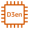
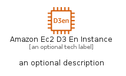
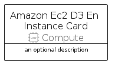
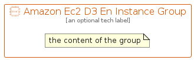

# AmazonEc2D3EnInstance


```text
aws-q1-2022/Resource/Compute/AmazonEc2D3EnInstance
```

```text
include('aws-q1-2022/Resource/Compute/AmazonEc2D3EnInstance')
```


| Illustration | AmazonEc2D3EnInstance | AmazonEc2D3EnInstanceCard | AmazonEc2D3EnInstanceGroup |
| :---: | :---: | :---: | :---: |
|  |  |  |  |


## AmazonEc2D3EnInstance

### Load remotely
```plantuml
@startuml
' configures the library
!global $LIB_BASE_LOCATION="https://raw.githubusercontent.com/tmorin/plantuml-libs/master/distribution"

' loads the library's bootstrap
!include $LIB_BASE_LOCATION/bootstrap.puml

' loads the package bootstrap
include('aws-q1-2022/bootstrap')

' loads the Item which embeds the element AmazonEc2D3EnInstance
include('aws-q1-2022/Resource/Compute/AmazonEc2D3EnInstance')

' renders the element
AmazonEc2D3EnInstance('AmazonEc2D3EnInstance', 'Amazon Ec2 D3 En Instance', 'an optional tech label')
@enduml
```

### Load locally
```plantuml
@startuml
' configures the library
!global $INCLUSION_MODE="local"
!global $LIB_BASE_LOCATION="../../.."

' loads the library's bootstrap
!include $LIB_BASE_LOCATION/bootstrap.puml

' loads the package bootstrap
include('aws-q1-2022/bootstrap')

' loads the Item which embeds the element AmazonEc2D3EnInstance
include('aws-q1-2022/Resource/Compute/AmazonEc2D3EnInstance')

' renders the element
AmazonEc2D3EnInstance('AmazonEc2D3EnInstance', 'Amazon Ec2 D3 En Instance', 'an optional tech label')
@enduml
```

## AmazonEc2D3EnInstanceCard

### Load remotely
```plantuml
@startuml
' configures the library
!global $LIB_BASE_LOCATION="https://raw.githubusercontent.com/tmorin/plantuml-libs/master/distribution"

' loads the library's bootstrap
!include $LIB_BASE_LOCATION/bootstrap.puml

' loads the package bootstrap
include('aws-q1-2022/bootstrap')

' loads the Item which embeds the element AmazonEc2D3EnInstanceCard
include('aws-q1-2022/Resource/Compute/AmazonEc2D3EnInstance')

' renders the element
AmazonEc2D3EnInstanceCard('AmazonEc2D3EnInstanceCard', 'Amazon Ec2 D3 En Instance Card', 'an optional description')
@enduml
```

### Load locally
```plantuml
@startuml
' configures the library
!global $INCLUSION_MODE="local"
!global $LIB_BASE_LOCATION="../../.."

' loads the library's bootstrap
!include $LIB_BASE_LOCATION/bootstrap.puml

' loads the package bootstrap
include('aws-q1-2022/bootstrap')

' loads the Item which embeds the element AmazonEc2D3EnInstanceCard
include('aws-q1-2022/Resource/Compute/AmazonEc2D3EnInstance')

' renders the element
AmazonEc2D3EnInstanceCard('AmazonEc2D3EnInstanceCard', 'Amazon Ec2 D3 En Instance Card', 'an optional description')
@enduml
```

## AmazonEc2D3EnInstanceGroup

### Load remotely
```plantuml
@startuml
' configures the library
!global $LIB_BASE_LOCATION="https://raw.githubusercontent.com/tmorin/plantuml-libs/master/distribution"

' loads the library's bootstrap
!include $LIB_BASE_LOCATION/bootstrap.puml

' loads the package bootstrap
include('aws-q1-2022/bootstrap')

' loads the Item which embeds the element AmazonEc2D3EnInstanceGroup
include('aws-q1-2022/Resource/Compute/AmazonEc2D3EnInstance')

' renders the element
AmazonEc2D3EnInstanceGroup('AmazonEc2D3EnInstanceGroup', 'Amazon Ec2 D3 En Instance Group', 'an optional tech label') {
    note as note
        the content of the group
    end note
}
@enduml
```

### Load locally
```plantuml
@startuml
' configures the library
!global $INCLUSION_MODE="local"
!global $LIB_BASE_LOCATION="../../.."

' loads the library's bootstrap
!include $LIB_BASE_LOCATION/bootstrap.puml

' loads the package bootstrap
include('aws-q1-2022/bootstrap')

' loads the Item which embeds the element AmazonEc2D3EnInstanceGroup
include('aws-q1-2022/Resource/Compute/AmazonEc2D3EnInstance')

' renders the element
AmazonEc2D3EnInstanceGroup('AmazonEc2D3EnInstanceGroup', 'Amazon Ec2 D3 En Instance Group', 'an optional tech label') {
    note as note
        the content of the group
    end note
}
@enduml
```

