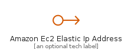
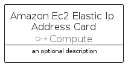
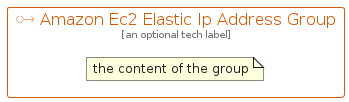

# AmazonEc2ElasticIpAddress


```text
aws-q1-2022/Resource/Compute/AmazonEc2ElasticIpAddress
```

```text
include('aws-q1-2022/Resource/Compute/AmazonEc2ElasticIpAddress')
```


| Illustration | AmazonEc2ElasticIpAddress | AmazonEc2ElasticIpAddressCard | AmazonEc2ElasticIpAddressGroup |
| :---: | :---: | :---: | :---: |
|  |  |  |  |


## AmazonEc2ElasticIpAddress

### Load remotely
```plantuml
@startuml
' configures the library
!global $LIB_BASE_LOCATION="https://raw.githubusercontent.com/tmorin/plantuml-libs/master/distribution"

' loads the library's bootstrap
!include $LIB_BASE_LOCATION/bootstrap.puml

' loads the package bootstrap
include('aws-q1-2022/bootstrap')

' loads the Item which embeds the element AmazonEc2ElasticIpAddress
include('aws-q1-2022/Resource/Compute/AmazonEc2ElasticIpAddress')

' renders the element
AmazonEc2ElasticIpAddress('AmazonEc2ElasticIpAddress', 'Amazon Ec2 Elastic Ip Address', 'an optional tech label')
@enduml
```

### Load locally
```plantuml
@startuml
' configures the library
!global $INCLUSION_MODE="local"
!global $LIB_BASE_LOCATION="../../.."

' loads the library's bootstrap
!include $LIB_BASE_LOCATION/bootstrap.puml

' loads the package bootstrap
include('aws-q1-2022/bootstrap')

' loads the Item which embeds the element AmazonEc2ElasticIpAddress
include('aws-q1-2022/Resource/Compute/AmazonEc2ElasticIpAddress')

' renders the element
AmazonEc2ElasticIpAddress('AmazonEc2ElasticIpAddress', 'Amazon Ec2 Elastic Ip Address', 'an optional tech label')
@enduml
```

## AmazonEc2ElasticIpAddressCard

### Load remotely
```plantuml
@startuml
' configures the library
!global $LIB_BASE_LOCATION="https://raw.githubusercontent.com/tmorin/plantuml-libs/master/distribution"

' loads the library's bootstrap
!include $LIB_BASE_LOCATION/bootstrap.puml

' loads the package bootstrap
include('aws-q1-2022/bootstrap')

' loads the Item which embeds the element AmazonEc2ElasticIpAddressCard
include('aws-q1-2022/Resource/Compute/AmazonEc2ElasticIpAddress')

' renders the element
AmazonEc2ElasticIpAddressCard('AmazonEc2ElasticIpAddressCard', 'Amazon Ec2 Elastic Ip Address Card', 'an optional description')
@enduml
```

### Load locally
```plantuml
@startuml
' configures the library
!global $INCLUSION_MODE="local"
!global $LIB_BASE_LOCATION="../../.."

' loads the library's bootstrap
!include $LIB_BASE_LOCATION/bootstrap.puml

' loads the package bootstrap
include('aws-q1-2022/bootstrap')

' loads the Item which embeds the element AmazonEc2ElasticIpAddressCard
include('aws-q1-2022/Resource/Compute/AmazonEc2ElasticIpAddress')

' renders the element
AmazonEc2ElasticIpAddressCard('AmazonEc2ElasticIpAddressCard', 'Amazon Ec2 Elastic Ip Address Card', 'an optional description')
@enduml
```

## AmazonEc2ElasticIpAddressGroup

### Load remotely
```plantuml
@startuml
' configures the library
!global $LIB_BASE_LOCATION="https://raw.githubusercontent.com/tmorin/plantuml-libs/master/distribution"

' loads the library's bootstrap
!include $LIB_BASE_LOCATION/bootstrap.puml

' loads the package bootstrap
include('aws-q1-2022/bootstrap')

' loads the Item which embeds the element AmazonEc2ElasticIpAddressGroup
include('aws-q1-2022/Resource/Compute/AmazonEc2ElasticIpAddress')

' renders the element
AmazonEc2ElasticIpAddressGroup('AmazonEc2ElasticIpAddressGroup', 'Amazon Ec2 Elastic Ip Address Group', 'an optional tech label') {
    note as note
        the content of the group
    end note
}
@enduml
```

### Load locally
```plantuml
@startuml
' configures the library
!global $INCLUSION_MODE="local"
!global $LIB_BASE_LOCATION="../../.."

' loads the library's bootstrap
!include $LIB_BASE_LOCATION/bootstrap.puml

' loads the package bootstrap
include('aws-q1-2022/bootstrap')

' loads the Item which embeds the element AmazonEc2ElasticIpAddressGroup
include('aws-q1-2022/Resource/Compute/AmazonEc2ElasticIpAddress')

' renders the element
AmazonEc2ElasticIpAddressGroup('AmazonEc2ElasticIpAddressGroup', 'Amazon Ec2 Elastic Ip Address Group', 'an optional tech label') {
    note as note
        the content of the group
    end note
}
@enduml
```

