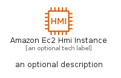
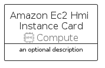
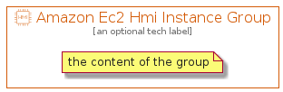

# AmazonEc2HmiInstance


```text
aws-q1-2022/Resource/Compute/AmazonEc2HmiInstance
```

```text
include('aws-q1-2022/Resource/Compute/AmazonEc2HmiInstance')
```


| Illustration | AmazonEc2HmiInstance | AmazonEc2HmiInstanceCard | AmazonEc2HmiInstanceGroup |
| :---: | :---: | :---: | :---: |
|  |  |  |  |


## AmazonEc2HmiInstance

### Load remotely
```plantuml
@startuml
' configures the library
!global $LIB_BASE_LOCATION="https://raw.githubusercontent.com/tmorin/plantuml-libs/master/distribution"

' loads the library's bootstrap
!include $LIB_BASE_LOCATION/bootstrap.puml

' loads the package bootstrap
include('aws-q1-2022/bootstrap')

' loads the Item which embeds the element AmazonEc2HmiInstance
include('aws-q1-2022/Resource/Compute/AmazonEc2HmiInstance')

' renders the element
AmazonEc2HmiInstance('AmazonEc2HmiInstance', 'Amazon Ec2 Hmi Instance', 'an optional tech label')
@enduml
```

### Load locally
```plantuml
@startuml
' configures the library
!global $INCLUSION_MODE="local"
!global $LIB_BASE_LOCATION="../../.."

' loads the library's bootstrap
!include $LIB_BASE_LOCATION/bootstrap.puml

' loads the package bootstrap
include('aws-q1-2022/bootstrap')

' loads the Item which embeds the element AmazonEc2HmiInstance
include('aws-q1-2022/Resource/Compute/AmazonEc2HmiInstance')

' renders the element
AmazonEc2HmiInstance('AmazonEc2HmiInstance', 'Amazon Ec2 Hmi Instance', 'an optional tech label')
@enduml
```

## AmazonEc2HmiInstanceCard

### Load remotely
```plantuml
@startuml
' configures the library
!global $LIB_BASE_LOCATION="https://raw.githubusercontent.com/tmorin/plantuml-libs/master/distribution"

' loads the library's bootstrap
!include $LIB_BASE_LOCATION/bootstrap.puml

' loads the package bootstrap
include('aws-q1-2022/bootstrap')

' loads the Item which embeds the element AmazonEc2HmiInstanceCard
include('aws-q1-2022/Resource/Compute/AmazonEc2HmiInstance')

' renders the element
AmazonEc2HmiInstanceCard('AmazonEc2HmiInstanceCard', 'Amazon Ec2 Hmi Instance Card', 'an optional description')
@enduml
```

### Load locally
```plantuml
@startuml
' configures the library
!global $INCLUSION_MODE="local"
!global $LIB_BASE_LOCATION="../../.."

' loads the library's bootstrap
!include $LIB_BASE_LOCATION/bootstrap.puml

' loads the package bootstrap
include('aws-q1-2022/bootstrap')

' loads the Item which embeds the element AmazonEc2HmiInstanceCard
include('aws-q1-2022/Resource/Compute/AmazonEc2HmiInstance')

' renders the element
AmazonEc2HmiInstanceCard('AmazonEc2HmiInstanceCard', 'Amazon Ec2 Hmi Instance Card', 'an optional description')
@enduml
```

## AmazonEc2HmiInstanceGroup

### Load remotely
```plantuml
@startuml
' configures the library
!global $LIB_BASE_LOCATION="https://raw.githubusercontent.com/tmorin/plantuml-libs/master/distribution"

' loads the library's bootstrap
!include $LIB_BASE_LOCATION/bootstrap.puml

' loads the package bootstrap
include('aws-q1-2022/bootstrap')

' loads the Item which embeds the element AmazonEc2HmiInstanceGroup
include('aws-q1-2022/Resource/Compute/AmazonEc2HmiInstance')

' renders the element
AmazonEc2HmiInstanceGroup('AmazonEc2HmiInstanceGroup', 'Amazon Ec2 Hmi Instance Group', 'an optional tech label') {
    note as note
        the content of the group
    end note
}
@enduml
```

### Load locally
```plantuml
@startuml
' configures the library
!global $INCLUSION_MODE="local"
!global $LIB_BASE_LOCATION="../../.."

' loads the library's bootstrap
!include $LIB_BASE_LOCATION/bootstrap.puml

' loads the package bootstrap
include('aws-q1-2022/bootstrap')

' loads the Item which embeds the element AmazonEc2HmiInstanceGroup
include('aws-q1-2022/Resource/Compute/AmazonEc2HmiInstance')

' renders the element
AmazonEc2HmiInstanceGroup('AmazonEc2HmiInstanceGroup', 'Amazon Ec2 Hmi Instance Group', 'an optional tech label') {
    note as note
        the content of the group
    end note
}
@enduml
```

