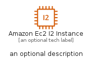
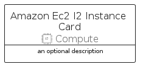
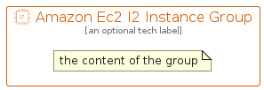

# AmazonEc2I2Instance


```text
aws-q1-2022/Resource/Compute/AmazonEc2I2Instance
```

```text
include('aws-q1-2022/Resource/Compute/AmazonEc2I2Instance')
```


| Illustration | AmazonEc2I2Instance | AmazonEc2I2InstanceCard | AmazonEc2I2InstanceGroup |
| :---: | :---: | :---: | :---: |
|  |  |  |  |


## AmazonEc2I2Instance

### Load remotely
```plantuml
@startuml
' configures the library
!global $LIB_BASE_LOCATION="https://raw.githubusercontent.com/tmorin/plantuml-libs/master/distribution"

' loads the library's bootstrap
!include $LIB_BASE_LOCATION/bootstrap.puml

' loads the package bootstrap
include('aws-q1-2022/bootstrap')

' loads the Item which embeds the element AmazonEc2I2Instance
include('aws-q1-2022/Resource/Compute/AmazonEc2I2Instance')

' renders the element
AmazonEc2I2Instance('AmazonEc2I2Instance', 'Amazon Ec2 I2 Instance', 'an optional tech label')
@enduml
```

### Load locally
```plantuml
@startuml
' configures the library
!global $INCLUSION_MODE="local"
!global $LIB_BASE_LOCATION="../../.."

' loads the library's bootstrap
!include $LIB_BASE_LOCATION/bootstrap.puml

' loads the package bootstrap
include('aws-q1-2022/bootstrap')

' loads the Item which embeds the element AmazonEc2I2Instance
include('aws-q1-2022/Resource/Compute/AmazonEc2I2Instance')

' renders the element
AmazonEc2I2Instance('AmazonEc2I2Instance', 'Amazon Ec2 I2 Instance', 'an optional tech label')
@enduml
```

## AmazonEc2I2InstanceCard

### Load remotely
```plantuml
@startuml
' configures the library
!global $LIB_BASE_LOCATION="https://raw.githubusercontent.com/tmorin/plantuml-libs/master/distribution"

' loads the library's bootstrap
!include $LIB_BASE_LOCATION/bootstrap.puml

' loads the package bootstrap
include('aws-q1-2022/bootstrap')

' loads the Item which embeds the element AmazonEc2I2InstanceCard
include('aws-q1-2022/Resource/Compute/AmazonEc2I2Instance')

' renders the element
AmazonEc2I2InstanceCard('AmazonEc2I2InstanceCard', 'Amazon Ec2 I2 Instance Card', 'an optional description')
@enduml
```

### Load locally
```plantuml
@startuml
' configures the library
!global $INCLUSION_MODE="local"
!global $LIB_BASE_LOCATION="../../.."

' loads the library's bootstrap
!include $LIB_BASE_LOCATION/bootstrap.puml

' loads the package bootstrap
include('aws-q1-2022/bootstrap')

' loads the Item which embeds the element AmazonEc2I2InstanceCard
include('aws-q1-2022/Resource/Compute/AmazonEc2I2Instance')

' renders the element
AmazonEc2I2InstanceCard('AmazonEc2I2InstanceCard', 'Amazon Ec2 I2 Instance Card', 'an optional description')
@enduml
```

## AmazonEc2I2InstanceGroup

### Load remotely
```plantuml
@startuml
' configures the library
!global $LIB_BASE_LOCATION="https://raw.githubusercontent.com/tmorin/plantuml-libs/master/distribution"

' loads the library's bootstrap
!include $LIB_BASE_LOCATION/bootstrap.puml

' loads the package bootstrap
include('aws-q1-2022/bootstrap')

' loads the Item which embeds the element AmazonEc2I2InstanceGroup
include('aws-q1-2022/Resource/Compute/AmazonEc2I2Instance')

' renders the element
AmazonEc2I2InstanceGroup('AmazonEc2I2InstanceGroup', 'Amazon Ec2 I2 Instance Group', 'an optional tech label') {
    note as note
        the content of the group
    end note
}
@enduml
```

### Load locally
```plantuml
@startuml
' configures the library
!global $INCLUSION_MODE="local"
!global $LIB_BASE_LOCATION="../../.."

' loads the library's bootstrap
!include $LIB_BASE_LOCATION/bootstrap.puml

' loads the package bootstrap
include('aws-q1-2022/bootstrap')

' loads the Item which embeds the element AmazonEc2I2InstanceGroup
include('aws-q1-2022/Resource/Compute/AmazonEc2I2Instance')

' renders the element
AmazonEc2I2InstanceGroup('AmazonEc2I2InstanceGroup', 'Amazon Ec2 I2 Instance Group', 'an optional tech label') {
    note as note
        the content of the group
    end note
}
@enduml
```

