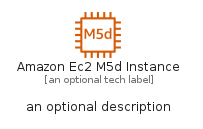
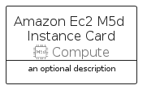
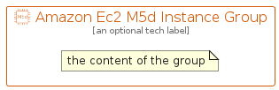

# AmazonEc2M5DInstance


```text
aws-q1-2022/Resource/Compute/AmazonEc2M5DInstance
```

```text
include('aws-q1-2022/Resource/Compute/AmazonEc2M5DInstance')
```


| Illustration | AmazonEc2M5DInstance | AmazonEc2M5DInstanceCard | AmazonEc2M5DInstanceGroup |
| :---: | :---: | :---: | :---: |
|  |  |  |  |


## AmazonEc2M5DInstance

### Load remotely
```plantuml
@startuml
' configures the library
!global $LIB_BASE_LOCATION="https://raw.githubusercontent.com/tmorin/plantuml-libs/master/distribution"

' loads the library's bootstrap
!include $LIB_BASE_LOCATION/bootstrap.puml

' loads the package bootstrap
include('aws-q1-2022/bootstrap')

' loads the Item which embeds the element AmazonEc2M5DInstance
include('aws-q1-2022/Resource/Compute/AmazonEc2M5DInstance')

' renders the element
AmazonEc2M5DInstance('AmazonEc2M5dInstance', 'Amazon Ec2 M5d Instance', 'an optional tech label')
@enduml
```

### Load locally
```plantuml
@startuml
' configures the library
!global $INCLUSION_MODE="local"
!global $LIB_BASE_LOCATION="../../.."

' loads the library's bootstrap
!include $LIB_BASE_LOCATION/bootstrap.puml

' loads the package bootstrap
include('aws-q1-2022/bootstrap')

' loads the Item which embeds the element AmazonEc2M5DInstance
include('aws-q1-2022/Resource/Compute/AmazonEc2M5DInstance')

' renders the element
AmazonEc2M5DInstance('AmazonEc2M5dInstance', 'Amazon Ec2 M5d Instance', 'an optional tech label')
@enduml
```

## AmazonEc2M5DInstanceCard

### Load remotely
```plantuml
@startuml
' configures the library
!global $LIB_BASE_LOCATION="https://raw.githubusercontent.com/tmorin/plantuml-libs/master/distribution"

' loads the library's bootstrap
!include $LIB_BASE_LOCATION/bootstrap.puml

' loads the package bootstrap
include('aws-q1-2022/bootstrap')

' loads the Item which embeds the element AmazonEc2M5DInstanceCard
include('aws-q1-2022/Resource/Compute/AmazonEc2M5DInstance')

' renders the element
AmazonEc2M5DInstanceCard('AmazonEc2M5dInstanceCard', 'Amazon Ec2 M5d Instance Card', 'an optional description')
@enduml
```

### Load locally
```plantuml
@startuml
' configures the library
!global $INCLUSION_MODE="local"
!global $LIB_BASE_LOCATION="../../.."

' loads the library's bootstrap
!include $LIB_BASE_LOCATION/bootstrap.puml

' loads the package bootstrap
include('aws-q1-2022/bootstrap')

' loads the Item which embeds the element AmazonEc2M5DInstanceCard
include('aws-q1-2022/Resource/Compute/AmazonEc2M5DInstance')

' renders the element
AmazonEc2M5DInstanceCard('AmazonEc2M5dInstanceCard', 'Amazon Ec2 M5d Instance Card', 'an optional description')
@enduml
```

## AmazonEc2M5DInstanceGroup

### Load remotely
```plantuml
@startuml
' configures the library
!global $LIB_BASE_LOCATION="https://raw.githubusercontent.com/tmorin/plantuml-libs/master/distribution"

' loads the library's bootstrap
!include $LIB_BASE_LOCATION/bootstrap.puml

' loads the package bootstrap
include('aws-q1-2022/bootstrap')

' loads the Item which embeds the element AmazonEc2M5DInstanceGroup
include('aws-q1-2022/Resource/Compute/AmazonEc2M5DInstance')

' renders the element
AmazonEc2M5DInstanceGroup('AmazonEc2M5dInstanceGroup', 'Amazon Ec2 M5d Instance Group', 'an optional tech label') {
    note as note
        the content of the group
    end note
}
@enduml
```

### Load locally
```plantuml
@startuml
' configures the library
!global $INCLUSION_MODE="local"
!global $LIB_BASE_LOCATION="../../.."

' loads the library's bootstrap
!include $LIB_BASE_LOCATION/bootstrap.puml

' loads the package bootstrap
include('aws-q1-2022/bootstrap')

' loads the Item which embeds the element AmazonEc2M5DInstanceGroup
include('aws-q1-2022/Resource/Compute/AmazonEc2M5DInstance')

' renders the element
AmazonEc2M5DInstanceGroup('AmazonEc2M5dInstanceGroup', 'Amazon Ec2 M5d Instance Group', 'an optional tech label') {
    note as note
        the content of the group
    end note
}
@enduml
```

